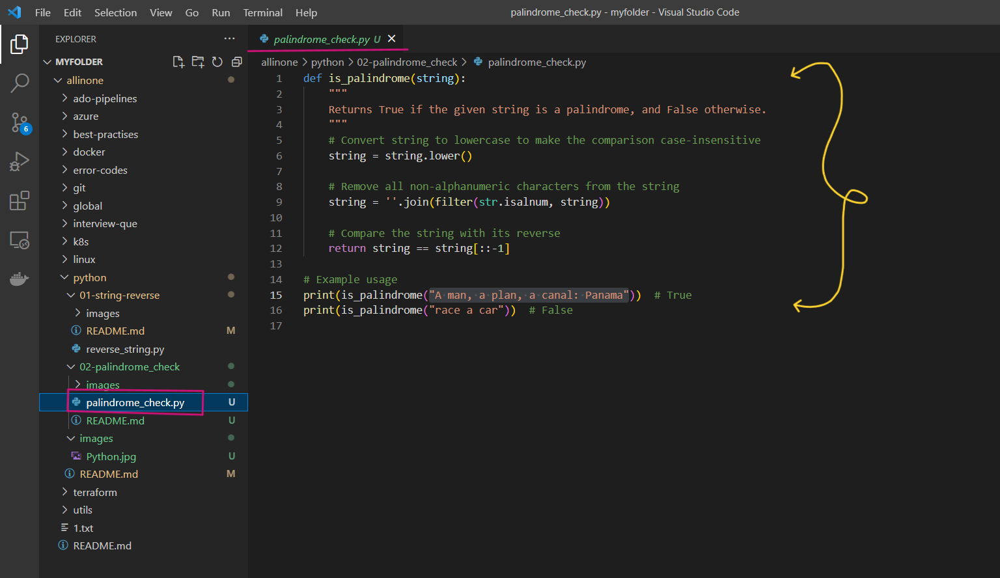
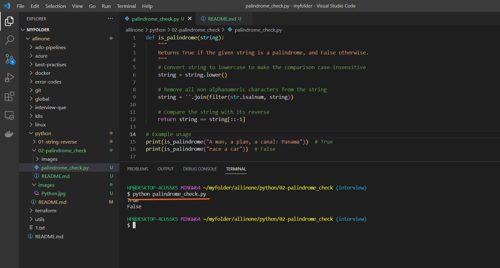
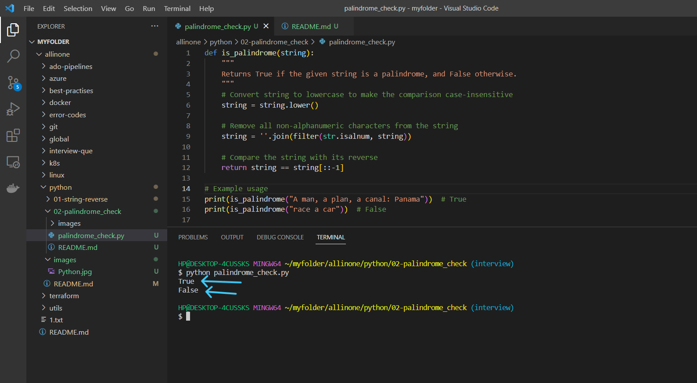

# Palindrome Check Program

### This is a simple Python program that  checks whether a given string is a palindrome or not. A palindrome is a string that is spelled the same way forwards and backwards, ignoring any spaces and punctuation.


# Introduction 

## What is Palindrome Check  ?

- Palindrome check is the process of verifying whether a given word, phrase, or sentence remains the same when read from left to right as it does from right to left. In other words, it checks if a sequence of characters reads the same forward and backward.

- To perform a palindrome check, you need to compare the characters of the given word, phrase, or sentence from the left side to the right side and from the right side to the left side. If all the characters are the same in both directions, the sequence is a palindrome.

- For example, to check if the word "level" is a palindrome, you would compare the first character 'l' to the last character 'l', the second character 'e' to the second-to-last character 'e', and so on. If all the characters match, the word is a palindrome.

- Many programming languages have built-in functions to perform palindrome checks on strings, making it easier to determine whether a given sequence of characters is a palindrome.


# Pre-requistes

- This program requires Python 3.x to be installed on your system. If you don't have Python installed, you can download it from the official website(https://www.python.org/downloads/).


# How to run ?

- ### To use this program, simply create a file called `palindrome_check.py` and add the code to it .




- ### Open the Terminal and run the following command .

   ```
   python palindrome_check.py
   ```




- ### As mentioned in the code , the expected output of `print(is_palindrome("A man, a plan, a canal: Panama"))` should be `True` and `print(is_palindrome("race a car"))`should be `False` .





# Description 

- The code defines a function called `is_palindrome` that takes a string as input and returns True if the string is a palindrome, and False otherwise.

- To determine whether a string is a palindrome or not, the function first converts the input string to lowercase using the `lower()` method. This ensures that all letters in the string are lowercase and makes the comparison case-insensitive.

- Next, the function removes all non-alphanumeric characters from the string using the `filter()` method and the `str.isalnum` function. This is done to ignore any spaces, punctuation, or other characters that are not letters or digits. 

- The `filter()` method applies the `str.isalnum` function to each character in the string, and keeps only the characters that are alphanumeric (i.e. letters or digits). The resulting characters are then joined back into a string using the `join(`) method.

- Finally, the function compares the modified string with its reverse using the slicing syntax `[::-1]`. This creates a reversed copy of the string, which is then compared to the original string using the `==` operator. If the original string is equal to its reverse, then the function returns True, indicating that the input string is a palindrome. If the original string is not equal to its reverse, then the function returns False, indicating that the input string is not a palindrome.

- You can use the `is_palindrome` function to check whether a given string is a palindrome or not by calling the function and passing the string as an argument. The function returns True or False, depending on whether the string is a palindrome or not.


