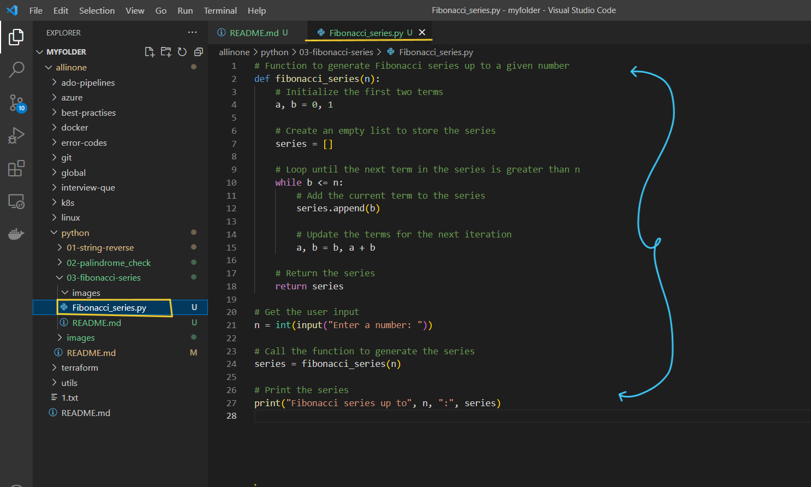
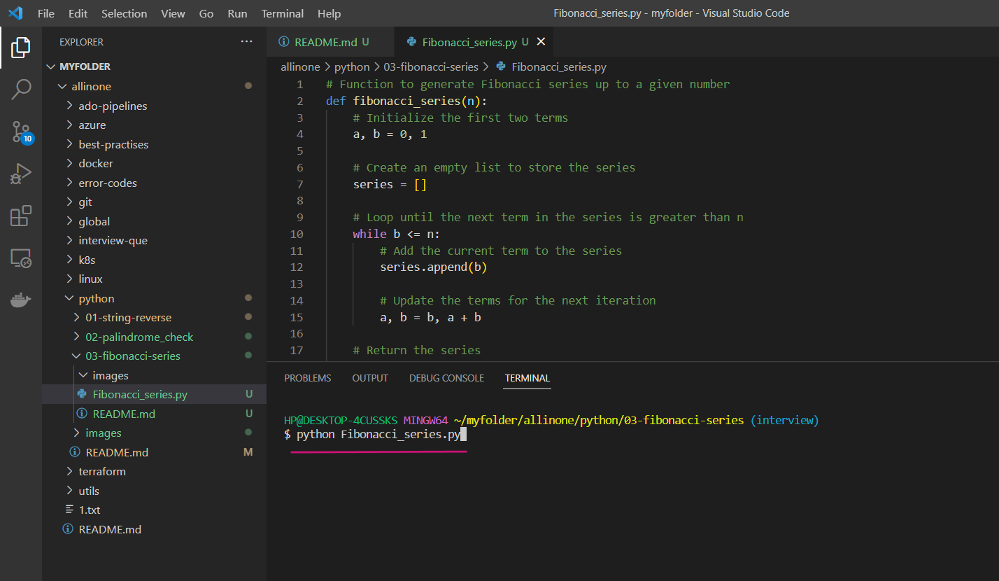
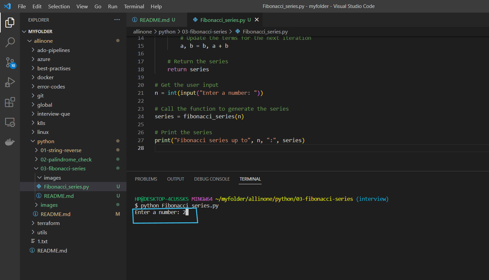
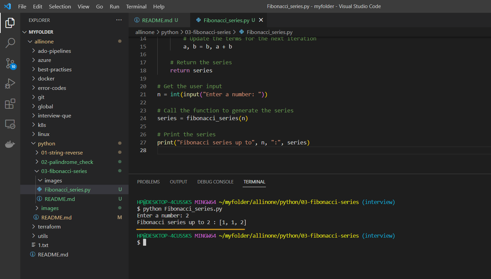

# Fibonacci_series Program

### This is a Python program that generates the Fibonacci series up to a given number. The user enters a number, and the program generates the series up to that number.

# Introduction 

## What is Fibonacci_series ?

- The Fibonacci series is a sequence of numbers in which each number is the sum of the two preceding ones. It is a well-known series with many applications in mathematics, computer science, and other fields. There are several ways to generate the Fibonacci series in Python, including using recursion, a loop, or a list.


# Pre-requistes

- This program requires Python 3.x to be installed on your system. If you don't have Python installed, you can download it from the official website(https://www.python.org/downloads/).


# How to run ?

- ### To use this program, simply create a file called `Fibonacci_series.py` and add the code to it .




- ### Open the Terminal and run the following command .

   ```
   python Fibonacci_series.py 
   ```




- ### Now , it will ask you to `Enter the number` , for which you want to see `Fibonacci series` .





- ### Once you enter the number . Click on Enter you can see Fibonacci series as a output of particular number which you entered.





# Description 

- We define a function called `fibonacci_series` that takes a single argument `n`, which is the maximum value for the series.

- Inside the function, we initialize the first two terms of the series (`a` and `b`) to 0 and 1, respectively. We also create an empty list called `series` to store the series.

- We then use a `while` loop to generate the series. The loop continues until the next term in the series is greater than `n`. Inside the loop, we append the current term (`b`) to the series list, and update the values of `a` and `b` for the next iteration of the loop.

- Once the loop is finished, we return the `series` list.

- In the main program, we get user input for the maximum value of the series (n), and call the `fibonacci_series` function with `n` as the argument.

- Finally, we print the resulting series.