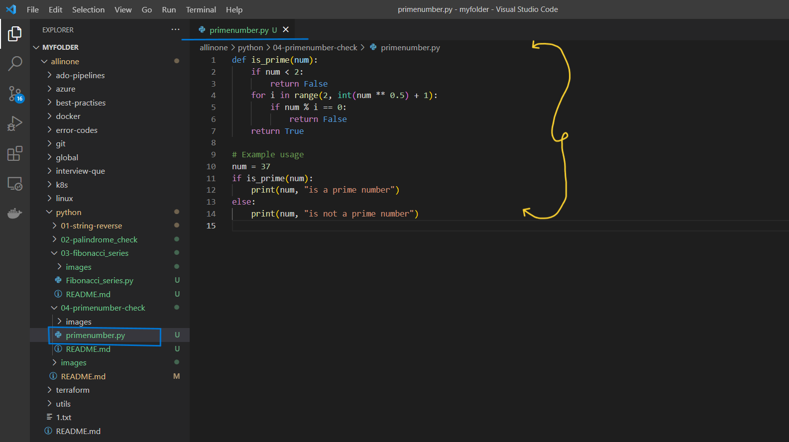
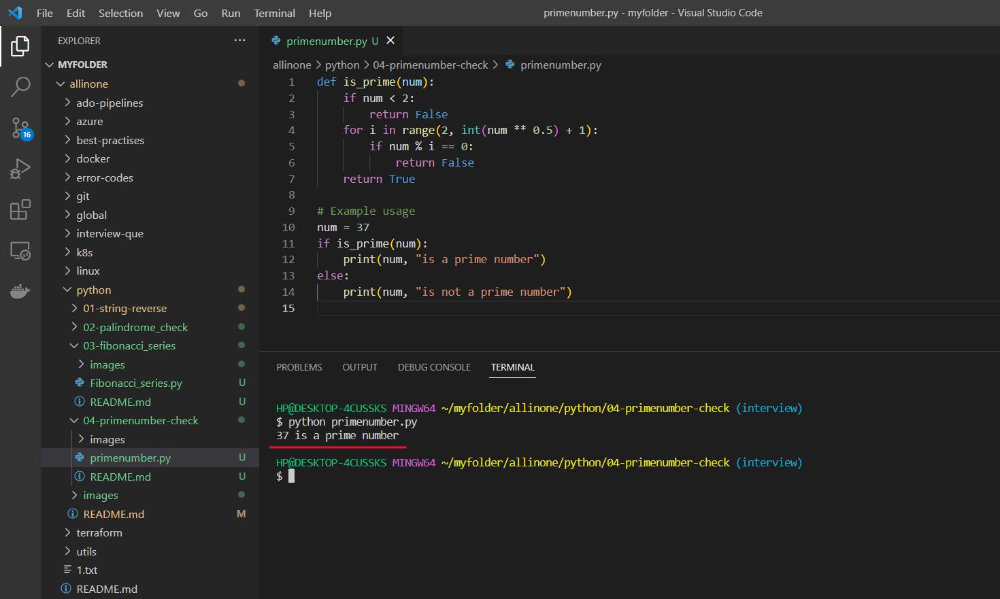
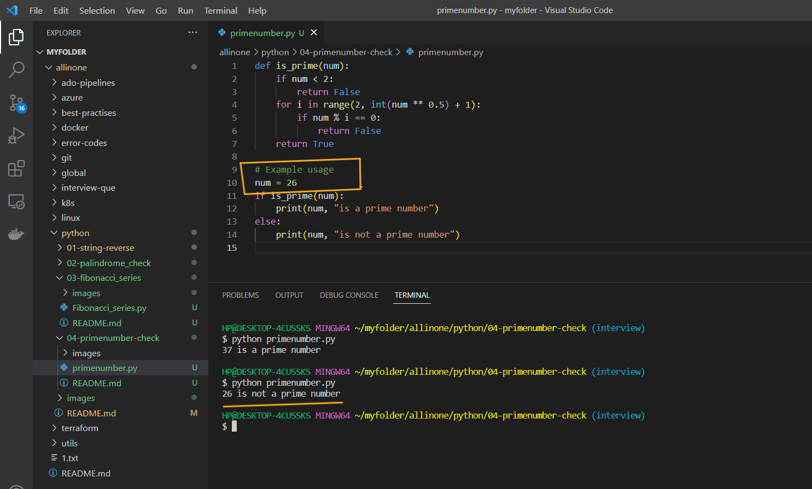

# Prime number Check  Program

### This is a Python program that checks if a given number is a prime number or not. It includes a function is_prime that takes a number as an argument and returns True if it's a prime number, and False otherwise. The program also includes an example usage that demonstrates how to call the is_prime function.

# Introduction 

## What is Prime Number ?

- A prime number is a positive integer greater than 1 that has no positive integer divisors other than 1 and itself. In other words, a prime number is a number that is only divisible by 1 and itself. For example, 2, 3, 5, 7, 11, 13, 17, 19, 23, 29, 31, 37, 41, 43, 47, etc. are prime numbers. The numbers that are not prime are called composite numbers. The Fibonacci series is a sequence of numbers in which each number is the sum of the two preceding ones. It is a well-known series with many applications in mathematics, computer science, and other fields. There are several ways to generate the Fibonacci series in Python, including using recursion, a loop, or a list.


# Pre-requistes

- This program requires Python 3.x to be installed on your system. If you don't have Python installed, you can download it from the official website(https://www.python.org/downloads/).


# How to run ?

- ### To use this program, simply create a file called `primenumber.py` and add the code to it .




- ### Open the Terminal and run the following command .

   ```
   python primenumber.py 
   ```


- ### Now , it will show you whether the mentioned number in th code is Prime number or not.




- ### It shows that Number `37` is `Prime Number` .

- ### Now , you can change the number in code and test again .



- ### Here i have changed the number to `26` and it shows that `its not a prime number`.

# Description 

- Here, `is_prime` is a function that takes an integer `n` as input and returns `True` if it is a `prime number`, and `False` otherwise.

- The function first checks if the number is less than `2`, as any number less than `2` is not a prime number. 

- It then uses a loop to check if the number is divisible by any integer between 2 and the square root of the number (inclusive). 

- If it is, then the number is not a prime and the function returns `False`. If the loop finishes without finding any divisors, then the number is a prime and the function returns True.