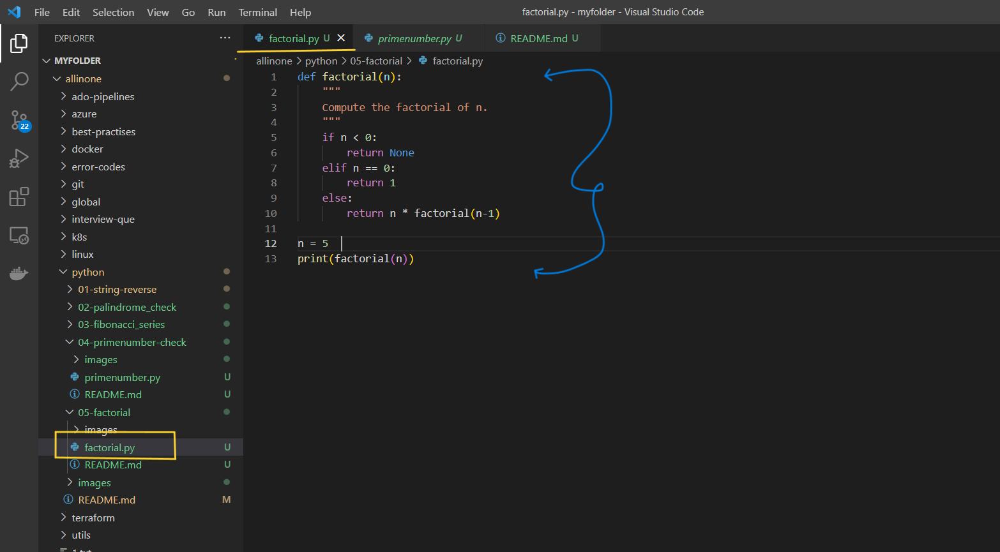
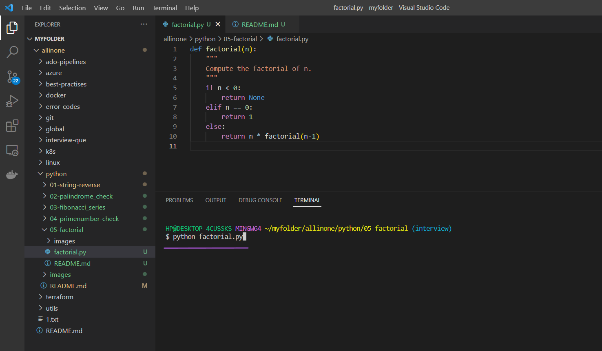
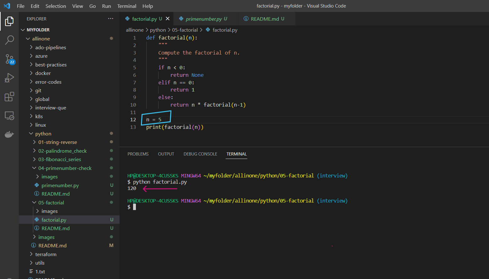
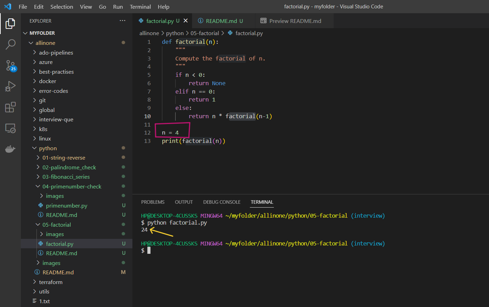

# Factorial Program

### This is a Python program that calculates the factorial of a given non-negative integer using recursion.

# Introduction 

## What is Factorial ?

- The factorial of a number is the sum of the multiplication, of all the whole numbers, from our specified number down to 1. 

  For example, the factorial of 6 would be 6 x 5 x 4 x 3 x 2 x 1 = 720

# Pre-requistes

- This program requires Python 3.x to be installed on your system. If you don't have Python installed, you can download it from the

official website(https://www.python.org/downloads/).


# How to run ?

- ### To use this program, simply create a file called `factorial.py` and add the code to it .




- ### Open the Terminal and run the following command .

   ```
   python factorial.py
   ```




- ### Now , it will show you the factorial of that integer which you mentioned in the code.




- ### It shows that `120` is the factorial of Integer `5` .

- ### Now , you can change the number in code and test again .



- ### Here i have changed the number to `4` and the factorial of it is `24`.

# Description 

- The above code defines a function named `factorial` that takes an integer argument `n`. The function recursively calculates the factorial of `n` and returns the result.

- In the implementation of the `factorial` function, the first condition checks if the input `n` is negative. If n is negative, the function returns `None`.

- The second condition checks if `n` is zero. If `n` is zero, the function returns `1` as the factorial of zero is 1.

- The final condition is the base case for the recursion. It multiplies `n` with the factorial of `(n-1)` and returns the result. This continues until the base case is reached.

- The code then sets the value of `n` to 4 and calls the `factorial` function with `n` as the argument. The result of the function call, which is the factorial of `n` (i.e., `4!`), is then printed to the console.