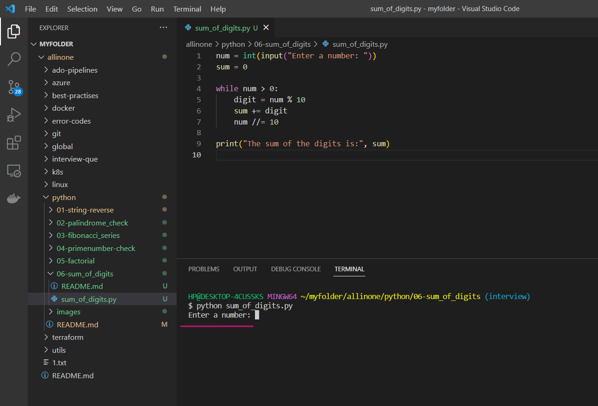
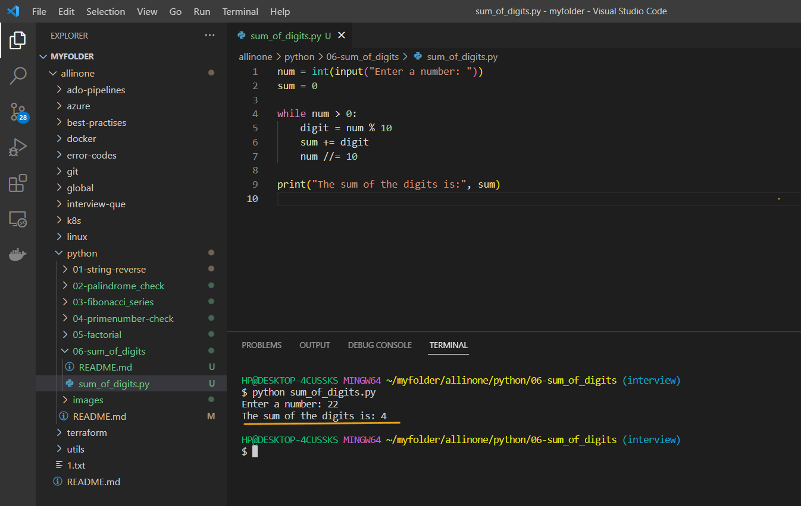
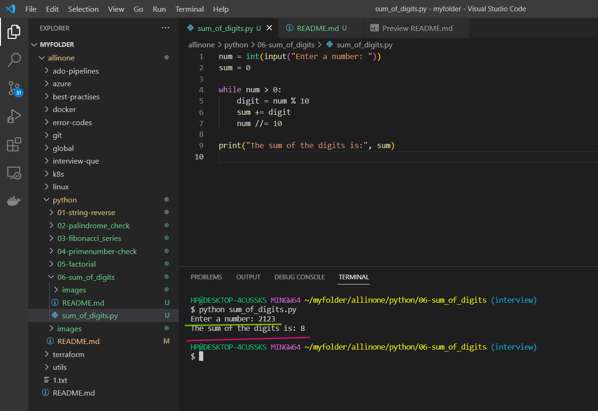

# Sum Of Digits Program

### This is a simple Python program that reads in a number from the user and computes the sum of its digits

# Introduction 

## What is Sum of Digits?

- The sum of digits of a number is the sum obtained by adding up all the individual digits in the number.

  For example, consider the number `456`. The sum of its digits is:

  `4 + 5 + 6 = 15`

  So, the sum of digits of the number `456` is `15`.

  Similarly, if we consider the number `1234`, the sum of its digits would be:

  `1 + 2 + 3 + 4 = 10`

  So, the sum of digits of the number `1234` is `10`.

  In general, the sum of digits of any number can be found by adding up all the individual digits in the number.

# Pre-requistes

- This program requires Python 3.x to be installed on your system. If you don't have Python installed, you can download it from the

official website(https://www.python.org/downloads/).


# How to run ?

- ### To use this program, simply create a file called `sum_of_digits.py` and add the code to it .


- ### Open the Terminal and run the following command .

   ```
   python sum_of_digits.py
   ```


- ### Now , it will ask you to `enter the number` for which you want a `sum` of it .




- ### As, you have added number `22` , so the sum of that is `4` (i.e, 2 + 2 = 4) .



- ### Now , you can enter the different number and check once again .



- ### Here we have changed the number to `2123` and the sum of it is `8`.

# Description 

- The user is prompted to enter a number, which is read in as an integer using the `input` function and stored in the `num` variable.

- The variable `sum` is initialized to zero.

- The program enters a `while` loop that continues until `num` is reduced to zero. In each iteration of the loop:

  a. The rightmost digit of `num` is extracted by taking the remainder of `num` divided by 10, and stored in the `digit` variable.

  b. The value of `digit` is added to the sum variable.

  c. The value of `num` is updated by dividing it by 10, discarding the rightmost digit.


- Once the loop has finished, the program outputs the sum of the digits using the `print` function.