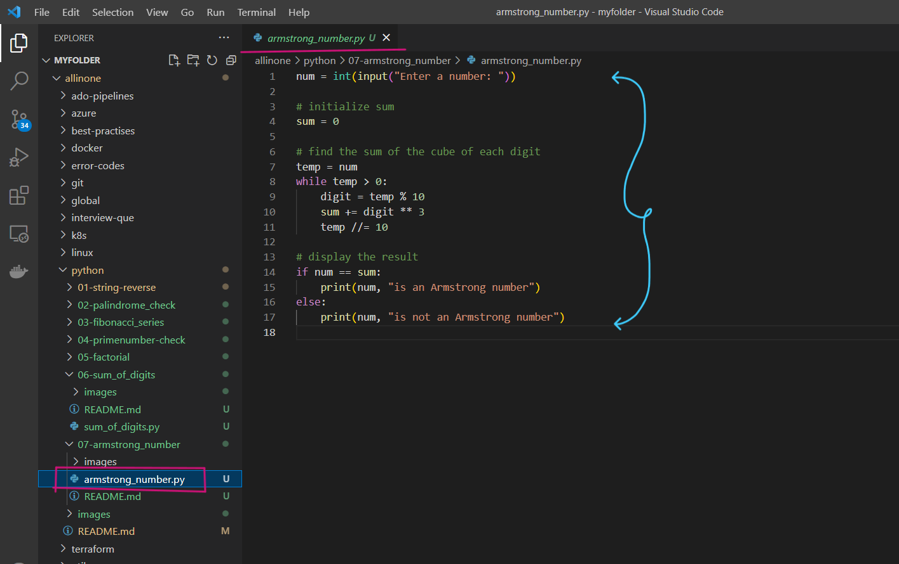
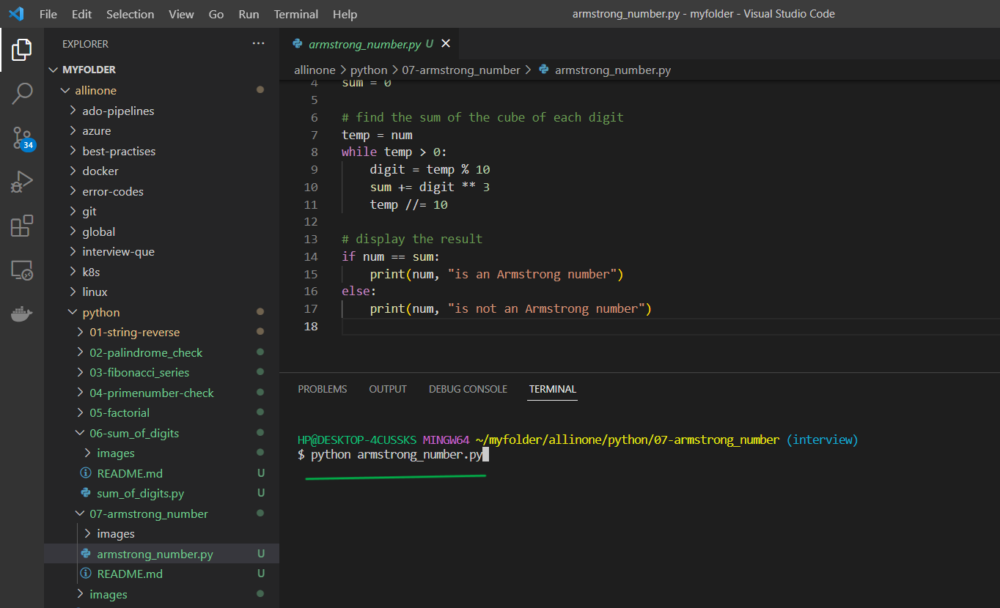
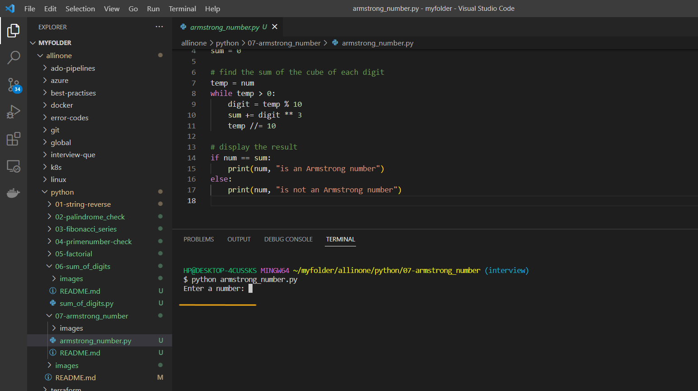
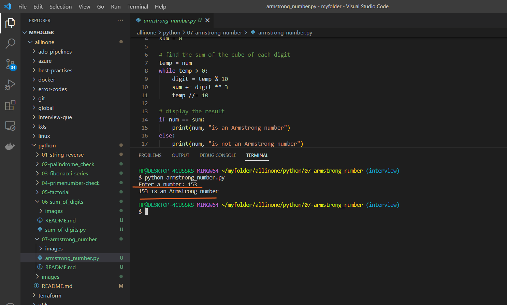
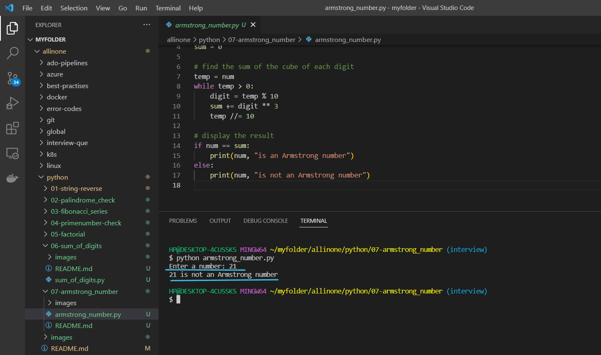

# Armstrong Number Program

### This Python program checks if a given number is an Armstrong number or not. An Armstrong number is a number that is equal to the sum of its own digits raised to the power of the number of digits.

# Introduction 

## What is Armstrong number ?

- An Armstrong number, also known as a Narcissistic number, is a number that is equal to the sum of its own digits raised to the power of the number of digits.

  For example, `153` is an Armstrong number because:

  `1^3 + 5^3 + 3^3 = 1 + 125 + 27 = 153`

  Similarly, `371` is an Armstrong number because:

  `3^3 + 7^3 + 1^3 = 27 + 343 + 1 = 371`

  Armstrong numbers are named after Michael F. Armstrong, who is credited with their discovery.


# Pre-requistes

- This program requires Python 3.x to be installed on your system. If you don't have Python installed, you can download it from the

official website(https://www.python.org/downloads/).


# How to run ?

- ### To use this program, simply create a file called `armstrong_number.py` and add the code to it .




- ### Open the Terminal and run the following command .

   ```
   python armstrong_number.py
   ```




- ### Now , it will ask you to `enter the number` for which you want to check if it is Armstrong number or not .




- ### As, you have Entered a  number `153` , and as it is 3 digits so , the cube of all digits `1^3 + 5^3 + 3^3 = 1 + 125 + 27 = 153` sums to be `153` which is a Armstrong Number.



- ### Now , you can enter the different number and check once again .



- ### Here we have entered a another number i.e, `21` and as it is 2 digits so square of both the digits i.e, `2^2 + 1^2 = 4 + 1 = 5`

  sums to be `5` which is not equal to `21` , which is not a Armstrong Number.

# Description 

- In this program, we first take input from the user and convert it to an integer. We then initialize a variable `sum` to 0, which we will use to store the sum of the cube of each digit.

- Next, we use a `while` loop to iterate over each digit in the number. We use the modulus operator `%` to get the last digit of the number, and then add the cube of that digit to `sum`. We then divide the number by 10 using integer division `//` to remove the last digit.

- After we have iterated over all the digits, we check if the original number is equal to the `sum`. If it is, we print a message saying that the number is an Armstrong number, otherwise we print a message saying that the number is not an Armstrong number.

- An Armstrong number is a number that is equal to the sum of its own digits raised to the power of the number of digits. For example, 153 is an Armstrong number because 1^3 + 5^3 + 3^3 = 153.