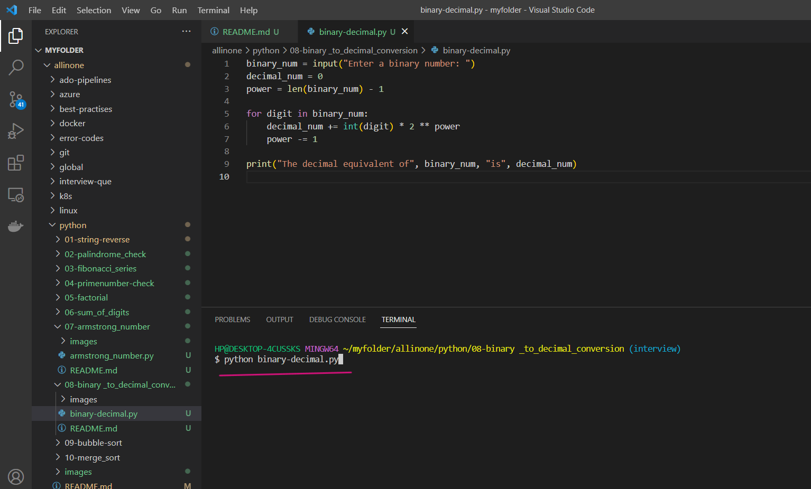
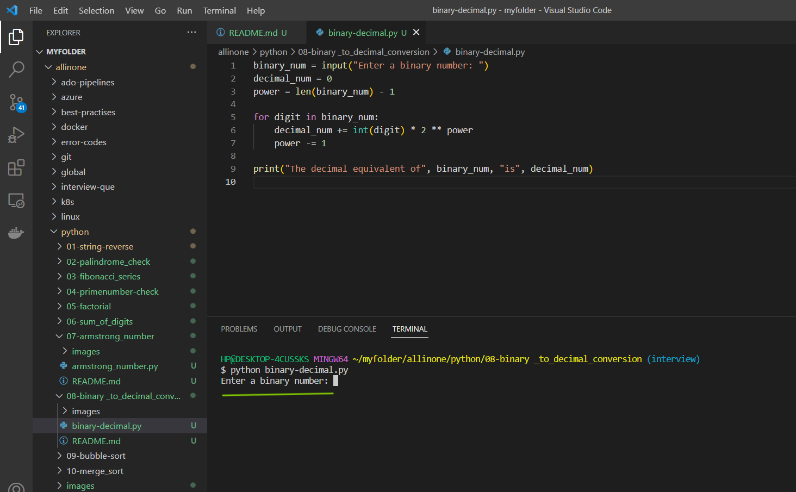
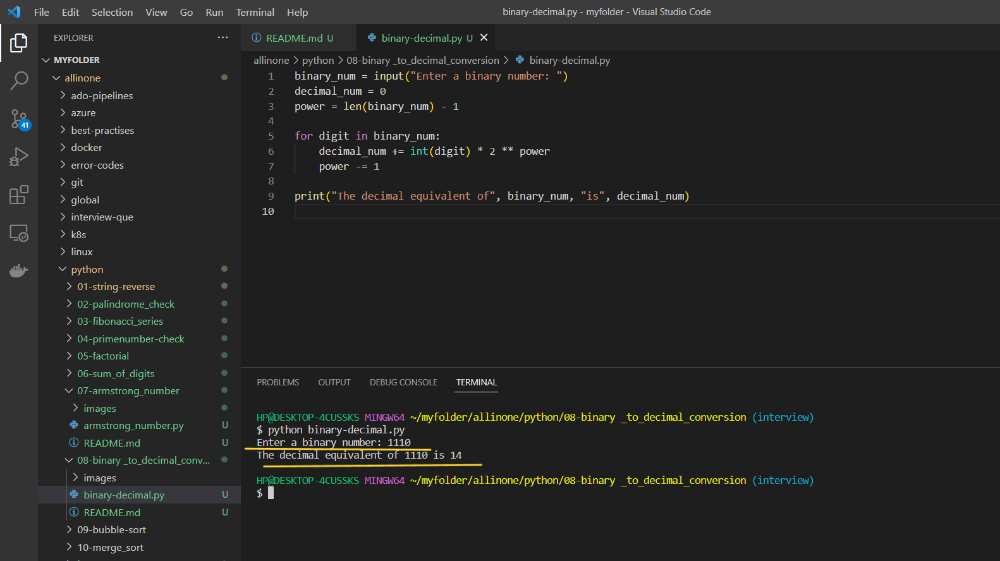

# Binary to Decimal Conversion Program

### This Python program checks if a given number is an Armstrong number or not. An Armstrong number is a number that is equal to the sum of its own digits raised to the power of the number of digits.

# Introduction 

## What is Binary to Decimal Conversion ?

- Binary to decimal conversion is the process of converting a binary (base-2) number to its decimal (base-10) equivalent. In binary, there are only two possible digits, 0 and 1. In decimal, there are ten possible digits, 0 through 9.

- To convert a binary number to decimal, you can use the following method:

  Write down the binary number.

- Starting from the rightmost digit, multiply each digit by 2 raised to the power of its position. For example, if the binary number is 1011, the rightmost digit is 1, so you would multiply it by 2^0 (which equals 1). The next digit to the left is also a 1, so you would multiply it by 2^1 (which equals 2). The next digit is a 0, so you would skip it. The leftmost digit is a 1, so you would multiply it by 2^3 (which equals 8).

- Add up the results of each multiplication. In the example above, you would have:

     ``` 1 x 2^0 = 1```

  ```1 x 2^1 = 2```

  ```0 x 2^2 = 0```

  ```1 x 2^3 = 8```

    ```
     11 (in decimal)
    ```
  Therefore, the binary number 1011 is equal to the decimal number 11.


# Pre-requistes

- This program requires Python 3.x to be installed on your system. If you don't have Python installed, you can download it from the

official website(https://www.python.org/downloads/).


# How to run ?

- ### To use this program, simply create a file called `binary-decimal.py` and add the code to it .


- ### Open the Terminal and run the following command .

   ```
   python binary-decimal.py
   ```




- ### Now , it will ask you to `enter the number` for which you want to have `binary to decimal conversion`.




- ### As, you have Entered a  number `1110`.

  ```0 x 2^0 = 0```

  ```1 x 2^1 = 2```

  ```1 x 2^2 = 4```

  ```1 x 2^3 = 8```

- ### Adding these values together gives:

  ```0 + 2 + 4 + 8 = 14```




# Description 

- In this program, we first ask the user to input a binary number. We then initialize two variables: `decimal_num` to store the decimal equivalent of the binary number, and `power` to keep track of the power of 2 that we're currently dealing with.

- We then loop through each digit in the binary number, starting from the leftmost digit. For each digit, we multiply it by the appropriate power of 2 and add it to `decimal_num`. We then decrement `power` so that we're ready to process the next digit.

- Finally, we print out the decimal equivalent of the binary number.

- Note: This program assumes that the input binary number is valid (i.e., it consists only of 0s and 1s). If the input contains any other characters, the program will produce an error.