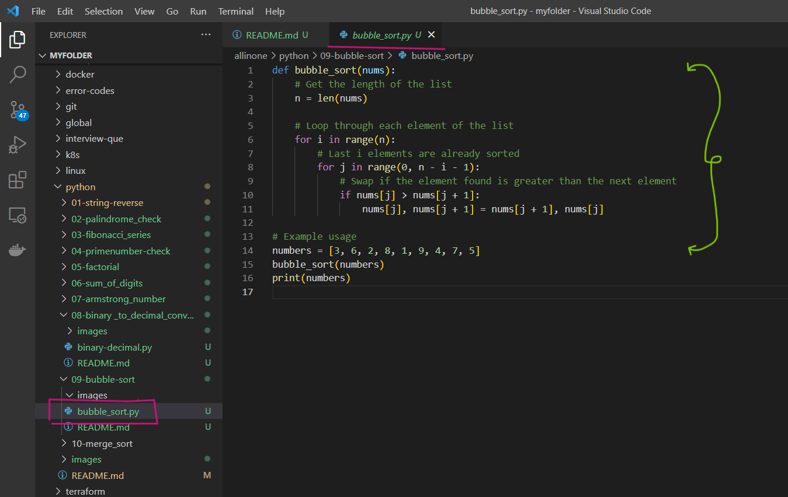
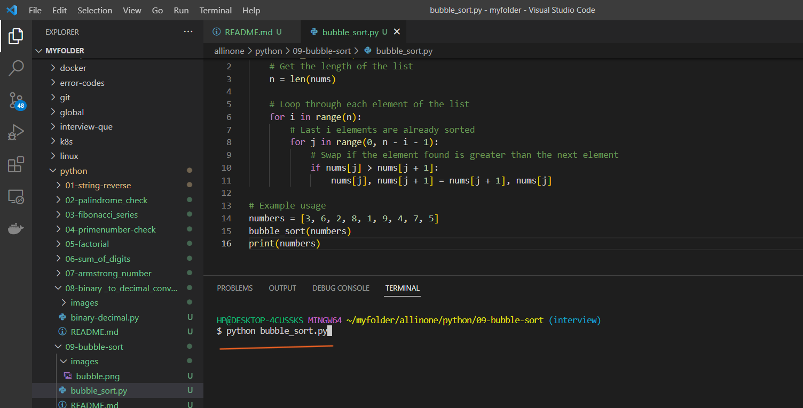
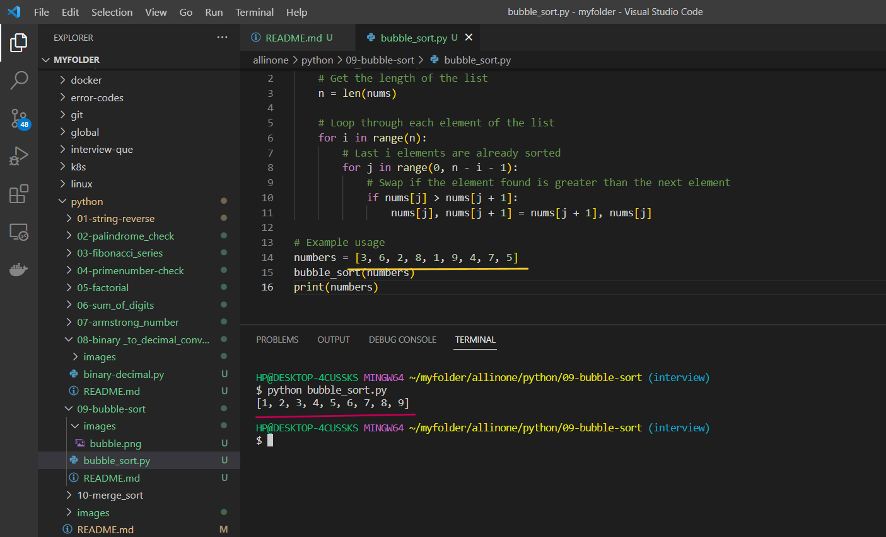

# Bubble sort  Program

### This Python program demonstrates how to implement the Bubble Sort algorithm to sort a list of numbers.


# Introduction 

## What is Bubble sort ?

- Bubble Sort is a simple sorting algorithm that repeatedly steps through the list or array to be sorted, compares adjacent elements and swaps them if they are in the wrong order. The algorithm gets its name from the way smaller elements "bubble" to the top of the list as the larger elements "sink" to the bottom.

- Here's how it works:

 1. Start at the beginning of the list.

 2. Compare the first two elements. If the first is greater than the second, swap them.

 3. Continue comparing adjacent elements and swapping them if necessary until the end of the list is reached.

 4. Repeat the steps above for each element in the list until no more swaps are needed.

- Bubble Sort has a worst-case and average time complexity of O(n^2), where n is the number of elements in the list. This makes it inefficient for sorting large lists, and it is generally not used in practice for sorting large datasets. However, it can be useful for sorting small datasets or as an educational tool to understand sorting algorithms.

# Pre-requistes

- This program requires Python 3.x to be installed on your system. If you don't have Python installed, you can download it from the

official website(https://www.python.org/downloads/).


# How to run ?

- ### To use this program, simply create a file called `bubble_sort.py` and add the code to it .




- ### Open the Terminal and run the following command .

   ```
   python bubble_sort.py
   ```




- ### Now , you can see a bubble sort order of the given group of numbers in the code.





# Description 

- This is an implementation of the Bubble Sort algorithm in Python. Bubble Sort is a simple sorting algorithm that repeatedly steps through the list, compares adjacent elements and swaps them if they are in the wrong order. The algorithm repeats this process until the list is sorted.

- The function takes a list of numbers as input and sorts it in ascending order using the Bubble Sort algorithm. The outer loop runs n times, where n is the length of the list. The inner loop compares adjacent elements and swaps them if they are in the wrong order. This process is repeated n-i-1 times in each iteration of the outer loop, where i is the index of the outer loop.

- The time complexity of Bubble Sort is O(n^2), which means that the time it takes to sort the list increases quadratically with the size of the list. Therefore, it is not efficient for large lists, and other sorting algorithms such as Quick Sort and Merge Sort are preferred for large datasets.

- In the example usage, the function is called with a list of 9 numbers and then the sorted list is printed using the print() function. The output will be: [1, 2, 3, 4, 5, 6, 7, 8, 9].