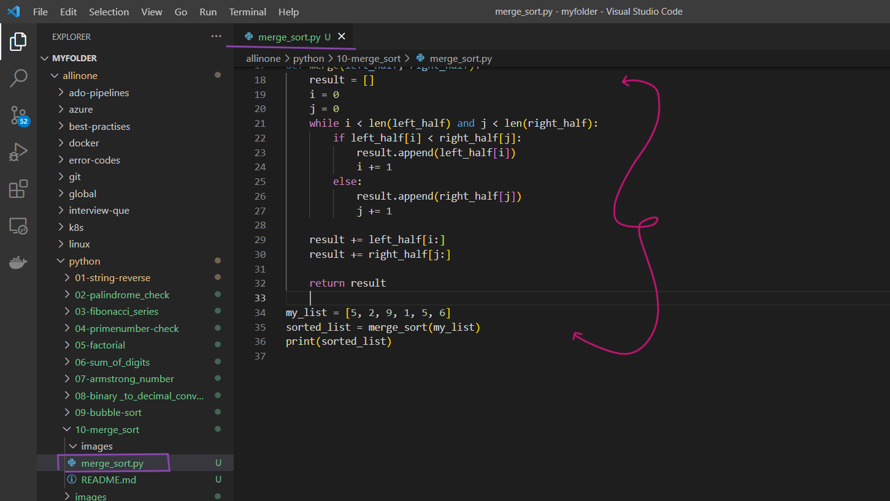
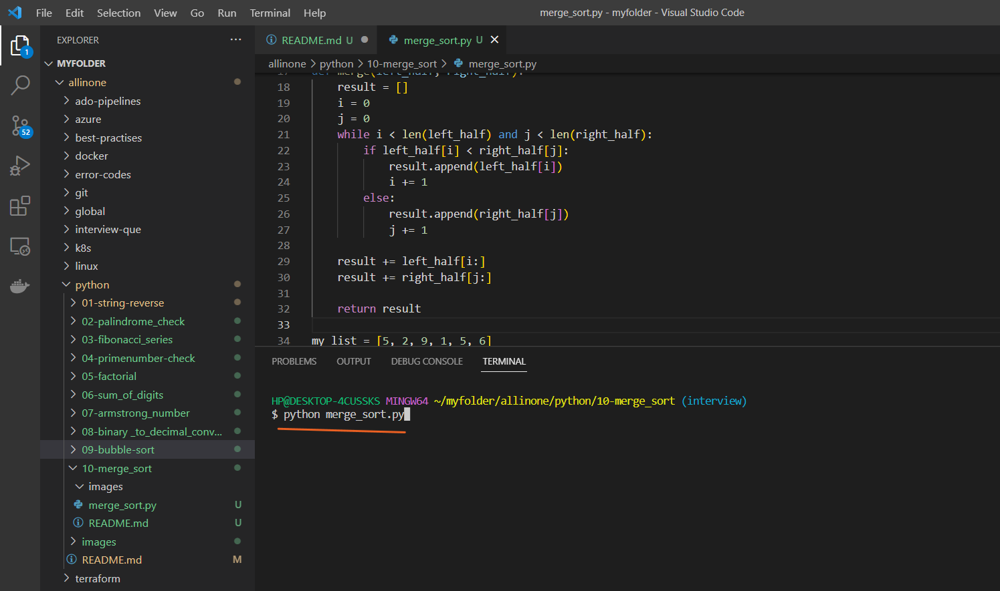
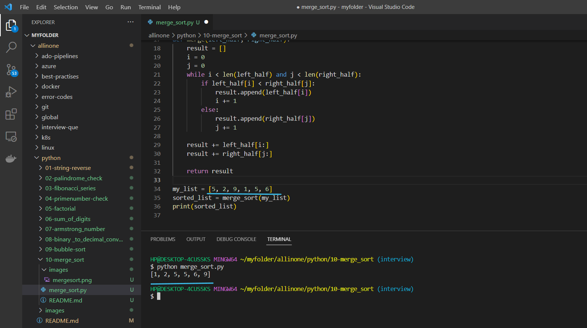

# Merge sort Program

### This is a Python program that implements the merge sort algorithm to sort a list of numbers.


# Introduction 

## What is Merge sort ?

- Merge sort is a popular and efficient sorting algorithm that uses a divide-and-conquer approach to sort a list of elements. It was invented by John von Neumann in 1945.

- The basic idea behind merge sort is to divide the list into smaller sub-lists, sort the sub-lists recursively, and then merge them back together in order to obtain the final sorted list. This process is repeated until the entire list is sorted.

- The algorithm works as follows:

- Divide the unsorted list into n sub-lists, each containing one element (a list of one element is considered sorted).
Repeatedly merge sub-lists to produce new sorted sub-lists until there is only one sub-list remaining. This will be the sorted list.
The merging process is performed by comparing the first elements of each sub-list, selecting the smallest element and placing it at the beginning of a new merged list. The comparison and selection of elements continue until all elements from both sub-lists have been placed in the merged list.

- The time complexity of merge sort is O(n log n), which makes it an efficient sorting algorithm, especially for large datasets. However, it requires additional memory space for the merging process, which can make it less suitable for very large datasets with limited memory resources.


# Pre-requistes

- This program requires Python 3.x to be installed on your system. If you don't have Python installed, you can download it from the

official website(https://www.python.org/downloads/).


# How to run ?

- ### To use this program, simply create a file called `merge_sort.py` and add the code to it .




- ### Open the Terminal and run the following command .

   ```
   python merge_sort.py
   ```




- ### Now , you can see a merge sort order of the given group of numbers in the code.





# Description 

- The program defines two functions: merge_sort and merge.

- The merge_sort function takes an array of numbers as input and recursively divides it in half until each half contains only one element. Then it uses the merge function to merge the two halves in sorted order.

- The merge function takes two arrays of numbers as input and merges them into a single sorted array. It does this by iterating through the two arrays and comparing the first elements of each. It then appends the smaller element to a new array and moves on to the next element in that array. Once one of the arrays is empty, the remaining elements in the other array are appended to the new array.

- When the merge_sort function is called on the original array, it returns the array sorted in ascending order.

- Overall, the program implements the merge sort algorithm, which is an efficient, general-purpose, comparison-based sorting algorithm that can handle large amounts of data.


