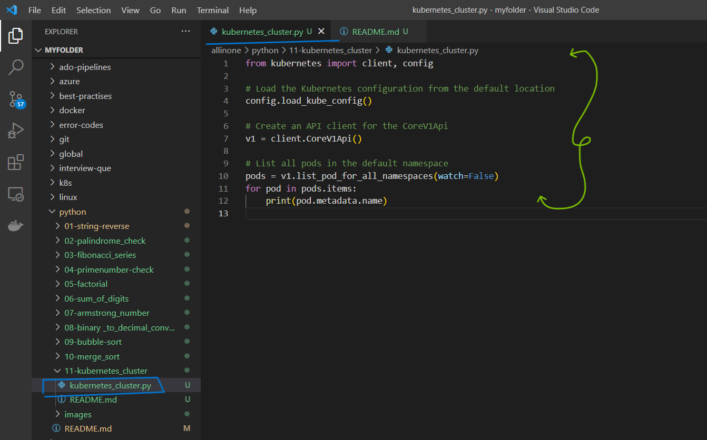
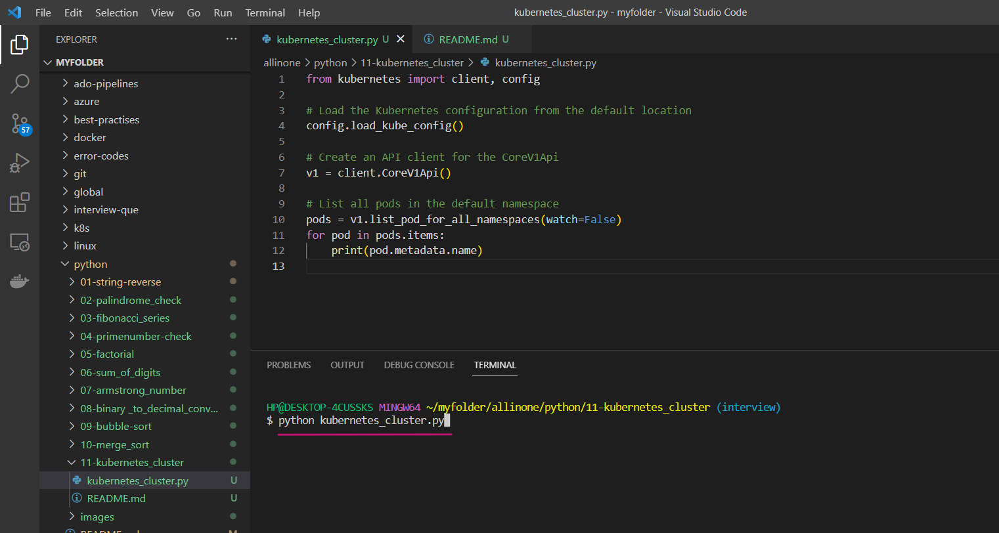
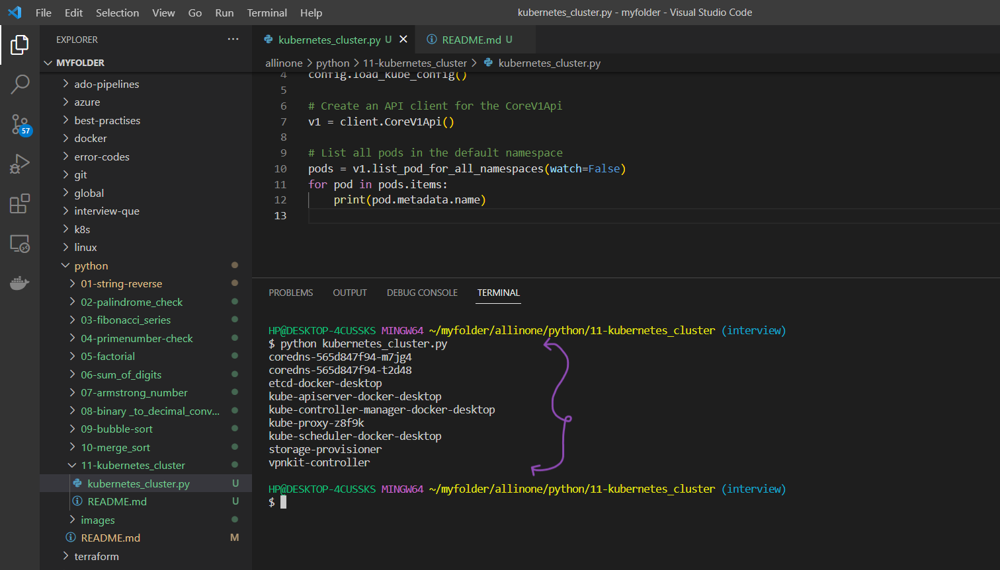

# Program to run Kubernetes cluster and list the pods 

### This is a simple Python program that connects to a Kubernetes cluster and lists all the pods in the default namespace .

# Introduction 

## What is kubernetes cluster ?

- Kubernetes is an open-source container orchestration platform that automates the deployment, scaling, and management of containerized applications. A Kubernetes cluster is a group of nodes (physical or virtual machines) that work together to run Kubernetes and the applications deployed on it.

- A Kubernetes cluster consists of a master node and worker nodes. The master node is responsible for managing the cluster, and the worker nodes are responsible for running the containers. The master node runs the Kubernetes control plane, which manages the state of the cluster, schedules containers on the worker nodes, and monitors the health of the cluster.

- The worker nodes run the containers and communicate with the master node to receive instructions on how to manage the containers. Containers are grouped into pods, and the Kubernetes scheduler assigns the pods to the worker nodes based on resource requirements, availability, and other factors.

- Kubernetes provides several benefits for containerized applications, including high availability, scalability, and automated container management. With a Kubernetes cluster, organizations can run their applications in a consistent and reliable environment, regardless of the underlying infrastructure.


# Pre-requistes

- This program requires Python 3.x to be installed on your system. If you don't have Python installed, you can download it from the

official website(https://www.python.org/downloads/).


# How to run ?

- ### To use this program, simply create a file called `kubernetes_cluster.py` and add the code to it .




- ### Open the Terminal and run the following command .

   ```
   python kubernetes_cluster.py
   ```




- ### Now , you can that you got connected to the kubernetes cluster and also the list of pods





# Description 

- The program first loads the Kubernetes configuration from the default location and creates an API client for the CoreV1Api. It then uses the list_pod_for_all_namespaces() function to list all the pods in the default namespace and loops through the list of pods to print their names.

- To use this program, you need to have Python 3 and the Kubernetes Python client library installed on your system. You can run the program from the command line using the python command.

- This code could be useful as a starting point for building more complex applications that interact with Kubernetes clusters using the Kubernetes Python client library. 


