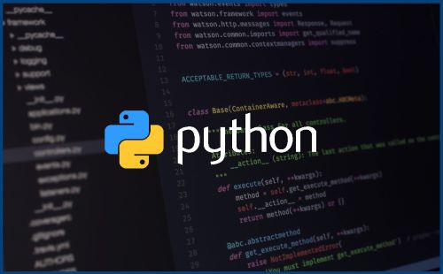

# Introduction 

## This Page contains all the python programs which are majorly asked in interviews.

# Python programs

|S.no  |   Python Program  |Link|
|------------|-----------|------|
|01|String Reverse|[String Reversal Program ](01-string-reverse/README.md) |
|02|Palindrome Check|[Palindrome Check Program ](02-palindrome_check/README.md) |
|03|Fibonacci Series|[Fibonacci_series Program ](03-fibonacci_series/README.md) |
|04|Prime Number Check|[Prime number Check  Program](04-primenumber-check/README.md) |
|05|Factorial|[Factorial Program](05-factorial/README.md) |
|06|Sum Of Digits|[Sum Of Digits Program](06-sum_of_digits/README.md) |
|07|Armstrong Number|[Armstrong Number Program](07-armstrong_number/README.md) |
|08|Binary to Decimal Coversion|[Binary to Decimal Conversion Program](08-binary_to_decimal_conversion/README.md) |
|09|Bubble Sort|[Bubble sort  Program](09-bubble-sort/README.md) |
|10|Merge Sort|[Merge sort Program](10-merge_sort/README.md) |
|11|Kubernetes Cluster|[Program to run Kubernetes cluster and list the pods ](11-kubernetes_cluster/README.md) |