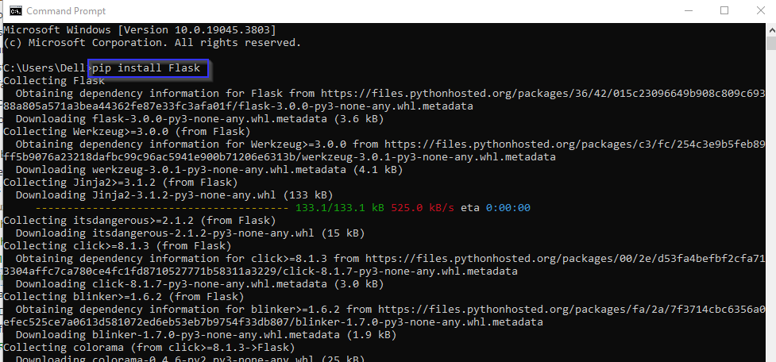
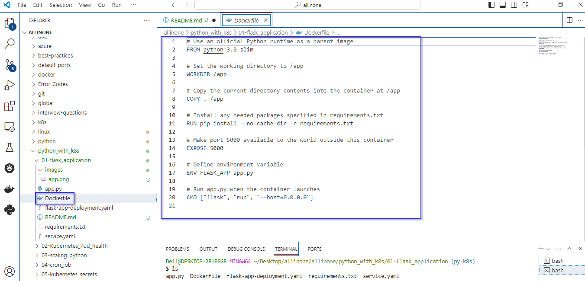
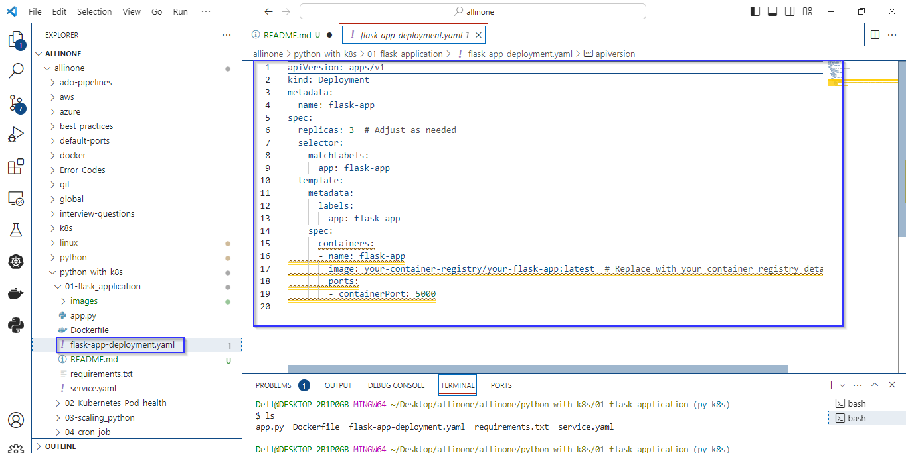
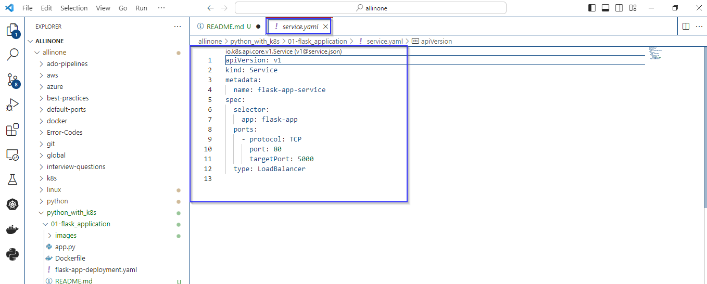
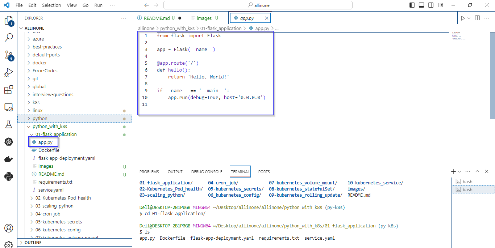
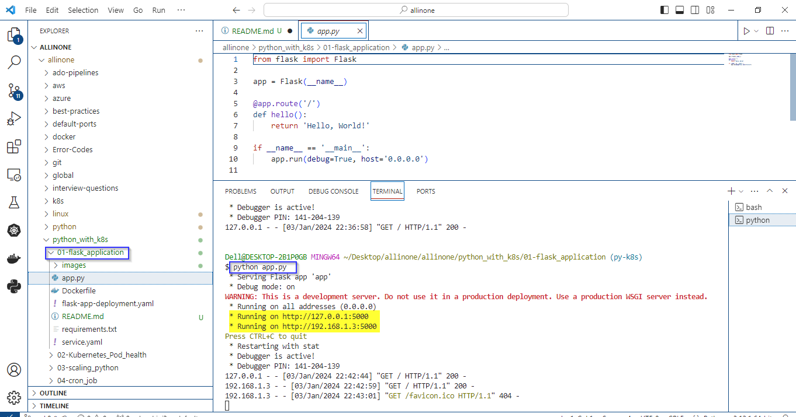
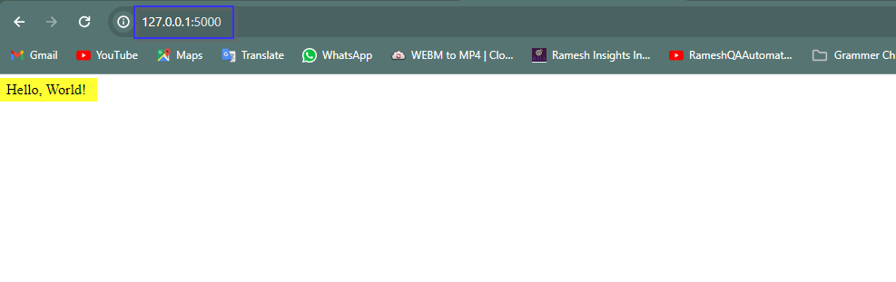

# Flask web application

### This Python code is a simple example of a web application using the Flask framework. 

# Introduction 

## what is Flask web application ?

- A Flask web application is a web application built using the Flask framework, which is a lightweight and flexible Python web framework. Flask is designed to be simple and easy to use, making it an excellent choice for developing web applications, especially smaller to medium-sized projects.


# Pre-requistes

- Ensure that Python is installed on your system. Flask is a Python web framework, and you'll need a working Python installation to run Flask applications.
- Install Flask using a package manager like pip. Open a terminal or command prompt and run: 

   ```
  pip install Flask
   ```



# Docker file

- This is a Dockerfile, a set of instructions used to create a Docker image for running a Flask web application.
- This Dockerfile is designed to package a Flask application into a Docker container, making it easy to deploy and run the application in different environments without worrying about dependencies and configurations.



# flask-app-deployment.yaml

- This is a Kubernetes Deployment YAML file that defines a deployment for a Flask application.
- Deploying the Flask application with three replicas. The application's Pods are labeled with app: flask-app, and the container image is pulled from a specified container registry. The application inside the container is expected to be listening on port 5000.



# service.yaml

- This is a Kubernetes Service YAML file that defines a service for a Flask application. 
- Creating a Kubernetes Service named flask-app-service that directs traffic to Pods labeled with app: flask-app. The Service listens on port 80 and forwards the traffic to the target port 5000 on the selected Pods. 
- The Service type is set to LoadBalancer, indicating that an external load balancer should be provisioned to handle incoming traffic.




# How to run ?

- ### To use this program, simply create a file called app.py and add the code to it .




- ### Open the Terminal and navigate to proper directory then run the following command .

   ```
   python app.py
   ```




- ### As mentioned in the code , the expected output would be 'Hello, World!' running on 5000 port.





# Description 

- These files collectively enable the deployment and exposure of a Flask web application using Docker and Kubernetes. 
- The Flask application is containerized with Docker, and Kubernetes Deployment and Service resources are defined to manage and expose the application in a scalable and load-balanced manner.
- The app.py file contains the actual Flask application code.
- While the Dockerfile provides instructions for creating the Docker image. 
- The Kubernetes deployment and service configurations define how the application should be deployed and made accessible within a Kubernetes cluster.


