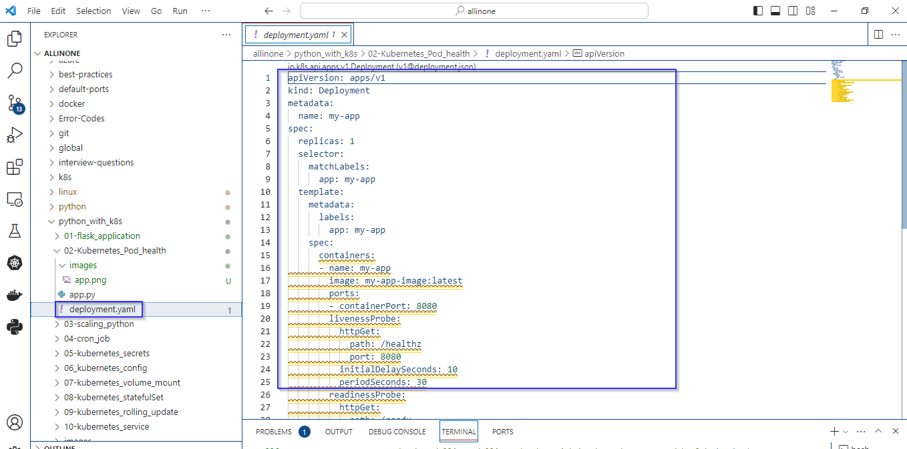
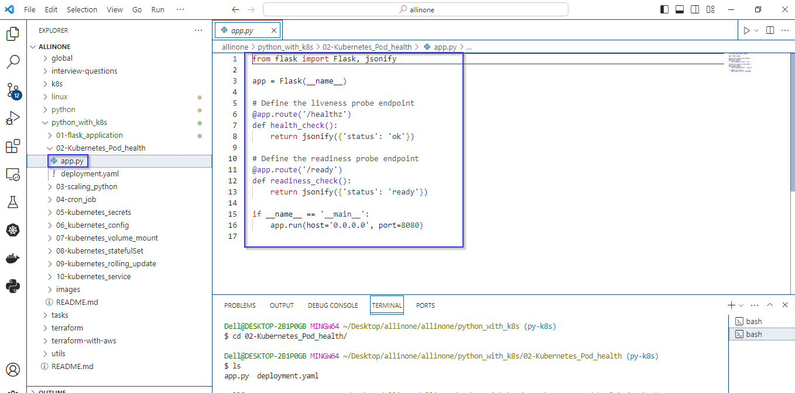
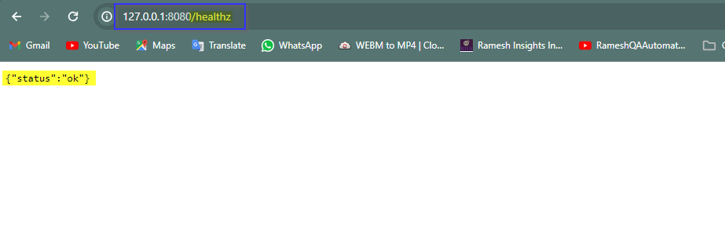
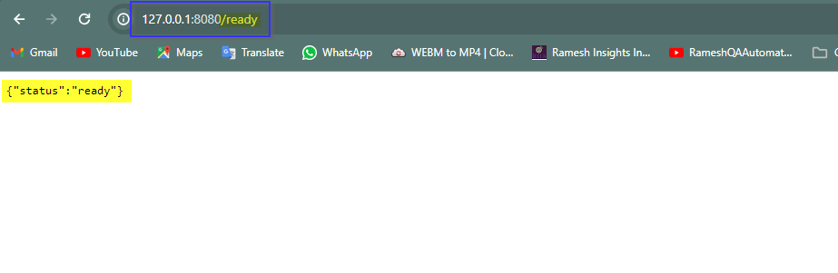

# Flask web application

### This Flask application includes health and readiness check endpoints, commonly used in containerized applications for Kubernetes. 

# Introduction 

- This Flask application serves two additional endpoints, /healthz and /ready, designed for liveness and readiness probes commonly used in container orchestration platforms like Kubernetes.
- Liveness probes help the orchestrator determine if the application is still running, while readiness probes indicate whether the application is ready to accept incoming traffic.
- The responses in JSON format provide a simple status check for these probes.


# Pre-requistes

- Ensure that Python is installed on your system. Flask is a Python web framework, and you'll need a working Python installation to run Flask applications.
- Install Flask using a package manager like pip. Open a terminal or command prompt and run: 

   ```
  pip install Flask
   ```


# deployment.yaml

- This Deployment YAML file is used to deploy a containerized application named my-app with one replica.
- The application's Pods are labeled with app: my-app, and the container image is specified as my-app-image:latest. 
- Liveness and readiness probes are defined to check the health and readiness of the application by making HTTP GET requests to /healthz and /ready paths, respectively, on port 8080. 




# How to run ?

- ### To use this program, simply create a file called app.py and add the code to it .




- ### Open the Terminal and navigate to proper directory then run the following command .

   ```
   python app.py
   ```


- ### As mentioned in the code , we need to append /healthz as an endpoint. The expected output would be {'status': 'ok'} running on 8080 port.





- ### As mentioned in the code , we need to append /ready as an endpoint. The expected output would be {'status': 'ready'} running on 8080 port.





# Description 

- The Flask application is written in Python and uses the Flask framework.
- A liveness probe and A readiness probe endpoints are defined.
- The application is configured to run on 0.0.0.0 (accessible from any network interface) and port 8080 using app.run().
- The Kubernetes Deployment ensures the application is deployed with the specified configurations, including containerization, replica management, and probe settings.
- The liveness and readiness probes are essential for Kubernetes to determine the health and readiness of the application and make intelligent deployment and scaling decisions.


