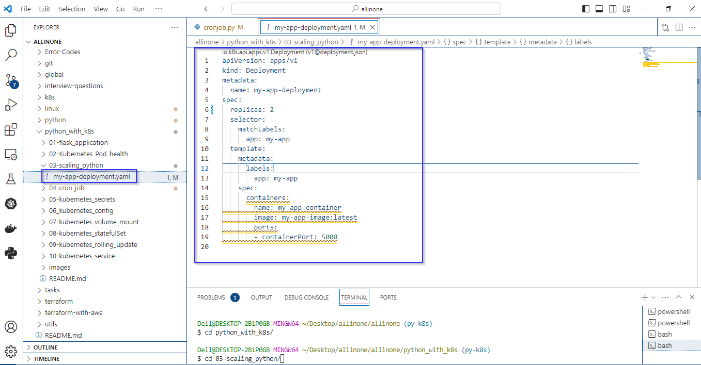
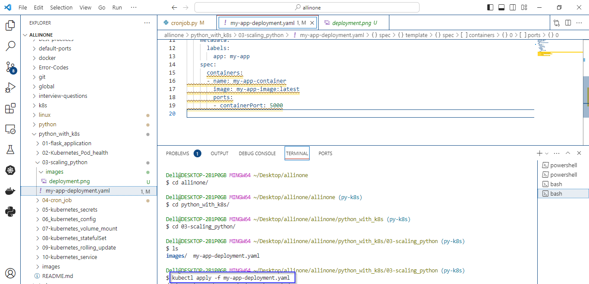
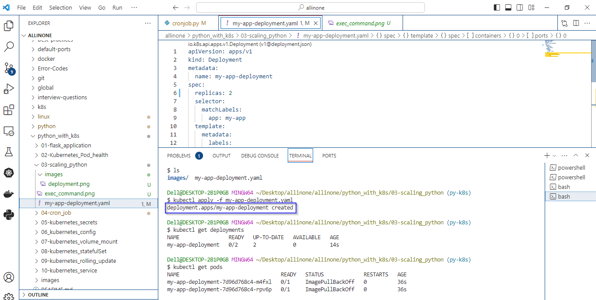

# Kubernetes Deployment 

### The provided YAML snippet represents a Kubernetes Deployment configuration.

# Introduction 

- In Kubernetes, a Deployment is an abstraction that defines a desired state for a set of pods. It allows you to declaratively manage the deployment and scaling of applications in a Kubernetes cluster. - Deployments enable you to describe the characteristics of your application, such as which container images to use, the number of replicas, and the way to update them.


# Pre-requistes

- Ensure you have a running Kubernetes cluster. You can use a local cluster like Docker Desktop for development, or a managed Kubernetes service like Azure Kubernetes Service (AKS) for production.
- Install the kubectl command-line tool, which is used to interact with the Kubernetes cluster. You can download it from the official Kubernetes website: Install kubectl.


# deployment.yaml

- apiVersion: Specifies the API version used for this Kubernetes resource.
- kind: Specifies the type of resource, which is a Deployment in this case.
- metadata: Contains metadata for the Deployment, including the name, which is set to "my-app-deployment."
- spec: Defines the desired state of the Deployment.
- template: Describes the pods that will be created by this Deployment.




# How to run ?

- ### To use this program, simply create a Yaml file called my-app-deployment.yaml and add the code to it .


- ### Open the Terminal and navigate to proper directory then run the following command .

   ```
   kubectl apply -f my-app-deployment.yaml
   ```




- ### As mentioned in the code. The expected output would be creation of deployment.





- ### To check whether the deployment has been created or not, just execute the command:

  ```
   kubectl get deployments
   ```
   
- ### To check no.of podes has been running, just execute the command:

  ```
   kubectl get pods
   ```  
# Description 

- The k8s deployment is written in Yaml configuration.
- This Deployment configuration is for a Kubernetes application named "my-app" with two replicas. 
- Each replica runs a container named "my-app-container" based on the "my-app-image:latest" image, exposing port 5000. 
- The selector ensures that the Deployment manages pods labeled with "app: my-app."


