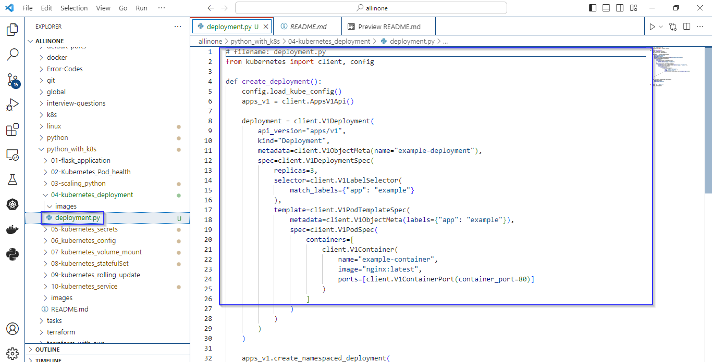
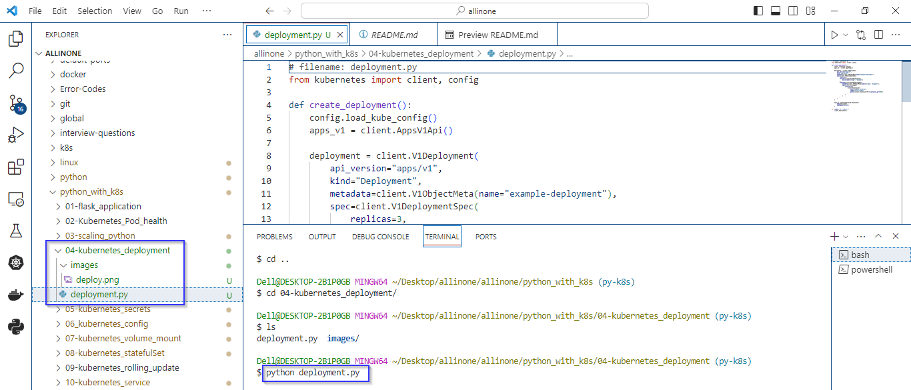
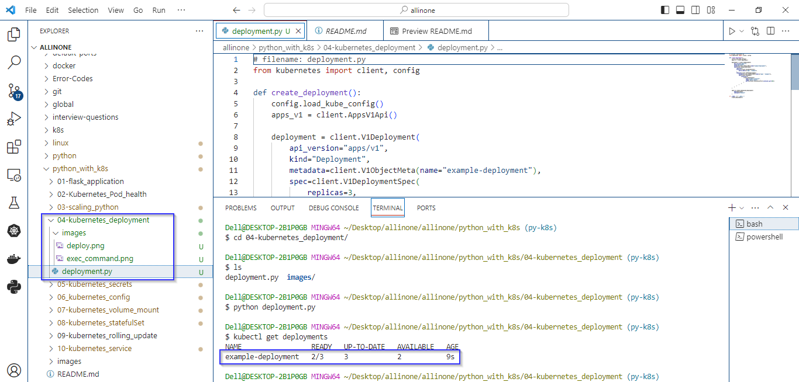
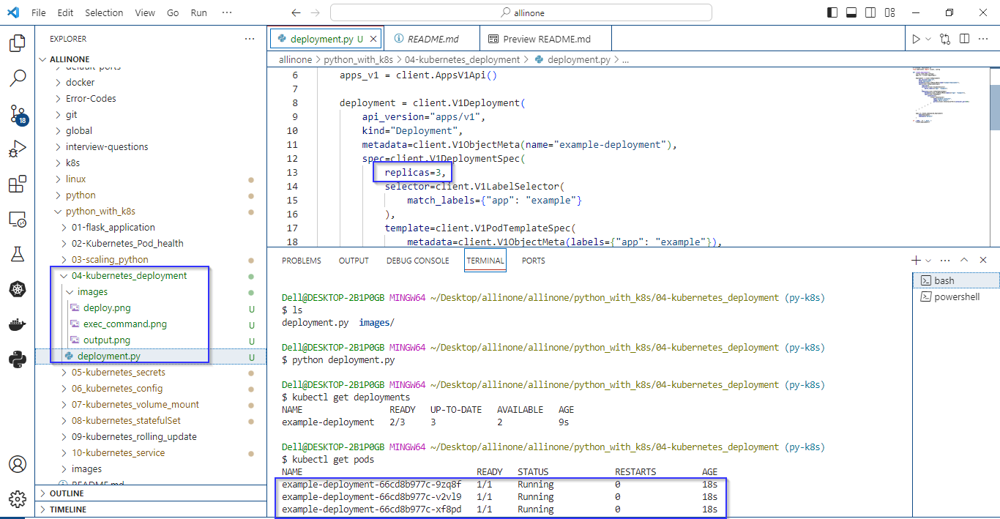

# Kubernetes Deployment

###  This Python script named deployment.py that uses the Kubernetes client library to create a Deployment.

# Introduction 

## what is kubernetes deployment ?

- In Kubernetes, a Deployment is a higher-level abstraction that enables declarative updates to applications. It provides a way to describe the desired state for an application or a set of replicas and manages the deployment and scaling of the application across the cluster.


# Pre-requistes

- Ensure you have a running Kubernetes cluster. You can use a local cluster like Docker Desktop for development, or a managed Kubernetes service like Azure Kubernetes Service (AKS) for production.
- Install the kubectl command-line tool, which is used to interact with the Kubernetes cluster. Configure kubectl to point to your Kubernetes cluster.
- Install the kubernetes Python library using the following command:

   ```
  pip install kubernetes
   ```


# deployment.py

- The script imports necessary modules from the Kubernetes client library and config to load the kubeconfig.
-  The function configures and creates a Kubernetes Deployment using the AppsV1Api.
- The create_deployment() function is called when the script is executed directly. It loads the kubeconfig and creates the Deployment.
- This script will create the specified Deployment in the "default" namespace of your Kubernetes cluster. 




# How to run ?

- ### To use this program, simply create a file called deployment.py and add the code to it .


- ### Open the Terminal and navigate to proper directory then run the following command .

   ```
   python deployment.py
   ```




- ### As mentioned in the code , the expected output would be creation of specified Deployment in the "default" namespace of your Kubernetes cluster.





- ### To check whether the deployment has been created or not, just execute the command:

  ```
   kubectl get deployments
   ```
   
- ### To check no.of podes has been running, just execute the command:

  ```
   kubectl get pods
   ```  

   

# Description 

- The core logic of the script is encapsulated within a function named create_deployment(). This function creates a Kubernetes Deployment using the AppsV1Api. 
- The script checks if it is being executed directly (not imported as a module) using the if __name__ == "__main__": block. If so, it calls the create_deployment() function.
-  The script, when executed, creates a Kubernetes Deployment named "example-deployment" with three replicas.
- The pods launched by this Deployment run an Nginx container, and each pod is labeled with app: example.
- The Deployment is created in the "default" namespace of the Kubernetes cluster.


