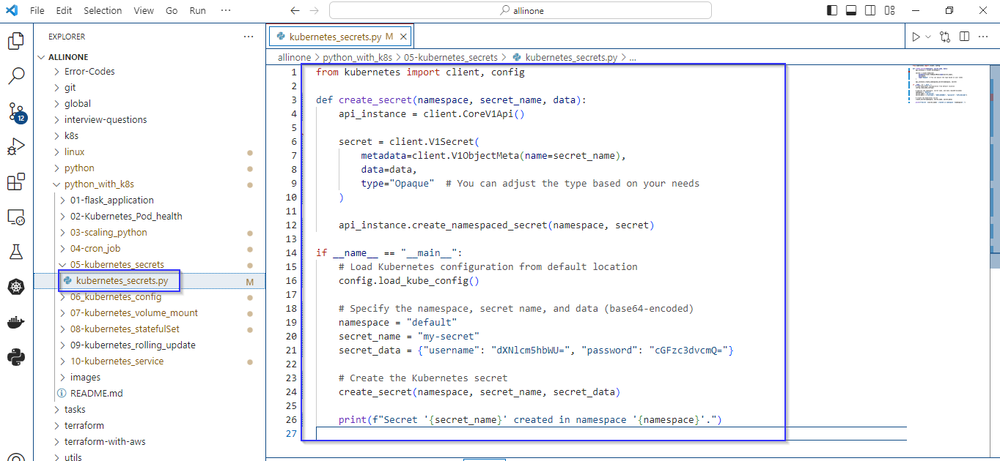
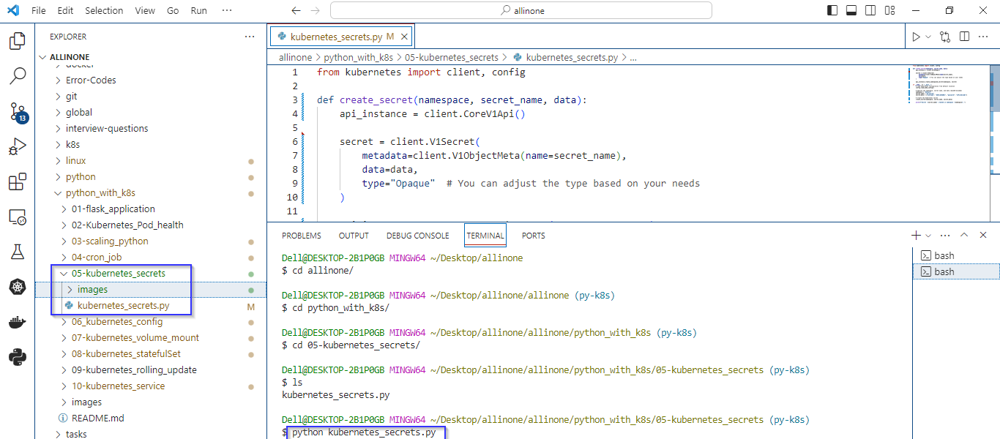
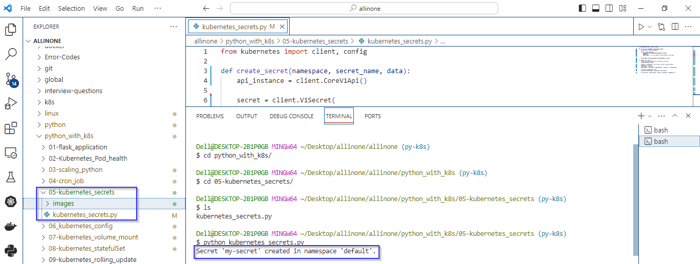
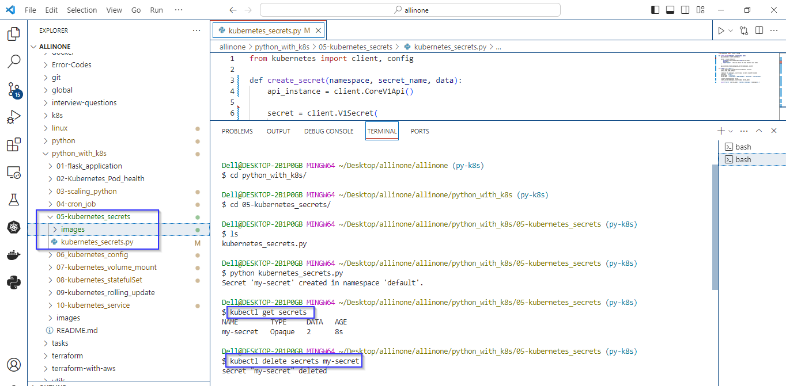

# Kubernetes Secrets

### The Python script uses the Kubernetes Python client to create a secret in a Kubernetes cluster. 

# Introduction 

## what is Secrets in k8s ?

- In Kubernetes, secrets are a way to store sensitive information, such as passwords, API keys, and other confidential data, securely within the cluster.
- Kubernetes secrets provide a mechanism for managing and distributing this sensitive information to pods in a secure manner.


# Pre-requistes

- Ensure that Python is installed on your system. 
- Ensure that pip is installed. pip is the package installer for Python. 

   ```
  pip --version
   ```
- Install the kubernetes Python library, which is used to interact with the Kubernetes API. 

  ```
  pip install kubernetes
   ```
- Ensure that kubectl is installed on your machine. kubectl is the command-line tool for interacting with a Kubernetes cluster. 
- Ensure that your kubectl context is set to the correct cluster and user. You can switch contexts using:

 ```
  kubectl config use-context your-context
   ```
   [Replace your-context with the appropriate context name.]


# k8s_secrets.py

- It imports the necessary modules from the Kubernetes Python client, including the client and configuration modules.
- It defines a function create_secret that takes a namespace, secret name, and data (base64-encoded key-value pairs).
- It uses the Kubernetes Python client to create a secret in the specified namespace.
- It then specifies the namespace, secret name, and base64-encoded data for the secret. Finally, it calls the create_secret function to create the secret and prints a confirmation message.


# How to run ?

- ### To use this program, simply create a file called kubernetes_secrets.py and add the code to it .




- ### Open the Terminal and navigate to proper directory then run the following command .

   ```
   python kubernetes_secrets.py
   ```




- ### As mentioned in the code , the expected output would be creation of Kubernetes secret with the specified name and data in the default namespace





- ### To check whether the secret has been created or not, just execute the command:

  ```
   kubectl get secrets
   ```
   
- ### To delete the secrets from cluster, just execute the command:

  ```
   kubectl delete secrets secret_name
   ```  

   

# Description 

- It loads the Kubernetes configuration from the default location using config.load_kube_config().
- It specifies the namespace, secret name, and base64-encoded data for the secret.
- It calls the create_secret function to create the secret in the specified namespace.
- When you run the script, it will print the message indicating that the secret has been created. 
- This message informs you that the secret named my-secret has been successfully created in the default namespace. 


