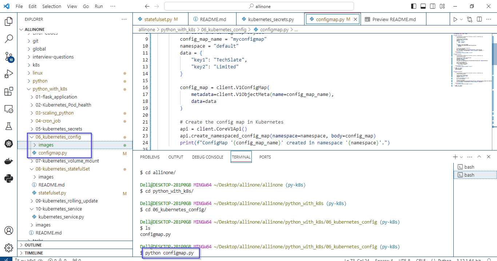

# Kubernetes ConfigMap

### This Python script performs  basic CRUD (Create, Read, Update, Delete) operations on a Kubernetes ConfigMap.

# Introduction 

## what is ConfigMap ?

-  A ConfigMap in Kubernetes is a way to store configuration data separate from your application code. - It allows you to define key-value pairs of settings or parameters that your applications might need. These settings could include database connection strings, API endpoints, or any other configuration details.
- ConfigMaps help keep your configuration external to your application, making it easier to manage, update, and share settings across different parts of your application or between different environments.

# Pre-requistes

-  Ensure you have a running Kubernetes cluster. You can use a local cluster like Docker Desktop for development, or a managed Kubernetes service like Azure Kubernetes Service (AKS) for production.
- Install the kubectl command-line tool, which is used to interact with the Kubernetes cluster. Configure kubectl to point to your Kubernetes cluster.
- Install the kubernetes Python library using the following command:

   ```
  pip install kubernetes
   ```


# How to run ?

- ### To use this program, simply create a file called configmap.py and add the code to it .


- ### Open the Terminal and navigate to proper directory then run the following command .

   ```
   python configmap.py
   ```




- ### As mentioned in the code. The expected output would be creating and deleting the configmap in default namespace.


# Description 

- Creates a ConfigMap named "myconfigmap" in the "default" namespace with the data:
"key1": "TechSlate"
"key2": "Limited"
- Reads the content of the ConfigMap named "myconfigmap" in the "default" namespace. Accesses and prints the key-value pairs in the ConfigMap.
- Deletes the ConfigMap named "myconfigmap" in the "default" namespace. Prints a message indicating the successful deletion of the ConfigMap. 

# Note
- You might need appropriate permissions to perform these operations in the specified namespace.


