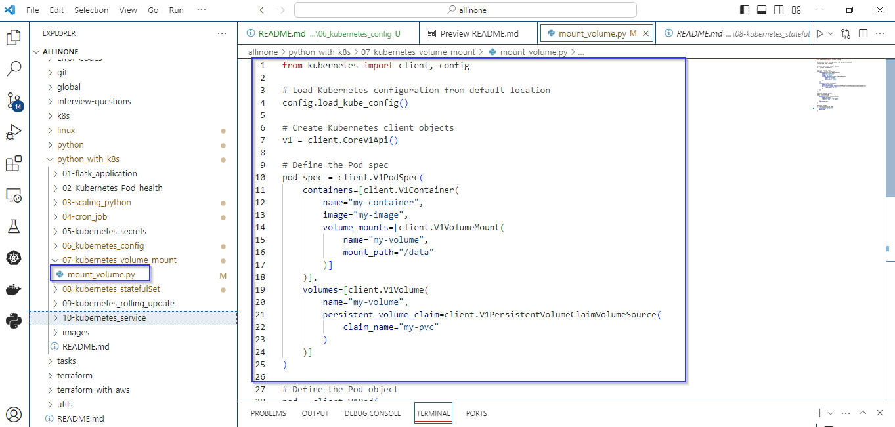
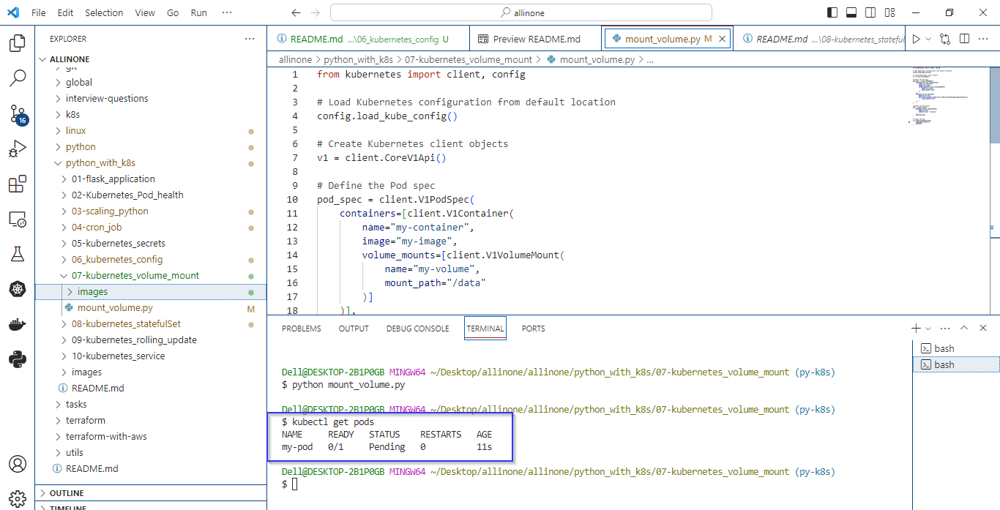

# Kubernetes Pod with a Persistent Volume Claim

### The script uses the kubernetes library in Python to create a Kubernetes Pod with a Persistent Volume Claim (PVC).

# Introduction 

## what is PersistentVolumeClaim (PVC) ?

- In Kubernetes, a PersistentVolumeClaim (PVC) is a resource object used to request storage in a cluster. It is part of the Persistent Volumes (PV) subsystem, which provides a way for applications to request and consume persistent storage.


# Pre-requistes

- Ensure you have a running Kubernetes cluster. You can use a local cluster like Docker Desktop for development, or a managed Kubernetes service like Azure Kubernetes Service (AKS) for production.
- Install the kubectl command-line tool, which is used to interact with the Kubernetes cluster. Configure kubectl to point to your Kubernetes cluster.
- Install the kubernetes Python library using the following command:

   ```
  pip install kubernetes
   ```


# mount_volume.py

- The script essentially automates the creation of a Kubernetes Pod.
- The Pod includes a container (my-container) based on the Docker image my-image.
- The container is mounted to a volume (my-volume) at the path /data.
- The volume is backed by a Persistent Volume Claim (PVC) named my-pvc.
- The Pod is labeled with "app: my-app".


# How to run ?

- ### To use this program, simply create a file called mount_volume.py and add the code to it .




- ### Open the Terminal and navigate to proper directory then run the following command .

   ```
   python mount_volume.py
   ```


- ### As mentioned in the code , the expected output would be creation of pod.





# Description 

- The script uses the kubernetes library in Python to create a Kubernetes Pod with a Persistent Volume Claim (PVC).
- After running the script, you can use kubectl commands to verify the existence and status of the created Pod in your Kubernetes cluster.
For example, you can use:

   ```
   kubectl get pods
  ```

- Make sure that the necessary resources (such as the specified Docker image and PersistentVolumeClaim) are available in your Kubernetes cluster before running the script.

