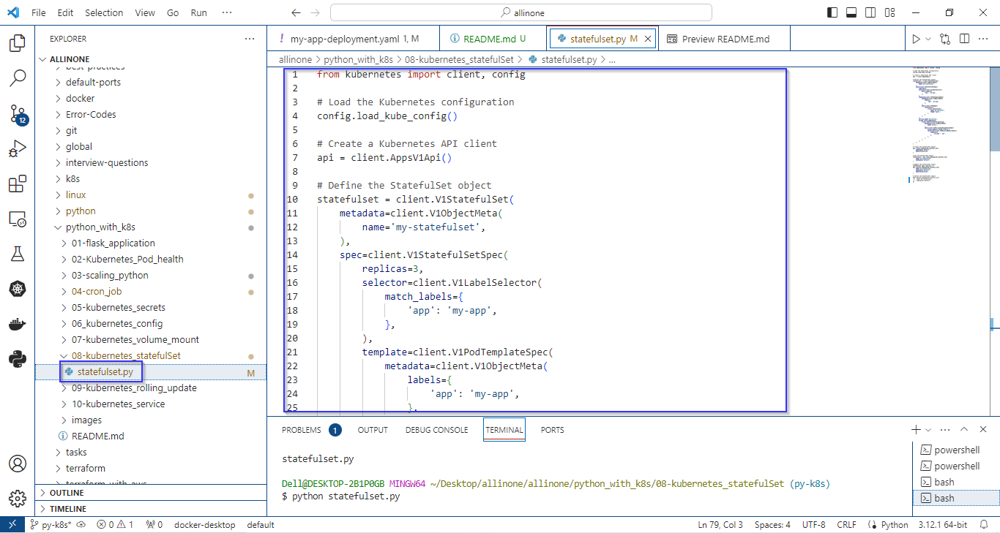
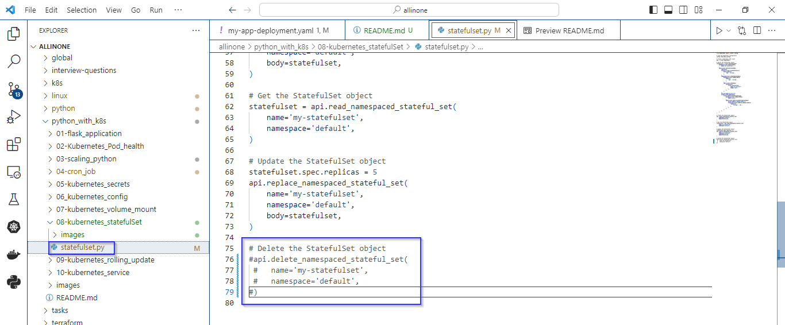
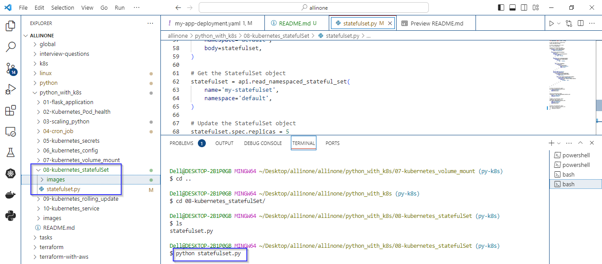
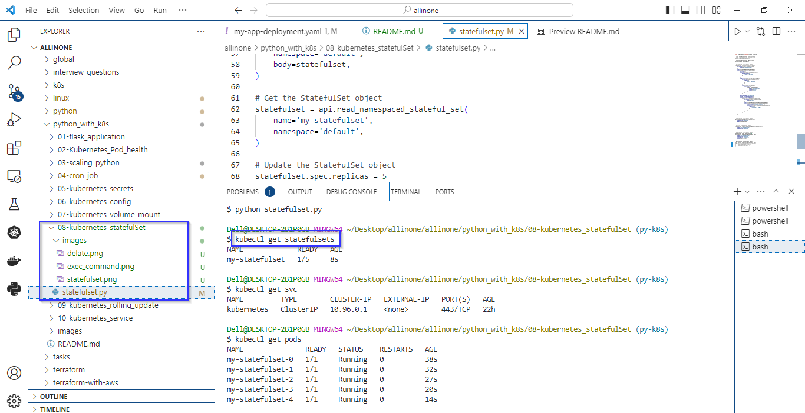
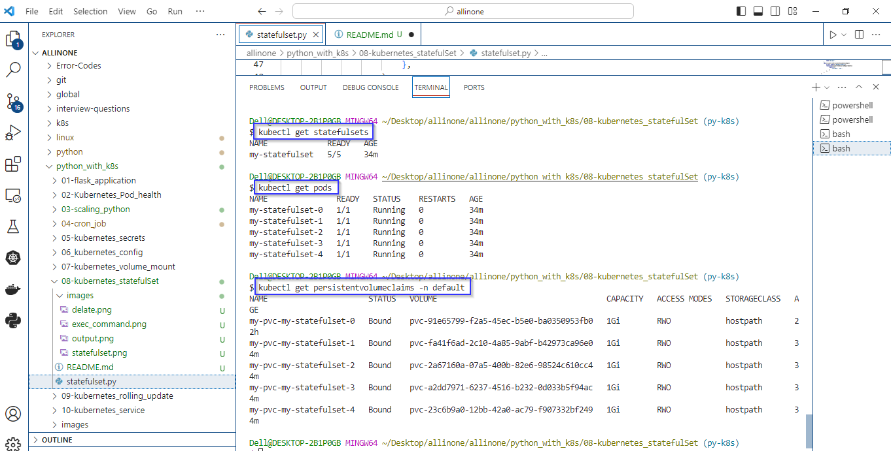

# Kubernetes StatefulSet 

### The provided Python script uses the Kubernetes Python client to interact with a Kubernetes cluster, create, read, update, and delete a StatefulSet named "my-statefulset." 

# Introduction 

-  A Kubernetes StatefulSet is a resource used to manage and deploy stateful applications in a predictable and orderly manner. Unlike a Deployment, which is well-suited for stateless applications, a StatefulSet is designed for applications that require stable network identities, persistent storage, and ordered deployment.


# Pre-requistes

- Ensure you have a running Kubernetes cluster. You can use a local cluster like Docker Desktop for development, or a managed Kubernetes service like Azure Kubernetes Service (AKS) for production.
- Install the kubectl command-line tool, which is used to interact with the Kubernetes cluster. You can download it from the official Kubernetes website: Install kubectl.


# statefulSet.yaml

- Creates a StatefulSet with 3 replicas, a pod template, a service named "my-service," and a persistent volume claim named "my-pvc."
- Reads the StatefulSet configuration, updates the number of replicas to 5, and replaces the existing StatefulSet configuration (commented out).
- Optionally, deletes the StatefulSet named "my-statefulset" from the "default" namespace (commented out).




# How to run ?

- ### To use this program, simply create a file called statefulset.py and add the code to it .


- ### Remember to comment the deletion block if you want to see the output of StatefulSet.




- ### Open the Terminal and navigate to proper directory then run the following command .

   ```
   python statefulset.py
   ```




- ### As mentioned in the code. The expected output would be creation of statefulset.





- ### To check whether the statefulset has been created or not, just execute the command:

  ```
   kubectl get statefulsets
   ```
   
- ### To check no.of podes has been running, just execute the command:

  ```
   kubectl get pods
   ```  

- ### To check if a PersistentVolumeClaim (PVC) has been created in a Kubernetes cluster, you can use 

  ```
   kubectl get persistentvolumeclaims
   ```  



# Description 

- The script demonstrates the complete lifecycle of a StatefulSet, including creation, reading, updating, and deletion. 
- It's important to note that the deletion part is commented out, and if uncommented, it would delete the StatefulSet. Care should be taken when executing deletion commands, especially in a production environment. 
- Creates the StatefulSet in the "default" namespace by making a request to the Kubernetes API.
- Get StatefulSet retrieves the StatefulSet object to check its status or make modifications.
- Updates the number of replicas in the StatefulSet to 5 and then replaces the existing StatefulSet configuration with the modified one.
- Deletes the StatefulSet named "my-statefulset" from the "default" namespace.


