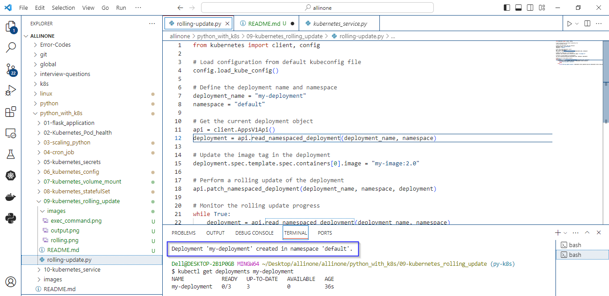
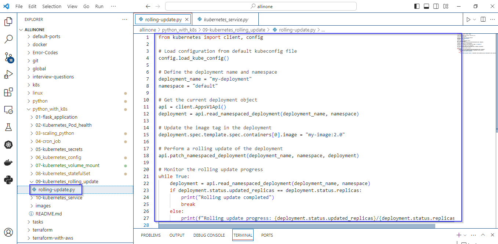
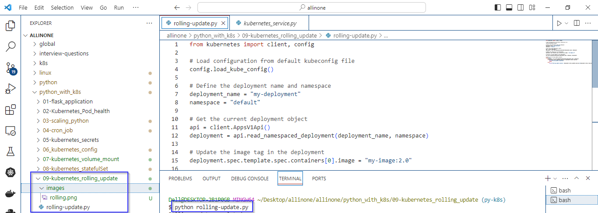
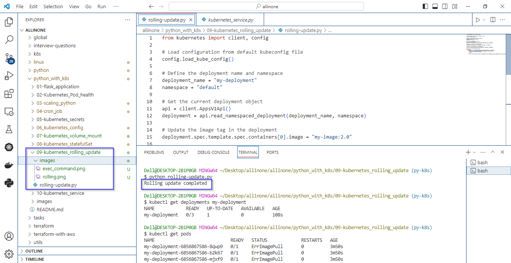

# Rolling Update

### The Python script demonstrates a rolling update for a Kubernetes Deployment using the kubernetes library.

# Introduction 

## what is Rolling Update ?

- A rolling update is a deployment strategy in Kubernetes (and other container orchestration systems) that allows updating a service or application with minimal downtime by gradually replacing instances of the old version with instances of the new version. This method ensures continuous availability of the application during the update process.


# Pre-requistes

- Ensure that you have a running Kubernetes cluster. This could be a local cluster, a cluster in the cloud AKS), or any other Kubernetes environment.
- Make sure you have kubectl installed and configured to point to your Kubernetes cluster. The script relies on the configuration provided by kubectl.
   ```
  kubectl version
   ```
- The script assumes that a Deployment named "my-deployment" already exists in the "default" namespace. Ensure that the deployment is created before running the rolling update script.



- The script updates the Docker image to "my-image:2.0". Ensure that this image exists in your container registry or is accessible by your Kubernetes cluster.
- Ensure that Python is installed on your system. The script uses the kubernetes library, which can be installed using:

  ```
  pip install kubernetes
   ```


# rolling-update.py

- Loads the Kubernetes configuration from the default kubeconfig file.
- Specifies the name of the deployment (my-deployment) and the namespace (default) where the deployment is located.
- Retrieves the current Deployment object using the read_namespaced_deployment method from the AppsV1Api.
- Updates the Docker image tag in the deployment to version 2.0.
- Initiates a rolling update of the deployment by using the patch_namespaced_deployment method.
- Enters a loop to monitor the progress of the rolling update. The script continuously checks if the number of updated replicas is equal to the total number of replicas. Once the update is complete, it prints a message and exits the loop.


# How to run ?

- ### To use this program, simply create a file called rolling-update.py and add the code to it .




- ### Open the Terminal and navigate to proper directory then run the following command .

   ```
   python rolling-update.py
   ```




- ### As mentioned in the code , the expected output would be update of deployment.





# Description 

- The script updates a Kubernetes Deployment named "my-deployment" in the "default" namespace by changing the Docker image tag to "my-image:2.0".
- It then performs a rolling update, continuously monitoring the progress until the update is completed.
- The rolling update strategy ensures minimal downtime by gradually replacing instances of the old version with instances of the new version, maintaining continuous availability of the application.


