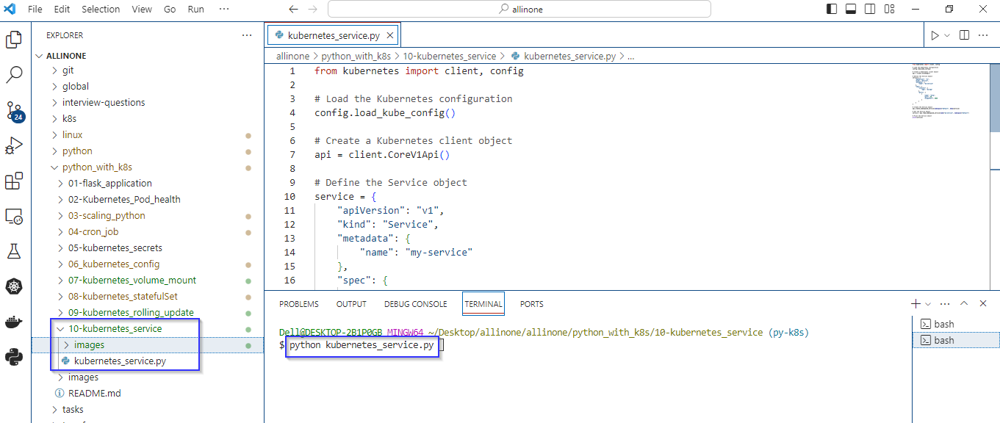
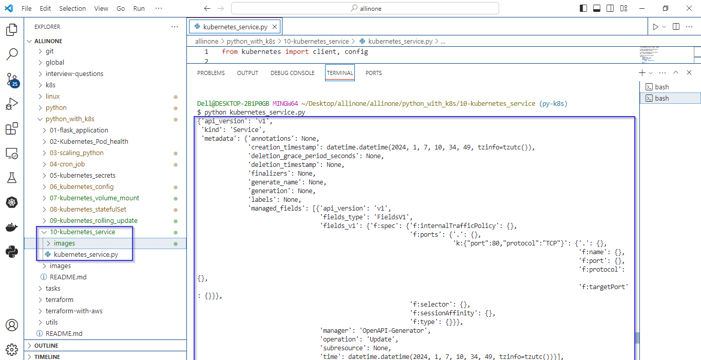
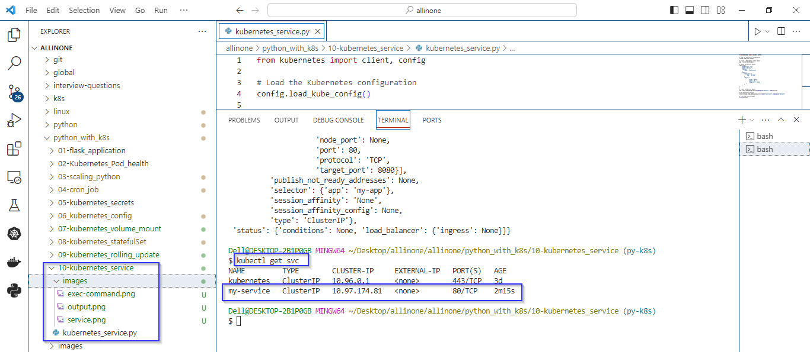

# Kubernetes Service

### The Python script utilizes the kubernetes library to interact with Kubernetes and create a Service object. 

# Introduction 

## what is Kubernetes Service ?

- In Kubernetes (K8s), a Service is an abstraction that provides a stable endpoint (IP address and port) to interact with a set of Pods. Services allow applications to be exposed to the network or other parts of the application while decoupling the application from the specifics of how the Pods are implemented or scaled.
- Types of Services:
    ClusterIP,
    NodePort,
    LoadBalancer,
    ExternalName.


# Pre-requistes

- Ensure that you have a running Kubernetes cluster. This could be a local cluster, a cluster in the cloud AKS), or any other Kubernetes environment.
- Make sure you have kubectl installed and configured to point to your Kubernetes cluster. The script relies on the configuration provided by kubectl.
   ```
  kubectl version
   ```
- Ensure that Python is installed on your machine.
- Install the kubernetes Python library. You can install it using pip:
   ```
  pip install kubernetes
   ```

# kubernetes_service.py

- The script begins by loading the Kubernetes configuration, allowing it to connect to the specified Kubernetes cluster.
- The script defines a Service object using a dictionary. This object represents a Kubernetes Service named "my-service" in the "default" namespace.
- The Service is configured to select Pods labeled with "app: my-app" and expose port 80 externally, directing traffic to port 8080 on the selected Pods.
- Creates the Service in the "default" namespace using the create_namespaced_service method.
- Retrieves the Service object with the name "m-service" from the "default" namespace using the read_namespaced_service method.


# How to run ?

- ### To use this program, simply create a file called kubernetes_service.py and add the code to it .


- ### Open the Terminal and navigate to proper directory then run the following command .

   ```
   python kubernetes_service.py
   ```




- ### As mentioned in the code , the expected output would be the details of the "my-service" Kubernetes Service object in the "default" namespace.



 ### To check whether the service has been created or not, just execute the command:

  ```
   kubectl get svc
   ```



# Description 

- The script creates a Kubernetes Service named "my-service" in the "default" namespace.
- The Service is configured to route traffic to Pods labeled with "app: my-app" on port 8080.
- After creating the Service, it retrieves and prints the details of the created Service object.


