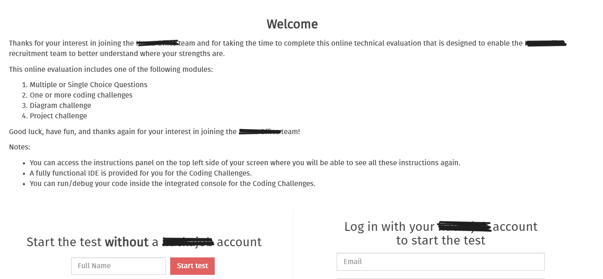
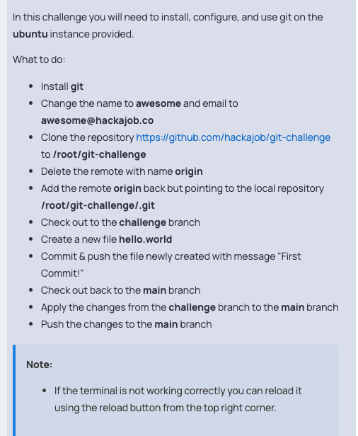
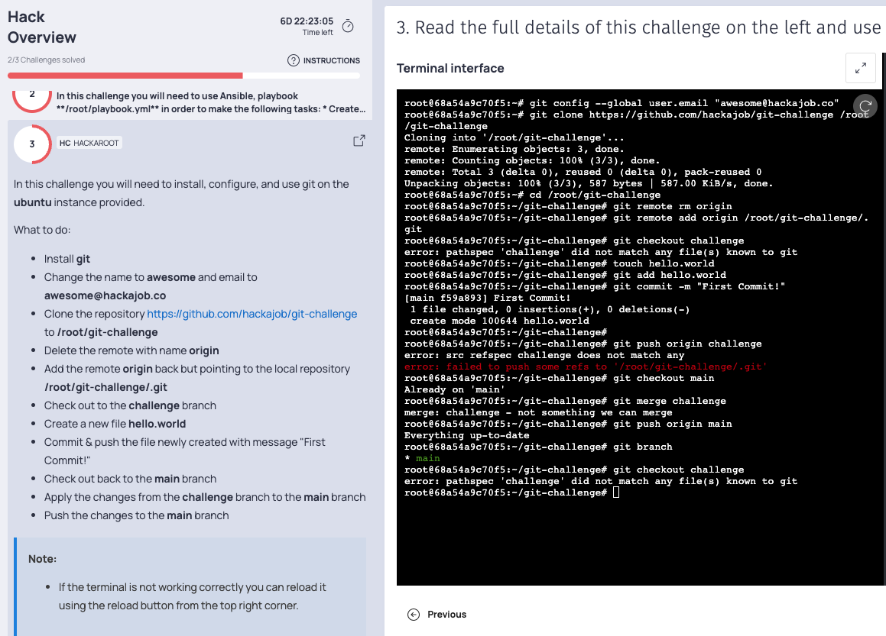
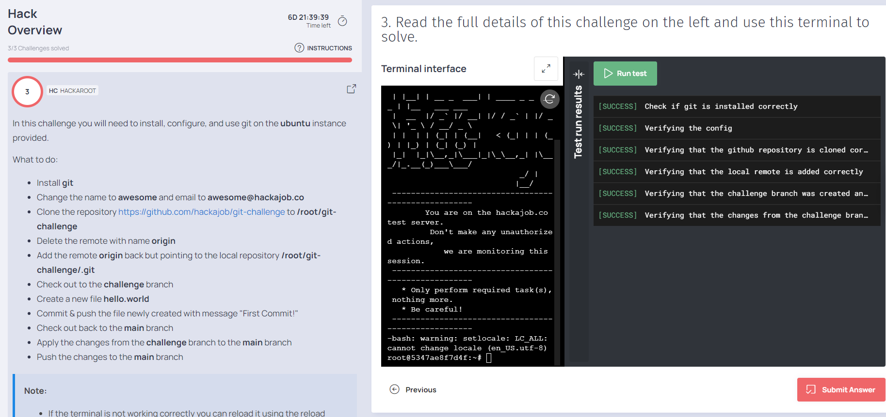

# Interview-Task-git-

# Table of contents

1.[overview](#**<overview>)

2.[Introduction](#**<Introduction>**)

3.[Test Instructions](#**<Test-Instructions>**)

4.[Task2](#**<Task2>**)

5.[solution](#**<solution>**)

## **Overview**

This represents a common initial stage in the interview process, involving an online test with various tasks to complete. The test requires candidates to execute predefined test cases. Once the assigned tasks are finished, candidates must run the provided test cases. If all test cases pass successfully, they can proceed to submit their results. In the event that any test case fails, candidates have the opportunity to make necessary adjustments before resubmitting. Attached are the test instructions, and screenshots for Task 2 have been included for clarity.

## **Introduction**

In a typical job interview process, the technical test is a crucial stage that evaluates a candidate's practical skills and knowledge relevant to the job position. This stage usually consists of a series of tests or exercises designed to assess the candidate's ability to solve technical problems and perform tasks that are directly related to the role they are applying for. Here is a test home screen instructions how it looks like.

## Test Instructions : 

Thanks for your interest in joining the team and for taking the time to complete this online technical evaluation that is designed to enable the recruitment team to better understand where your strengths are.
This online evaluation includes one of the following modules:
* Multiple or Single Choice Questions
* One or more coding challenges
* Diagram challenge
* Project challenge

Good luck, have fun, and thanks again for your interest in joining the team!

### Notes:

• You can access the instructions panel on the top left side of your screen where you will be able to see all these instructions again.

• A fully functional IDE is provided for you for the coding Challenges.

• You can run/debug your code inside the integrated console for the Coding Challenges.

### DESCRIPTION: 

To begin, kindly provide your login credentials, including your email address. Once this information is submitted, you will be prepared to initiate the test. In certain instances, practice tests may be available to help you familiarize yourself with the format of the actual test. When you are ready to commence the official examination, the timer will be activated, and you must complete the test within the allocated time frame before submitting your responses.



## TASK 2:

## git Task:

In this challenge you will need to install, configure, and use git on the ubuntu instance provided.

## Your task is to:

• Install git

• Change the name to awesome and email to awesome@hackajob.co

• Clone the repository https://github.com/hackajob/git-challenge
to /root/git-challenge

• Delete the remote with name origin

• Add the remote origin back but pointing to the local repository /root/git-challenge/.git

• Check out to the challenge branch

• Create a new file hello.world

• Commit & push the file newly created with message "First
Commit!*

• Check out back to the main branch

• Apply the changes from the challenge branch to the main branch

• Push the changes to the main branch



# **Solution**

## Install Git

**```sudo apt update```**

**```sudo apt install git```**

## Change Git configurations

**```git config --global user.name "awesome"```**

**```git config --global user.email "awesome@hackajob.co"```**

## Clone the repository

**```git clone https://github.com/hackajob/git-challenge /root/git-challenge```**

## Change directory to the cloned repository

**```cd /root/git-challenge```**

## Delete the remote named "origin"

**```git remote rm origin```**

## Add a new remote named "origin" pointing to the local repository

**```git remote add origin /root/git-challenge/.git```**

## Checkout to the challenge branch

**```git checkout challenge```**

## Create a new file hello.world

**```touch hello.world```**

## Add the file to the staging area

**```git add hello.world```**

## Commit the changes

**```git commit -m "First Commit!"```**

## Push the changes to the remote repository

**```git push origin challenge```**

## Checkout back to the main branch

**```git checkout main```**

## Merge changes from the challenge branch to the main branch

**```git merge challenge```**

## Push the changes to the main branch

**```git push origin main```**



