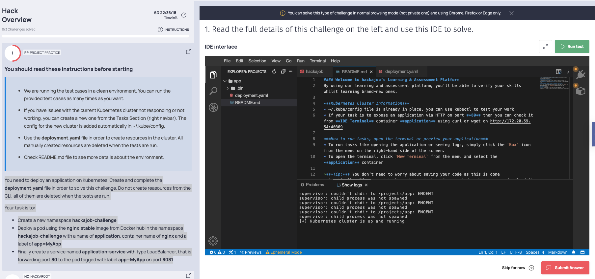
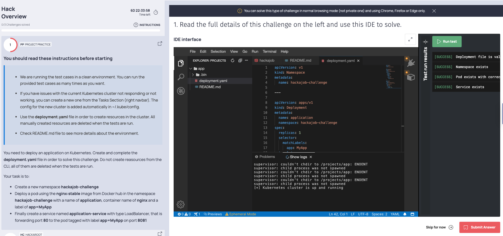

# Interview-Task-K8s-

# Table of contents

1.[overview](#**<overview>)

2.[Introduction](#**<Introduction>**)

3.[Test Instructions](#**<Test-Instructions>**)

4.[Task1](#**<Task1>**)

5.[deployment.yaml](#**<deployment.yaml>**)

## **Overview**

This represents a common initial stage in the interview process, involving an online test with various tasks to complete. The test requires candidates to execute predefined test cases. Once the assigned tasks are finished, candidates must run the provided test cases. If all test cases pass successfully, they can proceed to submit their results. In the event that any test case fails, candidates have the opportunity to make necessary adjustments before resubmitting. Attached are the test instructions, and screenshots for Task 1 have been included for clarity.

## **Introduction**

In a typical job interview process, the technical test is a crucial stage that evaluates a candidate's practical skills and knowledge relevant to the job position. This stage usually consists of a series of tests or exercises designed to assess the candidate's ability to solve technical problems and perform tasks that are directly related to the role they are applying for. Here is a test home screen instructions how it looks like.

## Test Instructions : 

Thanks for your interest in joining the team and for taking the time to complete this online technical evaluation that is designed to enable the recruitment team to better understand where your strengths are.
This online evaluation includes one of the following modules:
* Multiple or Single Choice Questions
* One or more coding challenges
* Diagram challenge
* Project challenge

Good luck, have fun, and thanks again for your interest in joining the team!

### Notes:

• You can access the instructions panel on the top left side of your screen where you will be able to see all these instructions again.

• A fully functional IDE is provided for you for the coding Challenges.

• You can run/debug your code inside the integrated console for the Coding Challenges.

### DESCRIPTION: 

To begin, kindly provide your login credentials, including your email address. Once this information is submitted, you will be prepared to initiate the test. In certain instances, practice tests may be available to help you familiarize yourself with the format of the actual test. When you are ready to commence the official examination, the timer will be activated, and you must complete the test within the allocated time frame before submitting your responses.


## TASK 1:

## Kubernetes Task:

You need to deploy an application on Kubernetes. Create and complete the deployment.yaml file in order to solve this challenge. Do not create reasources from the CLI, all of them are deleted when the tests are run.

## Your task is to:

* Create a new namespace hackajob-challenge

* Deploy a pod using the nginx:stable image from Docker hub in the namespace hackajob-challenge with a name of application, container name of nginx and a label 
  of app=MyApp 

* Finally create a service named application-service with type LoadBalancer, that is forwarding port 80 to the pod tagged with label app-MyApp on port 8081



### **Create deployment.yaml**

```
apiVersion: v1
kind: Namespace
metadata:
  name: hackajob-challenge
---
apiVersion: apps/v1
kind: Deployment
metadata:
  name: application
  namespace: hackajob-challenge
spec:
  selector:
    matchLabels:
      app: MyApp
  template:
    metadata:
      labels:
        app: MyApp
    spec:
      containers:
      - name: nginx
        image: nginx:stable
---
apiVersion: v1
kind: Service
metadata:
  name: application-service
  namespace: hackajob-challenge
spec:
  selector:
    app: MyApp
  ports:
  - protocol: TCP
    port: 80
    targetPort: 8081
  type: LoadBalancer
```
***

You can save this configuration in a file named deployment.yaml and then apply it to your Kubernetes cluster using the kubectl apply -f deployment.yaml command. This will create the specified namespace, deployment, and service as described in the challenge.

## COMMAND: 

 **```kubectl apply -f deployment.yaml```**

 