# <span style="color: Seagreen;">Introduction 

## <span style="color: lightpink;">**Terraform with env management**

In Terraform, environment management refers to the practice of organizing and managing multiple instances of infrastructure environments, such as development, staging, and production. This is typically done to ensure consistency, reproducibility, and isolation between different stages of the software development life cycle.

Environment management in Terraform involves creating separate configurations for each environment, allowing you to deploy and manage infrastructure with the same Terraform code across different stages. It helps prevent configuration drift, maintainability issues, and ensures that changes made in one environment do not impact others.


- **What is ``Amazon S3 Bucket``** ?

    Amazon S3 is a scalable and highly durable object storage service provided by Amazon Web Services (AWS). It is designed to store and retrieve any amount of data from anywhere on the web. S3 is widely used for various purposes, including data storage, backup, archival, content distribution, and hosting static websites.
    A bucket is the fundamental container in Amazon S3 for storing data. Each bucket has a globally unique name within the S3 namespace. 


- **What is ``AWS Lambda``** ?

    Amazon Lambda, commonly known as AWS Lambda, is a serverless computing service provided by Amazon Web Services (AWS). It enables you to run your code without provisioning or managing servers. AWS Lambda automatically scales and manages the infrastructure required to run your applications, allowing you to focus on writing code and building functionality.

- **What is ``AWS dynamodb``** ?
  
  Amazon DynamoDB is a fully managed NoSQL database service provided by Amazon Web Services (AWS). It is designed to provide fast and predictable performance with seamless scalability. DynamoDB is suitable for applications that require low-latency access to data and can scale horizontally to handle varying workloads. It supports key-value and document data models and offers features such as automatic scaling, built-in security, and backup and restore capabilities. DynamoDB is commonly used for web and mobile applications, gaming, IoT (Internet of Things), and other scenarios where high-performance and scalable database solutions are essential.


# <span style="color: lightpink;">Pre-requisites

- **An active AWS account.**
- **AWS CLI and Terraform installed on your machine.**
- **AWS IAM user with the necessary permissions and access key credentials.**
- **Run ``aws configure``** and give the respective ``Access Key`` and ``Secret Key`` .

# <span style="color: lightpink;"> Getting Started

# <span style="color: lightpink;"> Setup Environment Variables

```
export AWS_ACCESS_KEY_ID="VALUE_OF_ACCESS_KEY_ID"
export AWS_SECRET_ACCESS_KEY="VALUE_OF_SECRET_ACCESS_KEY"
export AWS_DEFAULT_REGION="VALUE_OF_DEFAULT_REGION"
```

- Run above command in bash shell to set Environment Variables


# <span style="color: lightpink;">Process

- **under env folder create 3 files i.e.,**

## `dev.tfvars`
```
env = "dev"

```

## `prod.tfvars`
```
env = "prod"
```

## `qa.tfvars`
```
env = "qa"
```

- **Open the `main.tf` file and edit the following variables as needed:**

## `main.tf`
```
resource "aws_s3_bucket" "bucket" {
  bucket        = local.bucket_name
  force_destroy = var.force_destroy
}

resource "aws_s3_bucket_public_access_block" "bucket" {
  bucket = aws_s3_bucket.bucket.id

  block_public_acls       = var.block_public_acls
  block_public_policy     = var.block_public_policy
  ignore_public_acls      = var.ignore_public_acls
  restrict_public_buckets = var.restrict_public_buckets
}
resource "aws_iam_role" "hello_lambda_exec" {
  name = local.lambda_name

  assume_role_policy = <<POLICY
{
  "Version": "2012-10-17",
  "Statement": [
    {
      "Effect": "Allow",
      "Principal": {
        "Service": "lambda.amazonaws.com"
      },
      "Action": "sts:AssumeRole"
    }
  ]
}
POLICY
}

resource "aws_iam_role_policy_attachment" "hello_lambda_policy" {
  role       = aws_iam_role.hello_lambda_exec.name
  policy_arn = "arn:aws:iam::aws:policy/service-role/AWSLambdaBasicExecutionRole"
}

resource "aws_lambda_function" "hello" {
  function_name = local.function_name

  s3_bucket = aws_s3_bucket.bucket.id
  s3_key    = aws_s3_object.lambda_hello.key

  runtime = "nodejs16.x"
  handler = "function.handler"
  role = aws_iam_role.hello_lambda_exec.arn
}

data "archive_file" "lambda_hello" {
  type = "zip"

  source_dir  = "../hello"
  output_path = "../hello.zip"
}

resource "aws_s3_object" "lambda_hello" {
  bucket = aws_s3_bucket.bucket.id

  key    = "hello.zip"
  source = data.archive_file.lambda_hello.output_path

  etag = filemd5(data.archive_file.lambda_hello.output_path)
}

resource "aws_dynamodb_table" "dynamodb" {
  name           = local.table_name
  billing_mode   = var.billing_mode
  read_capacity  = var.read_capacity
  write_capacity = var.write_capacity

  hash_key = "id"

  attribute {
    name = "id"
    type = "N"
  }

  ttl {
    attribute_name = "ttl"
    enabled        = false
  }
}

```
- **Open the `variables.tf` file and edit the following variables as needed:**


## `variables.tf`

```

variable "env" {
  type        = string
  description = "The environment in which the application is being deployed. For example, 'prod' or 'dev'."
  default     = "dev"
}

variable "s3_prefix" {
  type  = string
  default = "tech"
}

variable "bnst_prefix" {
  type  = string
  default = "4233"
}

variable "force_destroy" {
  description = "Destroy all objects in the S3 bucket when the bucket is destroyed"
  type        = bool
  default     = true
}

variable  "block_public_acls" {
  type        = bool
  default     = true
}

variable  "block_public_policy" {
  type        = bool
  default     = true
}

variable  "ignore_public_acls" {
  type        = bool
  default     = true
}

variable  "restrict_public_buckets" {
  type        = bool
  default     = true
}

variable "billing_mode" {
  description = "Billing mode for the DynamoDB table (PROVISIONED or PAY_PER_REQUEST)"
  type        = string
  default     = "PROVISIONED"  

}

variable "read_capacity" {
  description = "Read capacity for the DynamoDB table"
  type        = number
  default     = 5  
}

variable "write_capacity" {
  description = "Write capacity for the DynamoDB table"
  type        = number
  default     = 5  
}
```

- **Open the `outputs.tf` file and edit the following variables as needed:**


## `outputs.tf`

```
output "s3_bucket_name" {
  value = aws_s3_bucket.bucket.bucket
}
output "lambda_function_arn" {
  value = aws_lambda_function.hello.arn
}

output "table_name" {
  value = aws_dynamodb_table.dynamodb.name
}

```

- **Open the `local.tf` file and edit the following variables as needed:**


## `local.tf`

```
locals {
  org_name             = "ts"  
 bucket_name = "${local.org_name}-s3-234-${var.s3_prefix}-${var.env}-${var.bnst_prefix}"
 lambda_name = "${local.org_name}-lambda_123-${var.s3_prefix}-${var.env}-${var.bnst_prefix}"
 function_name = "${local.org_name}-lamfun_123-${var.s3_prefix}-${var.env}-${var.bnst_prefix}"
 table_name  = "${local.org_name}-dyna_123-${var.s3_prefix}-${var.env}-${var.bnst_prefix}"
}
```

- **Open the `provider.tf` file and edit the following variables as needed:**


## `provider.tf`

```
terraform {
  required_providers {
    aws = {
      source  = "hashicorp/aws"
      version = "~> 4.21.0"
    }
    random = {
      source  = "hashicorp/random"
      version = "~> 3.3.0"
    }
    archive = {
      source  = "hashicorp/archive"
      version = "~> 2.2.0"
    }
  }

  required_version = "~> 1.0"
}

provider "aws" {
  region = "us-east-1"
}

```

## `backend.tf`

```
terraform {
    backend "s3" {
        bucket = "bucket-state23"
        key = "global/mystatefile/terraform.tfstate"
        region ="us-east-1"
        encrypt = true
    }
}
```

## If you want to run the resources in ``dev`` Environment you can execute following steps with specfied environment path.

| Step    | command | Image |
|---------|-------------|-------|
| **Initialize**  | ``terraform init --var-file=./env/dev.tfvars`` |  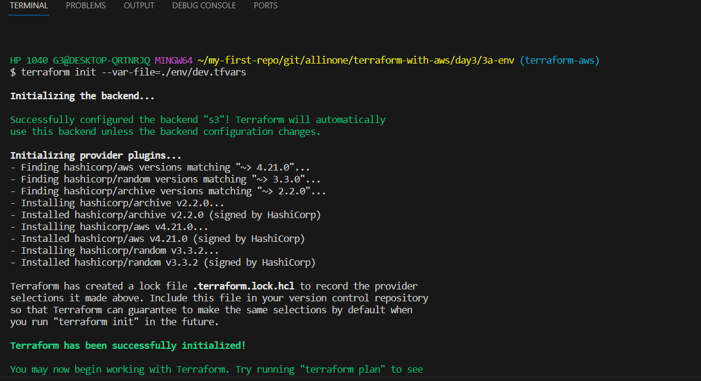 |
| **validate**   | ``terraform validate`` | 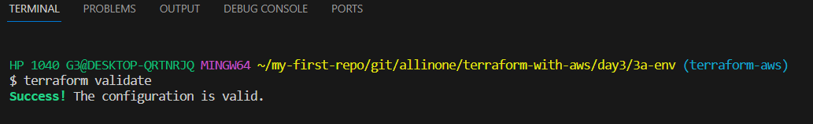 |
| **plan**  | ``terraform plan --var-file=./env/dev.tfvars`` |   |
| **apply**  | ``terraform apply --var-file=./env/dev.tfvars`` |  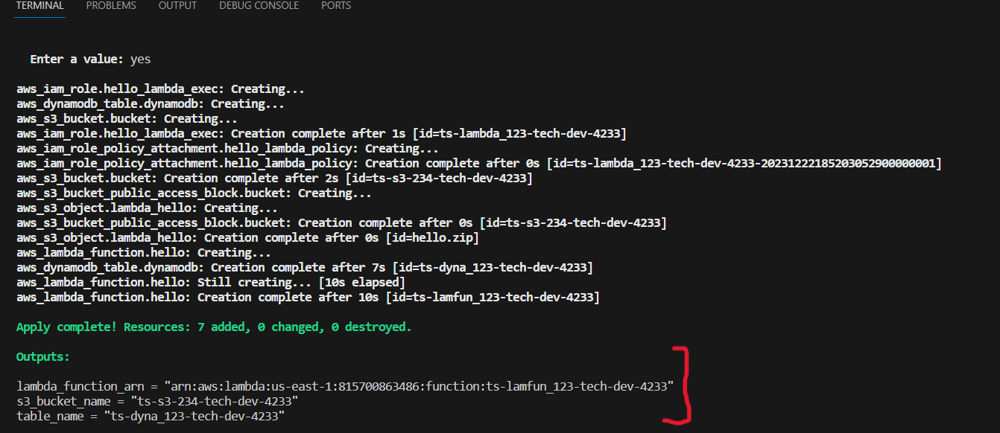 |

## we shall have a look how resources look in the console.

| ENV    | resource | Image |
|---------|-------------|-------|
| **dev** | ``s3``    |  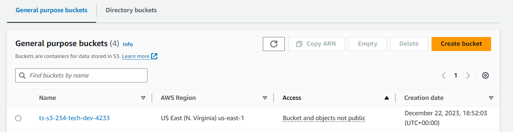 |
| **dev** | ``lambda`` |    |
| **dev** | ``dynamodb``|    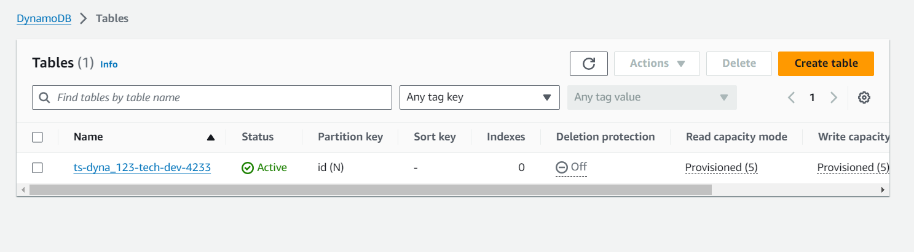 |  


## If you want to run the resources in ``prod`` Environment you can execute following steps with specfied environment path.

| Step    | command | Image |
|---------|-------------|-------|
| **Initialize**  | ``terraform init --var-file=./env/prod.tfvars`` |   |
| **validate**   | ``terraform validate`` | 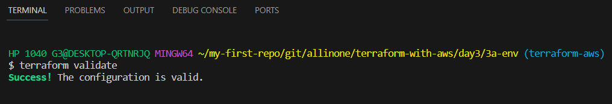 |
| **plan**  | ``terraform plan --var-file=./env/prod.tfvars`` |  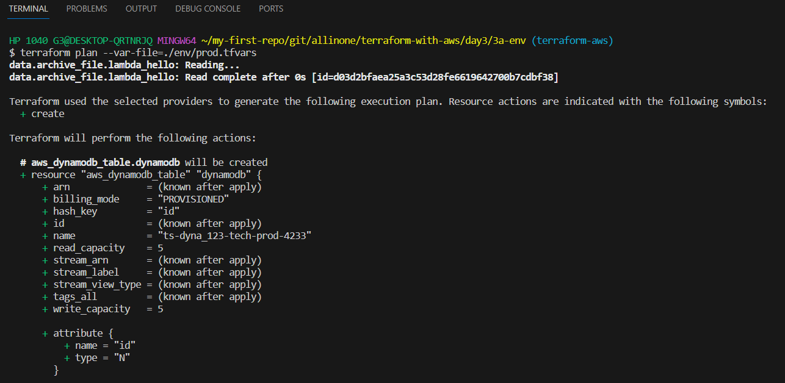 |
| **apply**  | ``terraform apply --var-file=./env/prod.tfvars`` |   |

## we shall have a look how resources look in the console.

| ENV    | resource | Image |
|---------|-------------|-------|
| **prod** | ``s3``    |  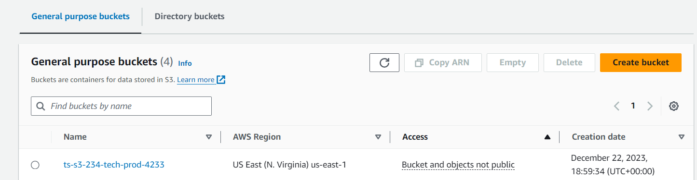 |
| **prod** | ``lambda`` |   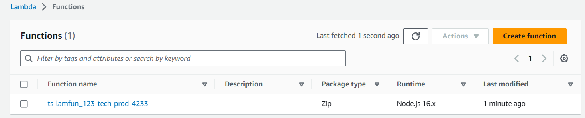 |
| **prod** | ``dynamodb``|     |  

## If you want to run the resources in ``qa`` Environment you can execute following steps with specfied environment path.

| Step    | command | Image |
|---------|-------------|-------|
| **Initialize**  | ``terraform init --var-file=./env/qa.tfvars`` |   |
| **validate**   | ``terraform validate`` |  |
| **plan**  | ``terraform plan --var-file=./env/qa.tfvars`` |  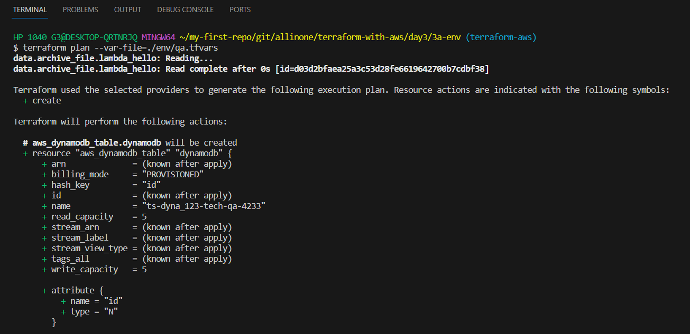 |
| **apply**  | ``terraform apply --var-file=./env/qa.tfvars`` |  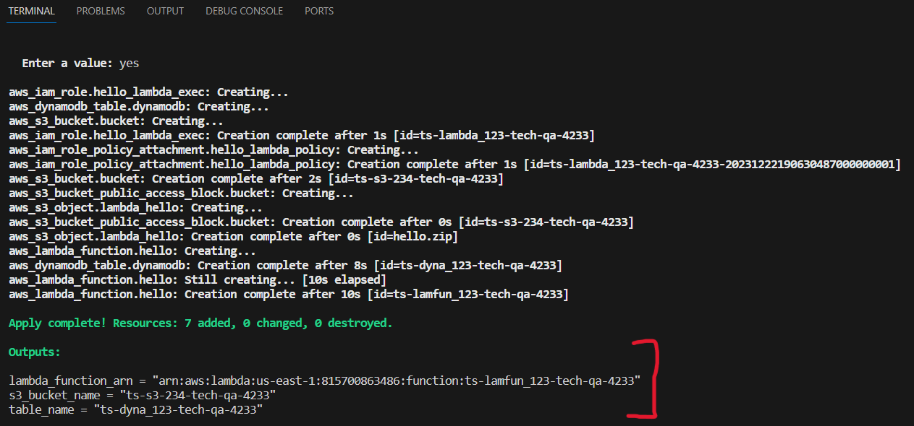 |

## we shall have a look how resources look in the console.

| ENV    | resource | Image |
|---------|-------------|-------|
| **qa** | ``s3``    |  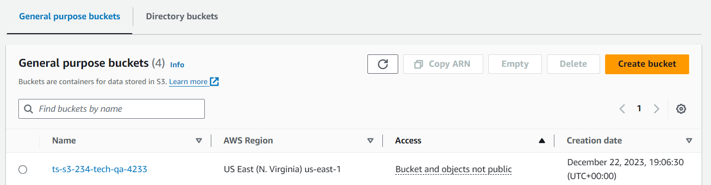 |
| **qa** | ``lambda`` |    |
| **qa** | ``dynamodb``|     |  

