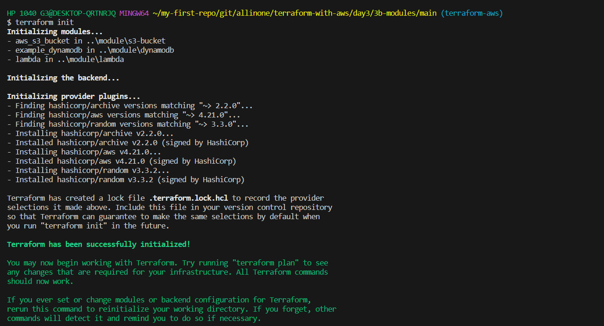
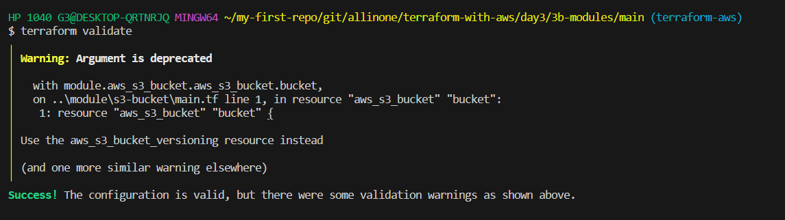
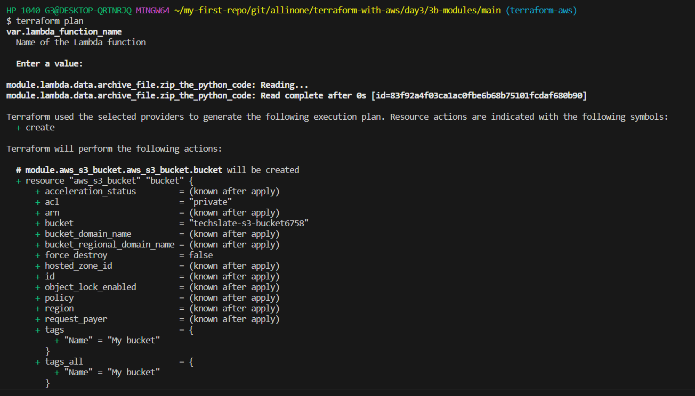
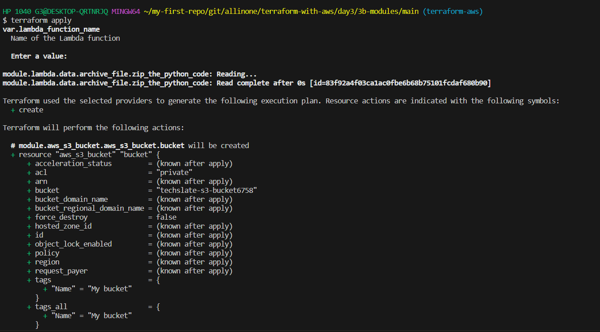
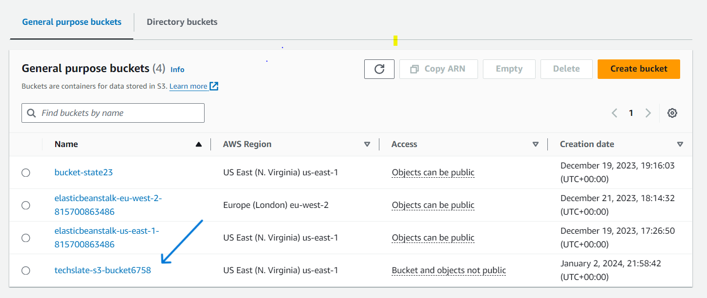
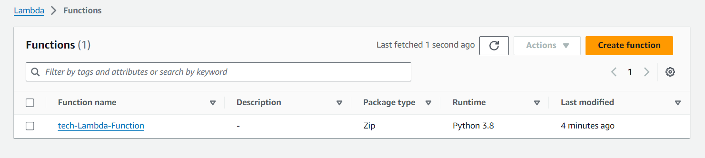
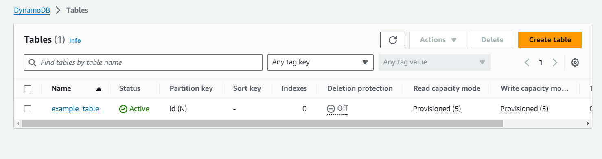

# <span style="color: lightpink;"> Introduction 

 Terraform modules are a way to organize and reuse Terraform code. They allow you to encapsulate a set of resources, configurations, and logic into a single, reusable unit. Modules help in maintaining a clean and modular infrastructure as your Terraform codebase grows.
 
 This is the terraform script to create s3-bucket, lambda, dynamodb using module

 - **What is ``Amazon S3 Bucket``** ?

    Amazon S3 is a scalable and highly durable object storage service provided by Amazon Web Services (AWS). It is designed to store and retrieve any amount of data from anywhere on the web. S3 is widely used for various purposes, including data storage, backup, archival, content distribution, and hosting static websites.
    A bucket is the fundamental container in Amazon S3 for storing data. Each bucket has a globally unique name within the S3 namespace. 

- **What is ``AWS Lambda``** ?

    Amazon Lambda, commonly known as AWS Lambda, is a serverless computing service provided by Amazon Web Services (AWS). It enables you to run your code without provisioning or managing servers. AWS Lambda automatically scales and manages the infrastructure required to run your applications, allowing you to focus on writing code and building functionality.

- **What is ``AWS dynamodb``** ?
  
  Amazon DynamoDB is a fully managed NoSQL database service provided by Amazon Web Services (AWS). It is designed to provide fast and predictable performance with seamless scalability. DynamoDB is suitable for applications that require low-latency access to data and can scale horizontally to handle varying workloads. It supports key-value and document data models and offers features such as automatic scaling, built-in security, and backup and restore capabilities. DynamoDB is commonly used for web and mobile applications, gaming, IoT (Internet of Things), and other scenarios where high-performance and scalable database solutions are essential.

# Folder Structure
 	
    main 
        main.tf -> which has main terraform scripts

        var.tf -> is having all the variables and default values

        provider.tf -> is having all the providers required
        
    modules  -> will have all the sub folders where respetive modules are written
     
     - dynamodb 

     - s3-bucket

     - lambda

# <span style="color: lightpink;">Pre-requisites

[Create an AWS account](../../../aws/aws-account-creation/README.md)

[Create a IAM user and create access keys](../../../aws/aws-user-creation/README.md)

**AWS CLI and Terraform installed on your machine.**

**Run ``aws configure``** and give the respective ``Access Key`` and ``Secret Key``

# <span style="color: lightpink;"> Getting Started

# <span style="color: lightpink;"> Setup Environment Variables

```
export AWS_ACCESS_KEY_ID="VALUE_OF_ACCESS_KEY_ID"
export AWS_SECRET_ACCESS_KEY="VALUE_OF_SECRET_ACCESS_KEY"
export AWS_DEFAULT_REGION="VALUE_OF_DEFAULT_REGION"
```

- Run above command in bash shell to set Environment Variables


# <span style="color: lightpink;">Process

# Terraform commands
    
- Run all the terraform commands from main folder
    
- No need to import/reference. With in the folder, terraform understands and reads all the .tf files

- ### Initialize

```
terraform init
```



- ### Validate

```
terraform validate
```


- ### Plan
    
```
terraform plan
```


- ### Apply

```
terraform apply
```


## After Apply , you can see resources getting created, Lets's direct to the AWS Console , and see whether the resources are reflecting one by one

### - **``S3 Bucket``**



### - **``AWS Lambda``** 



### - **``Dynamodb``**


