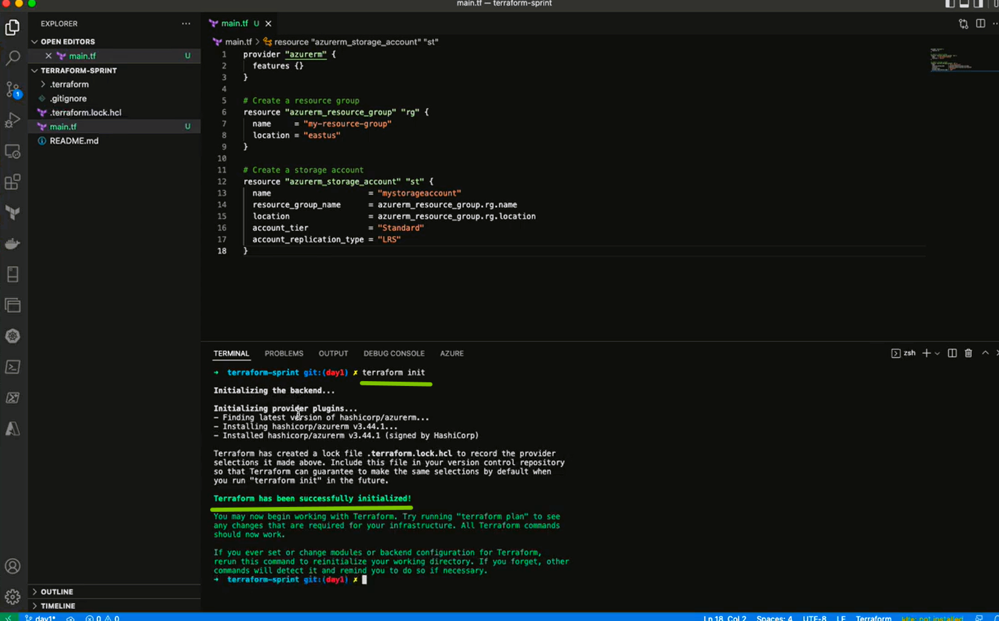
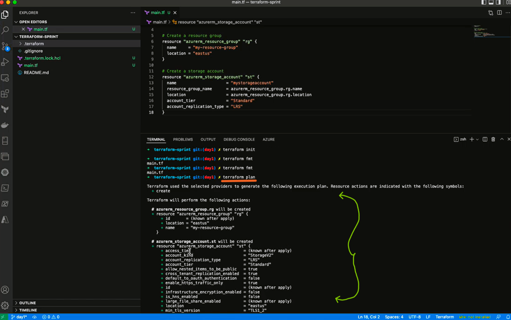
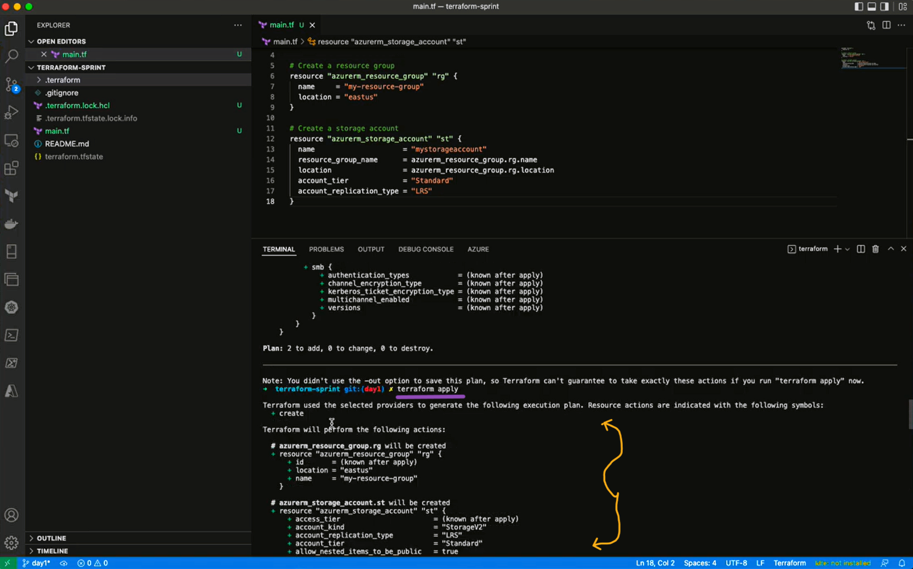
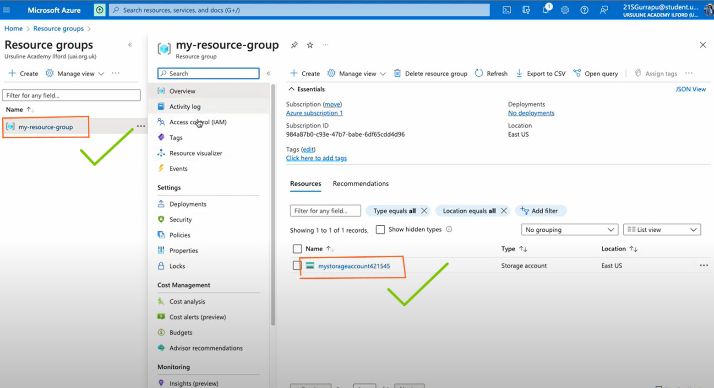
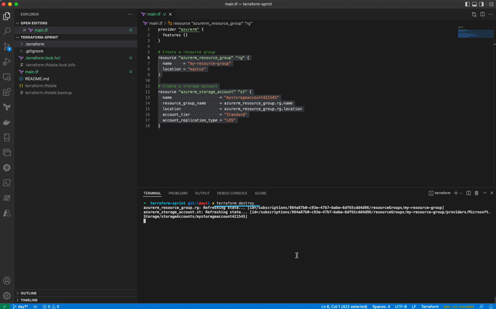
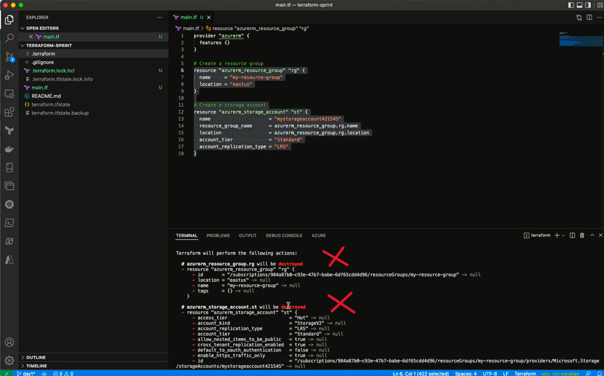

# Terraform Script: Create Azure Resource Group and Storage Account

This Terraform script creates an Azure resource group and storage account. The resource group provides a logical container for the storage account and other resources you may create in Azure. The storage account provides a durable and highly available location for storing data, such as files, blobs, and queues.

## Getting Started

To use this Terraform script, you'll need to have the following:

- An Active Azure subscription, with Azure CLI/PowerShell and Terraform Installed
- Service Prinicipal, with  CONTRIBUTOR access and export environment variables 

```
ARM_CLIENT_ID - The Azure Active Directory (AAD) client ID for authenticating to Azure.
ARM_CLIENT_SECRET - The AAD client secret for authenticating to Azure.
ARM_SUBSCRIPTION_ID - The subscription ID for the Azure subscription to use.
ARM_TENANT_ID - The AAD tenant ID for the Azure subscription.
```

### Setup Environment Variables in Windows

- Run this commands in bash shell

```
export ARM_TENANT_ID="VALUE_OF_TENANT_ID"
export ARM_SUBSCRIPTION_ID="VALUE_OF_SUBSCRIPTION_ID"
export ARM_CLIENT_ID="VALUE_OF_CLIENT_ID"
export ARM_CLIENT_SECRET="VALUE_OF_CLIENT_SECRET"
```

### Setup Environment Variables in Mac

```
export ARM_TENANT_ID="VALUE_OF_TENANT_ID"
export ARM_SUBSCRIPTION_ID="VALUE_OF_SUBSCRIPTION_ID"
export ARM_CLIENT_ID="VALUE_OF_CLIENT_ID"
export ARM_CLIENT_SECRET="VALUE_OF_CLIENT_SECRET"
```


## Usage

- Open the `main.tf` file and edit the following variables as needed:
- `name`: The name of the resource group and storage account to create.
- `location`: The location of the resource group and storage account. For example, "eastus".
- `account_tier`: The tier of the storage account. For example, "Standard".
- `account_replication_type`: The replication type of the storage account. For example, "LRS".

## main.tf

```
provider "azurerm" {
  features {}
}

# Create a resource group
resource "azurerm_resource_group" "rg" {
  name     = "my-resource-group"
  location = "eastus"
}

# Create a storage account
resource "azurerm_storage_account" "st" {
  name                     = "mystorageaccount"
  resource_group_name      = azurerm_resource_group.rg.name
  location                 = azurerm_resource_group.rg.location
  account_tier             = "Standard"
  account_replication_type = "LRS"
}

```


## Terraform Commands

- ### Initialize

```
terraform init
```


*** 

- ### Validate

```
terraform validate
```


- ### Plan

```
terraform plan
```


- ### Apply

```
terraform apply
```


- ## Now , you can go back to your portal and see if your Resource Group and Storage Account is created.




- ###  Destroy
```
terraform destroy
```




