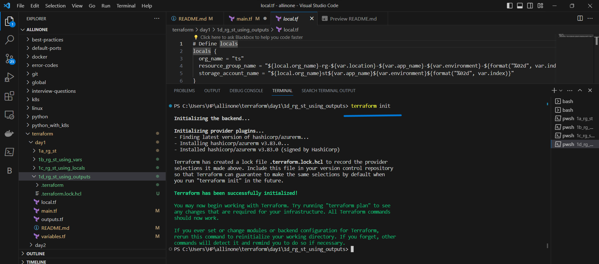
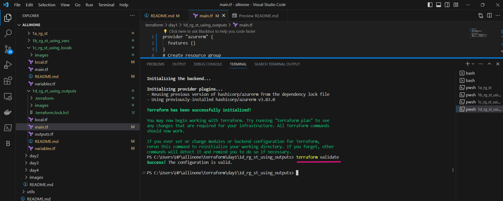
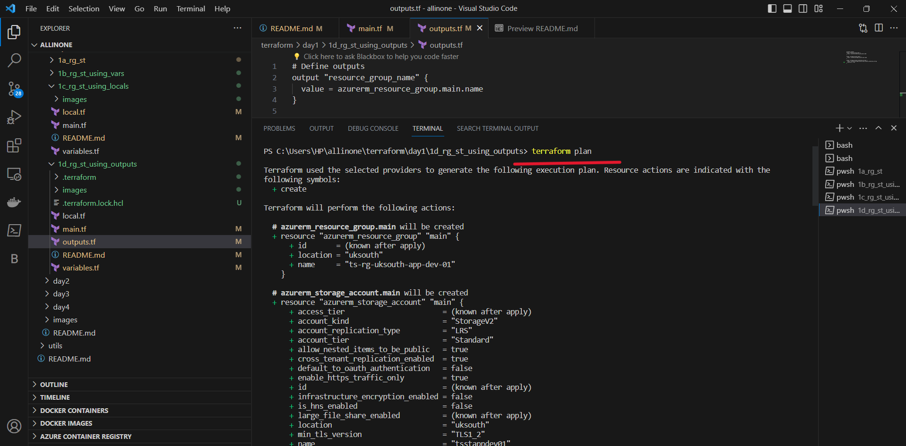
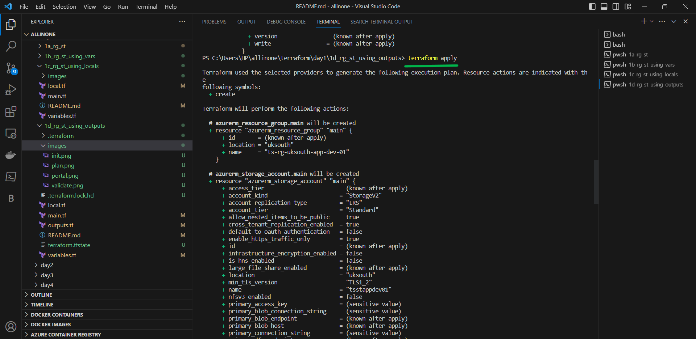
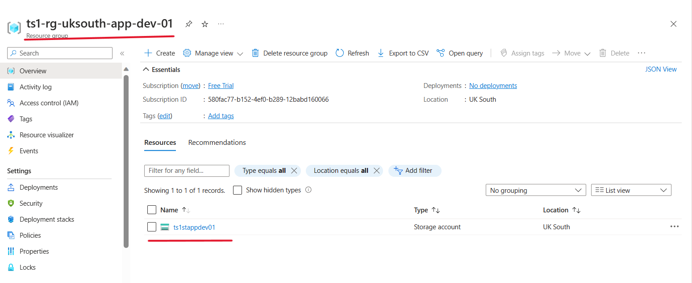

# Terraform Script: Create Azure Resource Group and Storage Account using Outputs

This Terraform script creates an Azure resource group and storage account. The resource group provides a logical container for the storage account and other resources you may create in Azure. The storage account provides a durable and highly available location for storing data, such as files, blobs, and queues.


## Getting Started 

To use this Terraform script, you'll need to have the following:

- An Active Azure subscription, with Azure CLI/PowerShell and Terraform Installed
- Service Prinicipal, with  CONTRIBUTOR access and export environment variables 

```
ARM_CLIENT_ID - The Azure Active Directory (AAD) client ID for authenticating to Azure.
ARM_CLIENT_SECRET - The AAD client secret for authenticating to Azure.
ARM_SUBSCRIPTION_ID - The subscription ID for the Azure subscription to use.
ARM_TENANT_ID - The AAD tenant ID for the Azure subscription.
```

### Setup Environment Variables in Windows

```
New-ItemProperty -Path "HKLM:\SYSTEM\CurrentControlSet\Control\Session Manager\Environment" -Name "ARM_TENANT_ID" -Value "VALUE_OF_TENANT_ID" -PropertyType String -Force
New-ItemProperty -Path "HKLM:\SYSTEM\CurrentControlSet\Control\Session Manager\Environment" -Name "ARM_SUBSCRIPTION_ID" -Value "VALUE_OF_SUBSCRIPTION_ID" -PropertyType String -Force
New-ItemProperty -Path "HKLM:\SYSTEM\CurrentControlSet\Control\Session Manager\Environment" -Name "ARM_CLIENT_ID" -Value "VALUE_OF_CLIENT_ID" -PropertyType String -Force
New-ItemProperty -Path "HKLM:\SYSTEM\CurrentControlSet\Control\Session Manager\Environment" -Name "ARM_CLIENT_SECRET" -Value "VALUE_OF_CLIENT_SECRET" -PropertyType String -Force
```

### Setup Environment Variables in Mac

```
export ARM_TENANT_ID="VALUE_OF_TENANT_ID"
export ARM_SUBSCRIPTION_ID="VALUE_OF_SUBSCRIPTION_ID"
export ARM_CLIENT_ID="VALUE_OF_CLIENT_ID"
export ARM_CLIENT_SECRET="VALUE_OF_CLIENT_SECRET"
```


## ( Already If you have created Environment variables please ignore , and move to the next step )


## Usage

- Open the `main.tf` file and edit the following variables as needed:

## `main.tf`
```
provider "azurerm" {
  features {}
}
# Create resource group
resource "azurerm_resource_group" "main" {
  name     = local.resource_group_name
  location = var.location
}

# Create storage account
resource "azurerm_storage_account" "main" {
  name                     = local.storage_account_name
  resource_group_name      = azurerm_resource_group.main.name
  location                 = var.location
  account_tier             = var.account_tier
  account_replication_type = var.account_replication_type
}
```
- Open the `variables.tf` file and edit the following variables as needed:


## `variables.tf`

```
variable "resource_group_name" {
  type        = string
  description = "The name of the resource group to create."
  default     = "example-rg"
}

variable "location" {
  type        = string
  description = "The location of the resource group and storage account. For example, 'eastus'."
  default     = "eastus"
}

variable "storage_account_name" {
  type        = string
  description = "The name of the storage account to create."
  default     = "examplestorageaccount"
}

variable "account_tier" {
  type        = string
  description = "The tier of the storage account. For example, 'Standard'."
  default     = "Standard"
}

variable "account_replication_type" {
  type        = string
  description = "The replication type of the storage account. For example, 'LRS'."
  default     = "LRS"
}
```
- Open the `local.tf` file and edit the following variables as needed:

## `local.tf`

```
locals {
  org_name = "ts"  
  resource_group_name = "${local.org_name}-rg-${var.location}-${var.app_name}-${var.environment}-${format("%02d", var.index)}"
  storage_account_name = "${local.org_name}st${var.app_name}${var.environment}${format("%02d", var.index)}"
}

```
- Open the `outputs.tf` file and edit the following variables as needed:


## `outpits.tf`

```
output "resource_group_name" {
  value = azurerm_resource_group.main.name
}

output "storage_account_name" {
  value = azurerm_storage_account.main.name
}

output "storage_account_connection_string" {
  value = azurerm_storage_account.main.primary_connection_string
  sensitive = true
}
```


# Terraform Commands

- ### Initialize

```
terraform init
``` 


- ### Validate

```
terraform validate
```


- ### Plan

```
terraform plan
```


- ### Apply

```
terraform apply
```


- ### Lets check the portal , we can see that resources got created.




