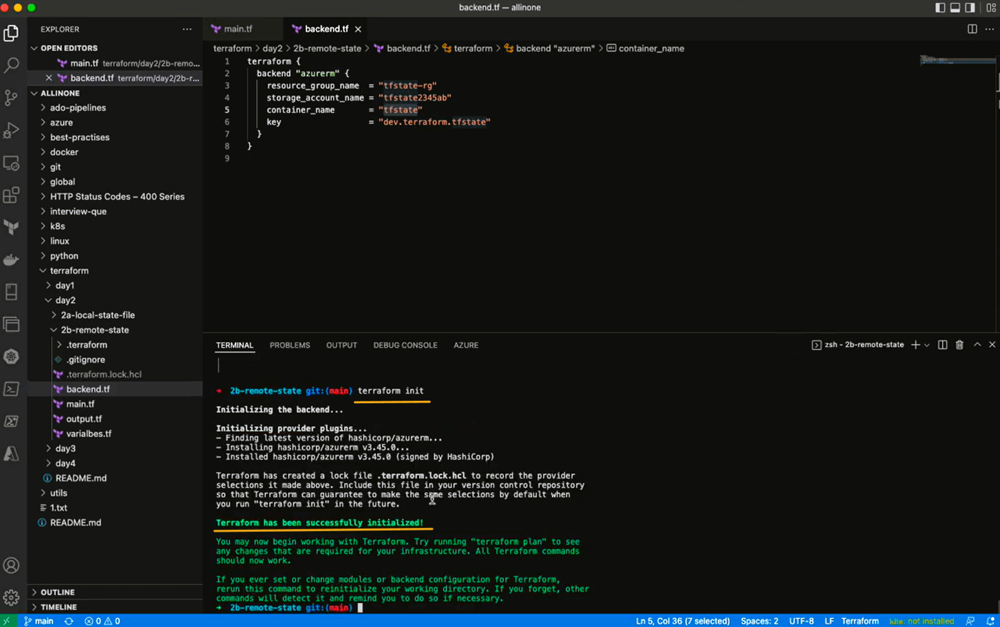
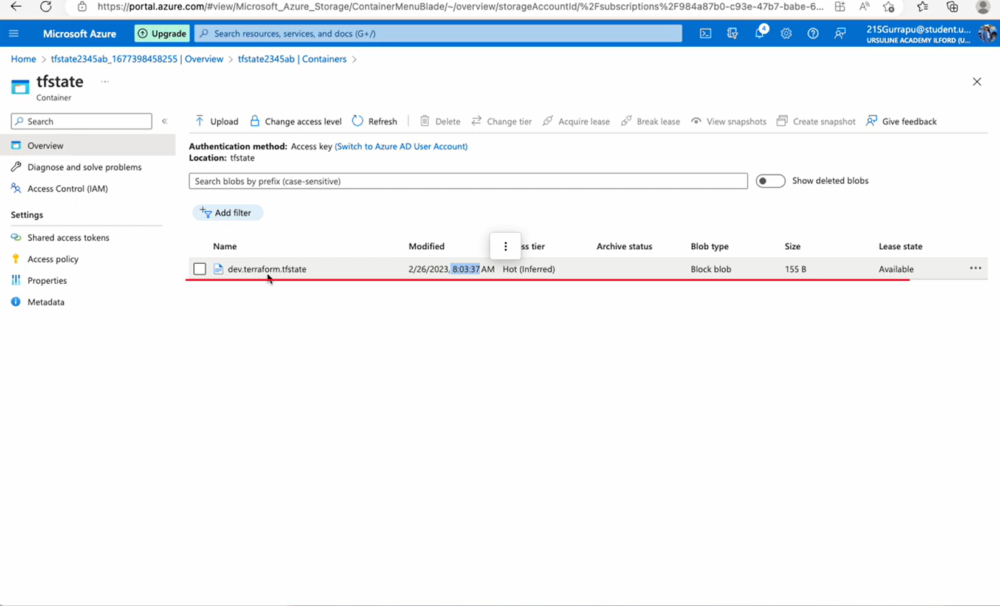
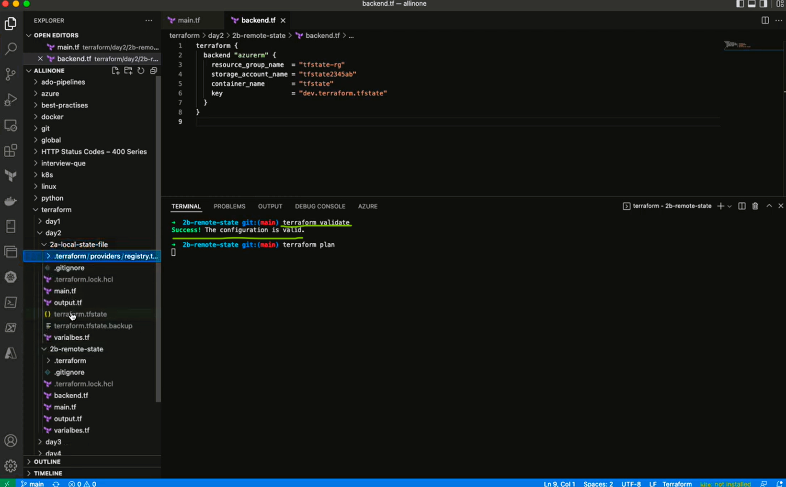
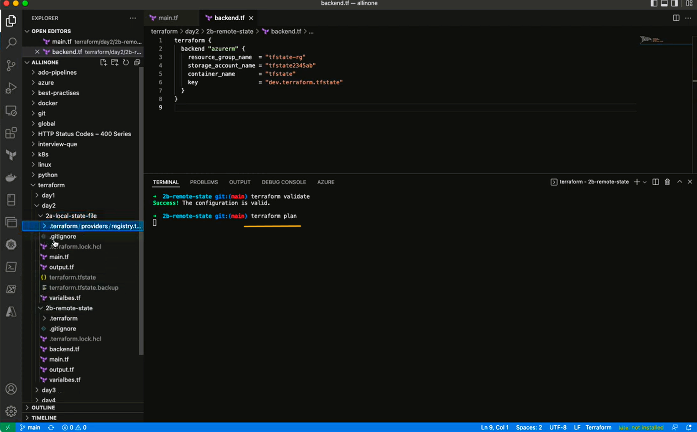
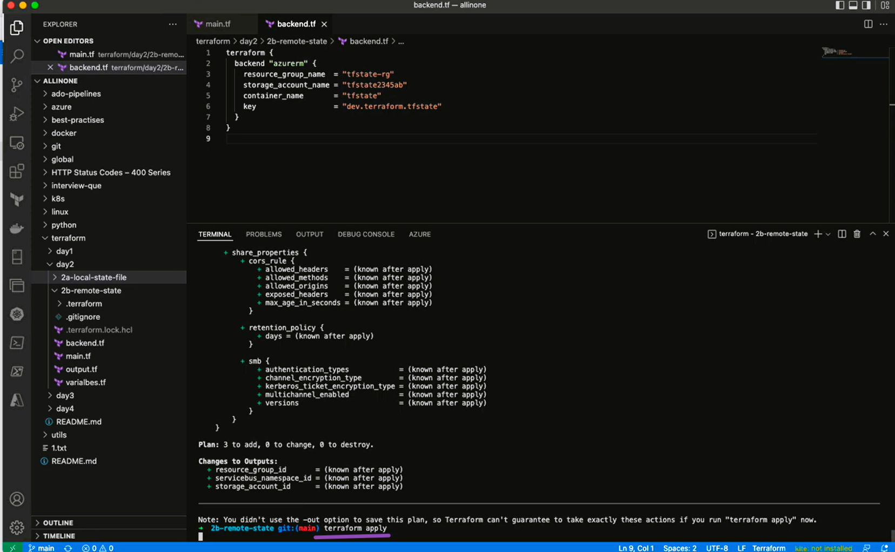
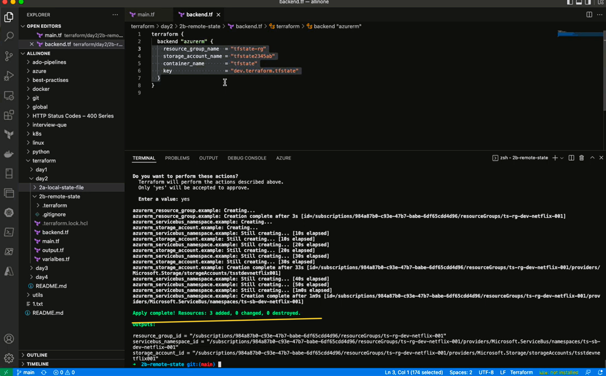
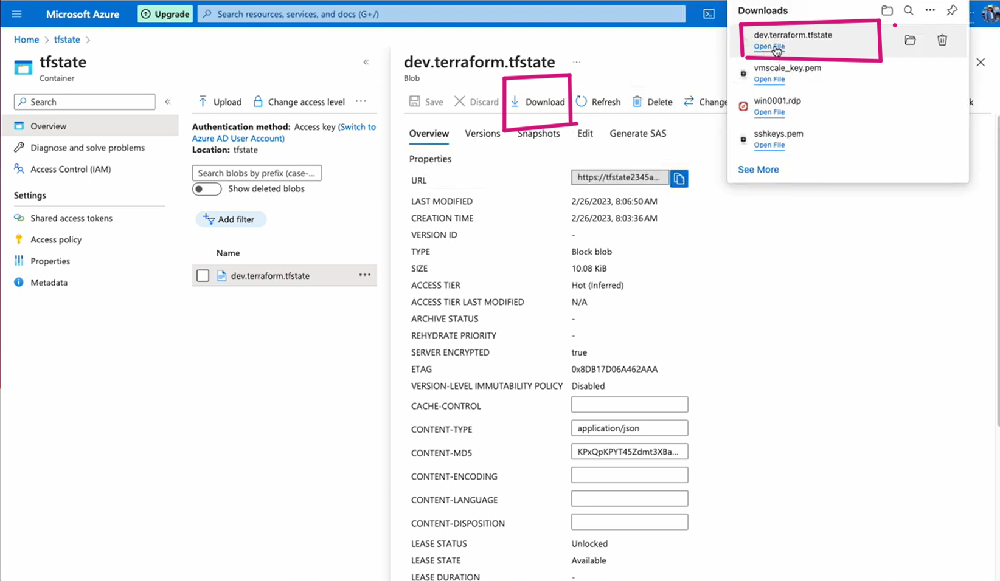

# Terraform Script: Creating remote state file using backend.tf by creating Resource group , storage account and servicebus.


## Getting Started 

To use this Terraform script, you'll need to have the following:

- An Active Azure subscription, with Azure CLI/PowerShell and Terraform Installed
- Service Prinicipal, with  CONTRIBUTOR access and export environment variables 

```
ARM_CLIENT_ID - The Azure Active Directory (AAD) client ID for authenticating to Azure.
ARM_CLIENT_SECRET - The AAD client secret for authenticating to Azure.
ARM_SUBSCRIPTION_ID - The subscription ID for the Azure subscription to use.
ARM_TENANT_ID - The AAD tenant ID for the Azure subscription.
```

### Setup Environment Variables in Windows

```
New-ItemProperty -Path "HKLM:\SYSTEM\CurrentControlSet\Control\Session Manager\Environment" -Name "ARM_TENANT_ID" -Value "VALUE_OF_TENANT_ID" -PropertyType String -Force
New-ItemProperty -Path "HKLM:\SYSTEM\CurrentControlSet\Control\Session Manager\Environment" -Name "ARM_SUBSCRIPTION_ID" -Value "VALUE_OF_SUBSCRIPTION_ID" -PropertyType String -Force
New-ItemProperty -Path "HKLM:\SYSTEM\CurrentControlSet\Control\Session Manager\Environment" -Name "ARM_CLIENT_ID" -Value "VALUE_OF_CLIENT_ID" -PropertyType String -Force
New-ItemProperty -Path "HKLM:\SYSTEM\CurrentControlSet\Control\Session Manager\Environment" -Name "ARM_CLIENT_SECRET" -Value "VALUE_OF_CLIENT_SECRET" -PropertyType String -Force
```

### Setup Environment Variables in Mac

```
export ARM_TENANT_ID="VALUE_OF_TENANT_ID"
export ARM_SUBSCRIPTION_ID="VALUE_OF_SUBSCRIPTION_ID"
export ARM_CLIENT_ID="VALUE_OF_CLIENT_ID"
export ARM_CLIENT_SECRET="VALUE_OF_CLIENT_SECRET"
```


## ( Already If you have created Environment variables please ignore , and move to the next step )


## Usage

- Open the `main.tf` file and edit the following variables as needed:

## `main.tf`
```
provider "azurerm" {
  features {
    
  }
}

resource "azurerm_resource_group" "example" {
  name                      = local.resource_group_name
  location                  = var.location
}

resource "azurerm_storage_account" "example" {
  name                      = local.storage_account_name
  resource_group_name       = azurerm_resource_group.example.name
  location                  = var.location
  account_tier              = "Standard"
  account_replication_type  = "LRS"
}

resource "azurerm_servicebus_namespace" "example" {
  name                      = local.servicebus_namespace_name
  location                  = var.location
  resource_group_name       = azurerm_resource_group.example.name
  sku                       = "Standard"
}

```
- Open the `variables.tf` file and edit the following variables as needed:


## `variables.tf`

```
locals {
  resource_group_name           = "${var.org_name}-${var.rg_prefix}-${var.env}-${var.main_project}-${var.sub_project}"
  storage_account_name          = "${var.org_name}${var.st_prefix}${var.env}${var.main_project}${var.sub_project}"
  servicebus_namespace_name     = "${var.org_name}-${var.sb_prefix}-${var.env}-${var.main_project}-${var.sub_project}"
}

variable "org_name" {
  description = "Azure region to deploy resources in"
  type  = string
  default = "ts"
}

variable "rg_prefix" {
  type  = string
  default = "rg"
}

variable "st_prefix" {
  type  = string
  default = "st"
}

variable "sb_prefix" {
  type  = string
  default = "sb"
}

variable "env" {
  type  = string
  default = "dev"
}

variable "main_project" {
    type  = string
    default = "netflix"
}

variable "sub_project" {
    type  = string
    default = "001"
}

variable "location" {
  description = "Azure region to deploy resources in"
  type  = string
  default = "eastus"
}


```

- Open the `outputs.tf` file and edit the following variables as needed:


## `outputs.tf`

```
output "resource_group_id" {
  value = azurerm_resource_group.example.id
}

output "storage_account_id" {
  value = azurerm_storage_account.example.id
}

output "servicebus_namespace_id" {
  value = azurerm_servicebus_namespace.example.id
}
```

- Open the `backend.tf` file and edit the following variables as needed:


## `backend.tf`

```
terraform {
  backend "azurerm" {
    resource_group_name  = "tfstate-rg"
    storage_account_name = "tfstate2345ab"
    container_name       = "tfstate"
    key                  = "dev.terraform.tfstate"
  }
}
```


# Terraform Commands

- ### Initialize

```
terraform init
```


*** 

## In remote state here , it will create the tfstate file in container as shown below i.e. remotely.




- ### Validate

```
terraform validate
```


- ### Plan

```
terraform plan
```


- ### Apply

```
terraform apply
```




## - After Apply , you can go to portal and to the tfstate file and download that.


