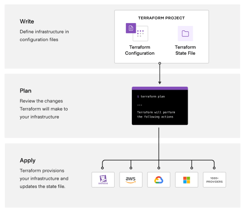

# Introduction 

This is the home page containing local state file and remote state file links of day2 terraform.  .

## What is Resource Group?

- An Azure Resource Group is a logical container for resources deployed on the Microsoft Azure cloud platform. It acts as a way to manage and organize related Azure resources. Resources within a resource group can include virtual machines, storage accounts, virtual networks, web apps, databases, and more.

## What is Storage Account?

- An Azure Storage account is a Microsoft Azure service that provides highly scalable and secure cloud storage for various types of data. It serves as a central place to store and manage different types of data such as blobs, files, queues, tables, and disks. Azure Storage is a fundamental building block for many cloud-based applications and services.

## What is Service Bus?

- Azure Service Bus is a cloud messaging service provided by Microsoft Azure, which is a part of the Azure messaging services suite. It enables communication between distributed applications and services. Azure Service Bus supports both asynchronous messaging and event-driven architectures, making it a reliable choice for decoupling different components of an application.

## What is local state file in Terraform?

- A local state file in Terraform, refers to the file that stores the state information of your infrastructure within the same directory as your Terraform configuration files. The state file keeps track of the mapping between the resources in your Terraform configuration and the real-world infrastructure they represent.

## What is remote state file in Terraform?

- A remote state file in Terraform,  refers to storing the state information of your infrastructure in a remote location rather than in the same directory as your Terraform configuration files. The state file contains information about the resources managed by Terraform, such as resource IDs, metadata, and other details needed to keep track of the infrastructure's state.

     

# Details and Links of the Sections 

|S.No                | Topic         | Link |
|----------------    |---------------|-------|
|DAY2| 2a-local-state-file|[Creating Azure Resource Group, Storage Account and Service Bus](2a-local-state-file) |
|DAY2| 2b-remote-state|[Creating Azure Resource Group, Storage Account and Service Bus](2b-remote-state) |
