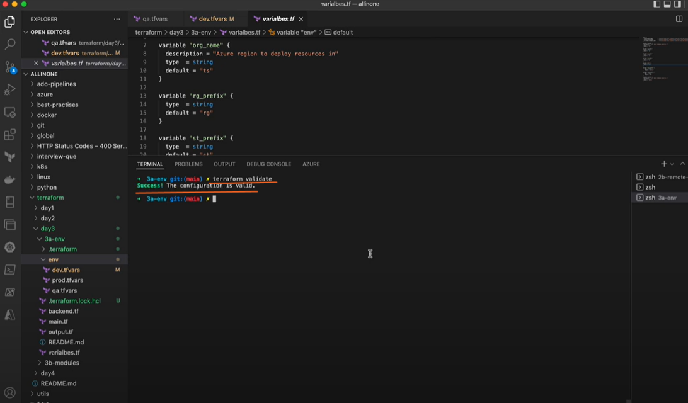
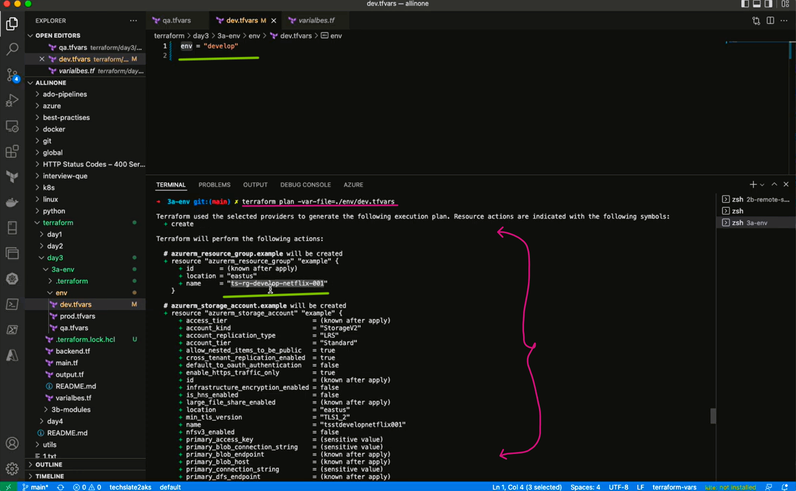
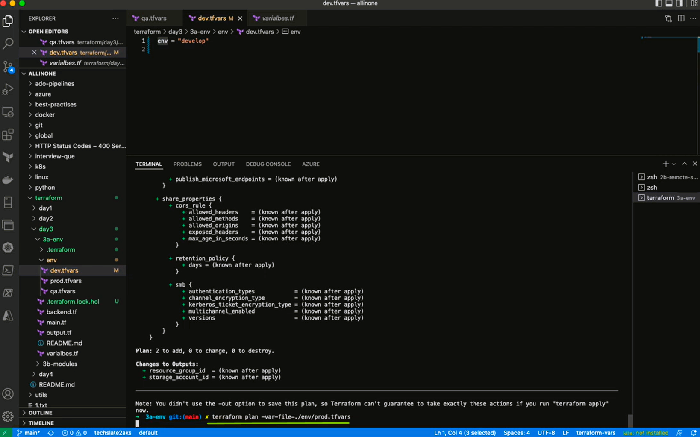
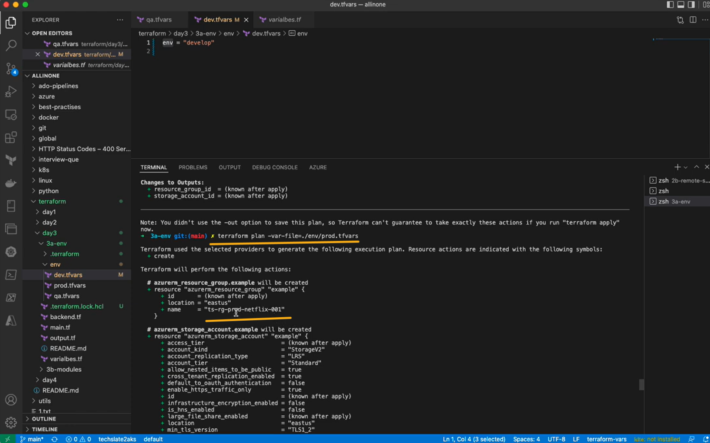

# Introduction 

## **Terraform with env management**

## example :     


## If you want to run the resources in Dev Environment you can execute following commands with specfied environment path.

- ### Initialize

```
terraform init --var-file=./env/dev.tfvars
```

- ### Validate

```
terraform validate
```


- ### Plan

```
terraform plan --var-file=./env/dev.tfvars
```


- ### if you want run plan for prod.tfvars i.e. for production environmet , run following command

```
terraform plan --var-file=./env/pro.tfvars
```




- ## So, this is how you can manage environments according to the requirement 

- ## you can go further and run apply.

- ### Apply

```
terraform apply --var-file=./env/dev.tfvars
```


