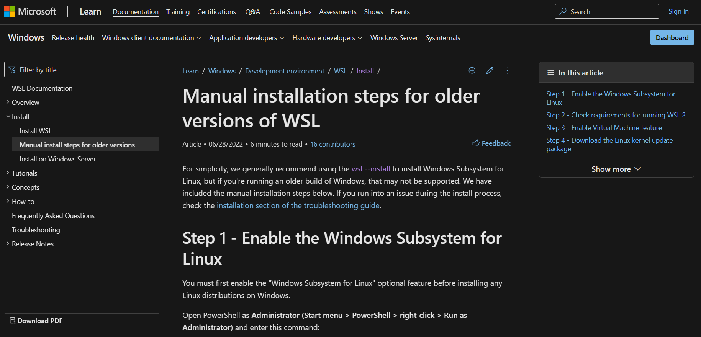
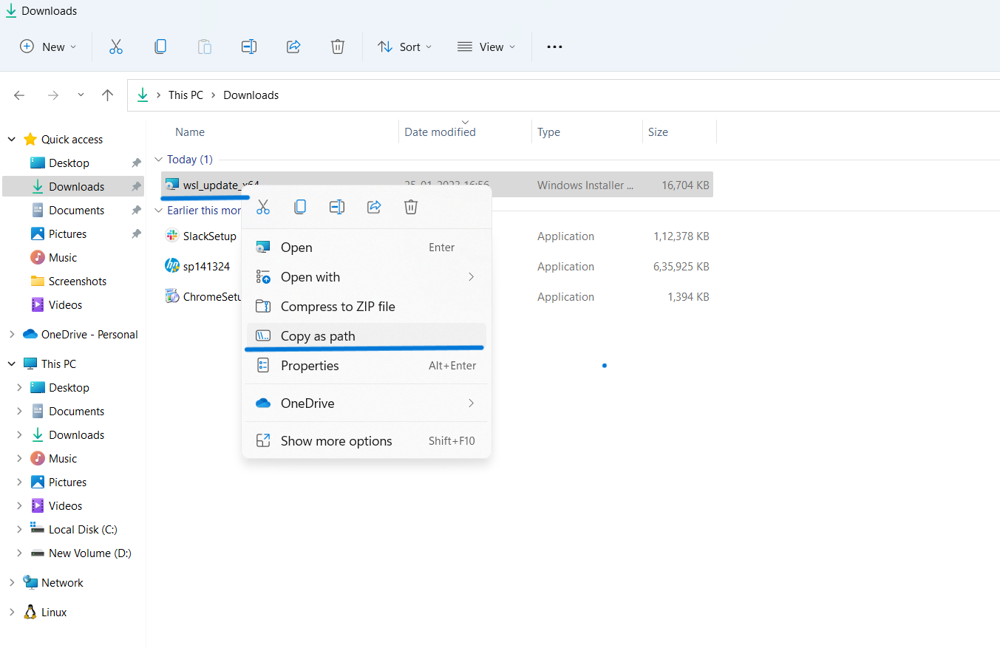
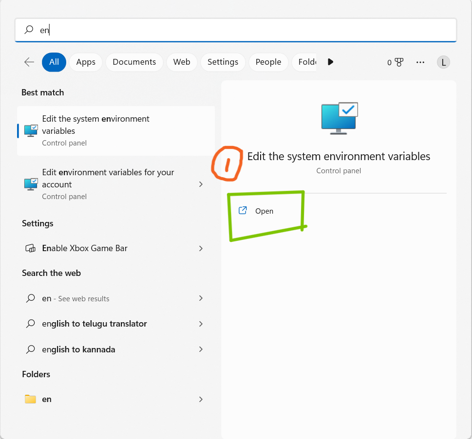
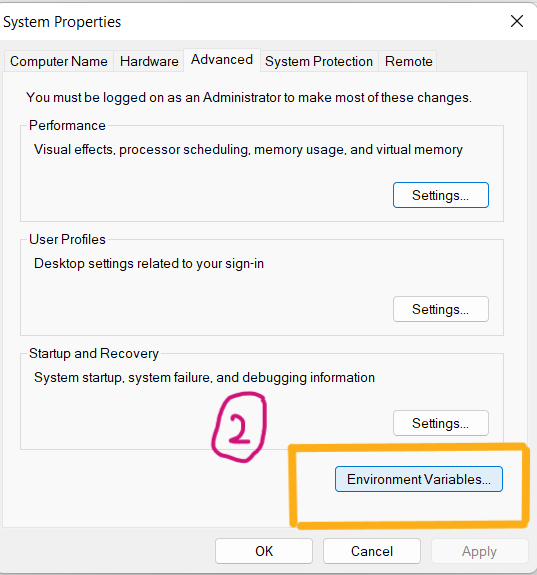
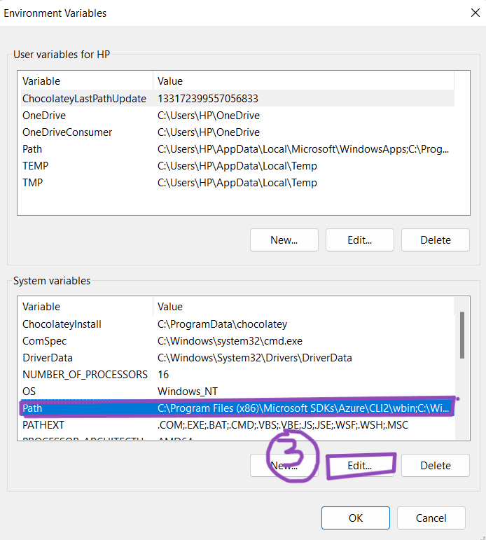
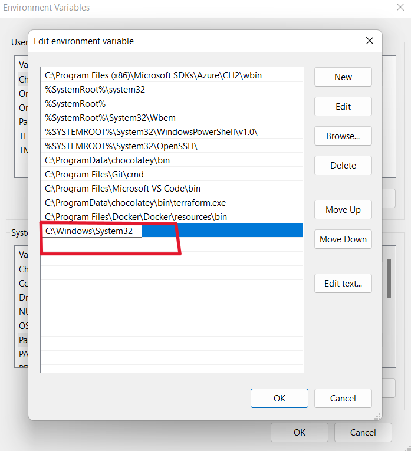
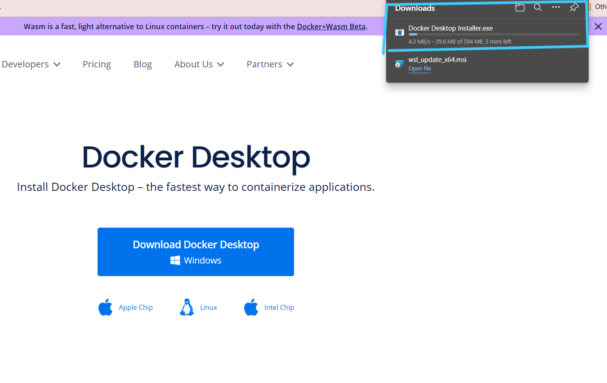
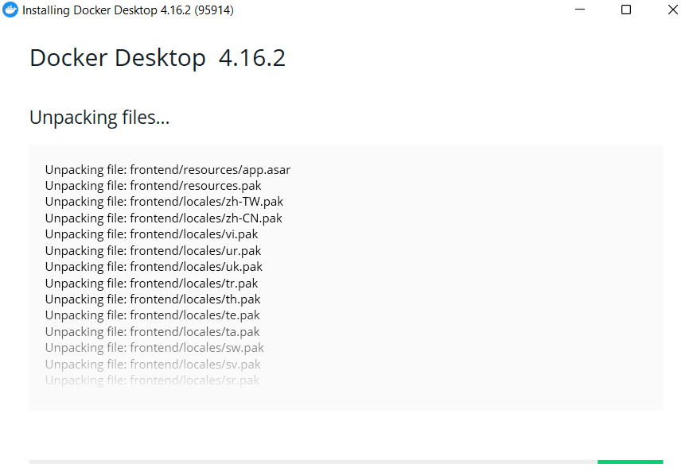
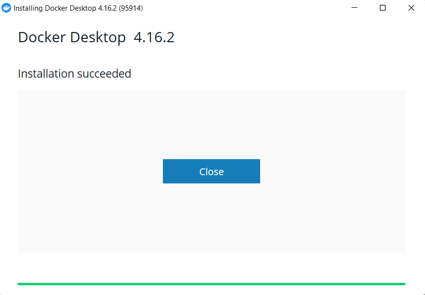
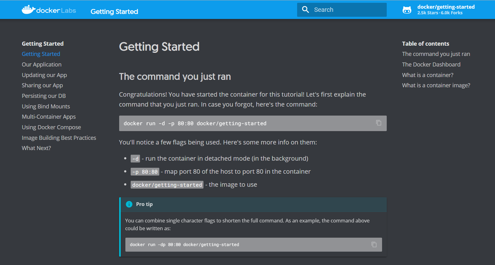

# Introduction

This is the help page to install docker in windows machine 


# How To 

## Step 1 : Install WSL

**Install WSL or make sure you have WSL Installed your machine.**

### 1. **Lets first check if we have WSL installed in our system , by typing the below command in Powershell (Run as Administrator)** ###

**```wsl --list --verbose```**


### 2. **If WSL is not installed in our system , lets install by following the below steps :** ###
  
- **Click the below link , which will direct you to Microsfot Document**

   https://learn.microsoft.com/en-us/windows/wsl/install-manual



- **Directly Jump to 4th step! and click on the WSL2 Linux kernel update package for x64 machines.**


- **You can see WSL Package Downloading.**


***

## Step 2 : WSL to PATH

- **Add WSL path to env variable i.e. PATH**

1. **Go to the file location of **wsl_update_x64** and copy the path of it .**



2. **Add the path to System Environment variables .**

   ### Open the Edit the system environment variables.


***
   ### Click on Environment Variables .


***
   ### Click on Path and then Click on Edit .


***
   ### Click on New and paste the path there . Click on OK.


***

## Step 3 : Download

- **Download Docker Desktop and Install it.**

1. **Go to your favourite Browser, and type "Docker Desktop".**


2. **According to your computer Operating system click on respective OS**


3. **You can see Docker Desktop Downloading , it will take some time to download.**



4. **Once it is downloaded , click on the Docker Desktop , it will start installing**



**Docker Desktop Installed Succesfully. Click on Close..**



5. **Now ,Open your Docker Desktop , You can see Docker Running**


***


## Step 4 :  How to verify
- **Open Powershell Terminal and run below command**

``` 
docker run -d -p 80:80 docker/getting-started 
``` 


- **Open browser and enter url "localhost:80".**


- **You should see Getting Started page Appearing.**




***
# Double Check (if errors) : 
- Verify whether Hypervisor is enabled or not.

``` 
Get-WmiObject -Class Win32_ComputerSystem | Select-Object -ExpandProperty HypervisorPresent
``` 