# Introduction

# Docker 


Docker is an open-source platform that allows developers to automate the deployment, scaling, and management of applications using containerization. Containers are lightweight and isolated environments that package an application and all its dependencies, including libraries and configuration files, into a single unit. Docker provides a standardized way to create, distribute, and run containers on any operating system.

Here are some key concepts related to Docker:

- **Images**: Docker images are the building blocks of containers. They are read-only templates that contain everything needed to run an application, including the code, runtime, libraries, and system tools.

- **Containers**: A Dockerfile is a text file that defines the configuration of a Docker image. It contains a series of instructions to build the image, such as specifying the base image, copying files, installing dependencies, and configuring the runtime environment.

- **Docker Hub**: Docker Hub is a cloud-based registry that allows you to find, share, and store Docker images. It is the default public registry for Docker, hosting a vast collection of pre-built images for various applications and technologies.

- **Docker Compose**: Docker Compose is a tool for defining and running multi-container Docker applications. It uses a YAML file to define the services, networks, and volumes required for your application stack, allowing you to manage multiple containers as a single unit.

- **Docker Swarm**: Docker Swarm is a native clustering and orchestration solution for Docker. It allows you to create and manage a swarm of Docker nodes, turning them into a single virtual Docker host. Swarm enables you to deploy and scale applications across multiple machines, providing high availability and load balancing.

- **Docker Engine**: Docker Engine is the runtime environment for Docker. It runs and manages containers on a host machine, handling container execution, networking, storage, and other core functionalities.

These are just some of the fundamental concepts of Docker. Docker has become incredibly popular in the software development community due to its ability to simplify application deployment, improve scalability, and enhance development workflows.

***

# How to Install Docker Desktop

| Step | Description | Image |
|------|-------------|-------|
| **Prequisites** | | | |
| **Step 1** | **Install WSL or make sure you have WSL Installed your machine.Lets first check if we have WSL installed in our system , by typing the below command in Powershell(RunasAdministrator)** **```wsl --list --verbose```**|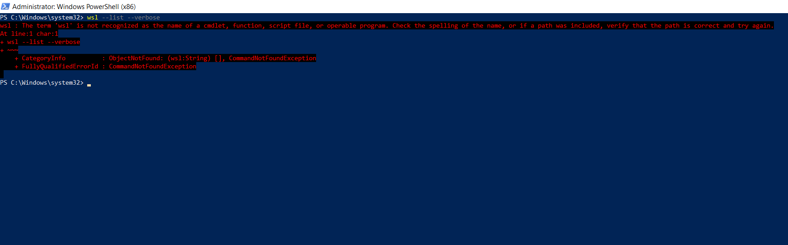 |
| **Step 1.a**| **If WSL is not installed in our system , lets install by following the below steps, Click the below link , which will direct you to Microsfot Document**     https://learn.microsoft.com/en-us/windows/wsl/install-manual | |
| **Step 1.b** | **Please follow all the 6 steps which are been mentioned in the document. And in the 4th step don’t forget to download the WSL2 Linux kernel update package, which is very much necessary for us to run the Docker Desktop You can see WSL Package Downloading.**|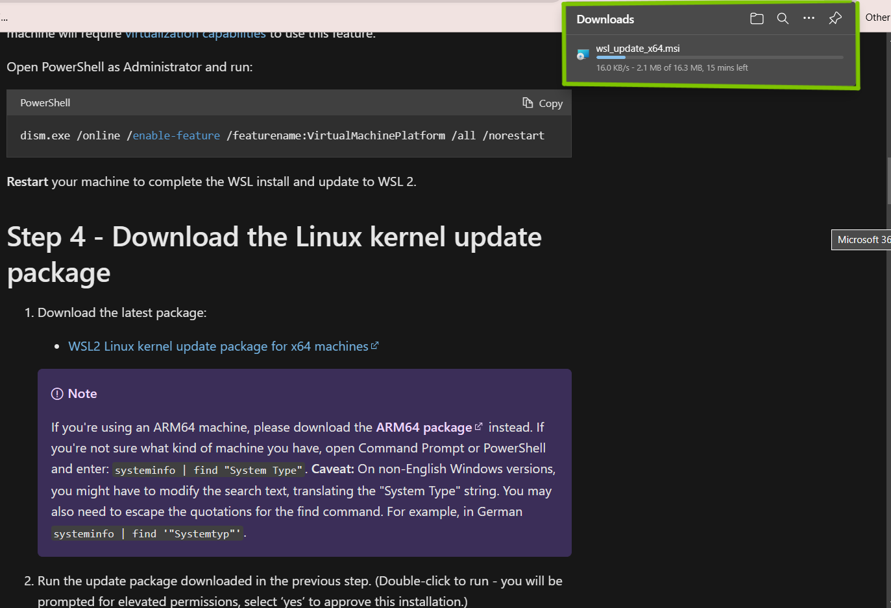 |
| **Step 2** | **Now, once the package is downloaded, we need to add the WSL path to our System Environment Variables.**| |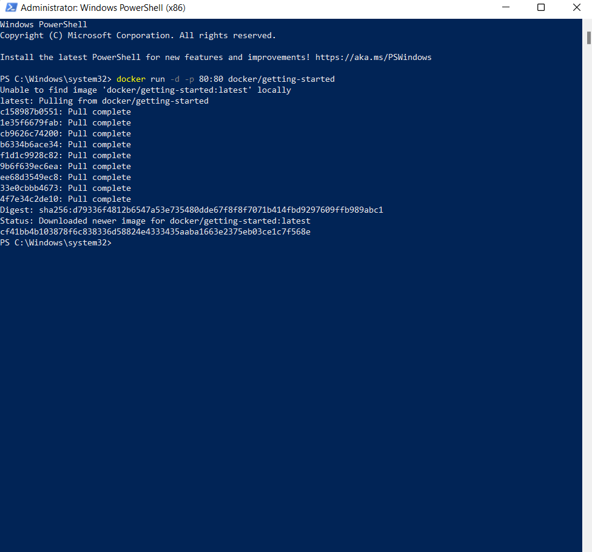 |
| **Step 2.a**| **Go to the Search box and search for WSL.Click on the File Location**|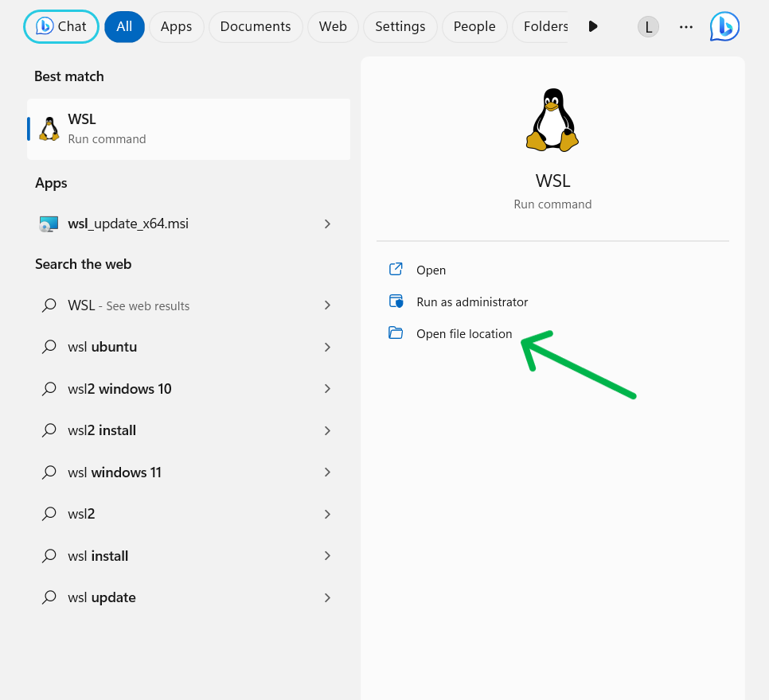 |
| **Step 2.b** | **Now, copy the path of WSL**|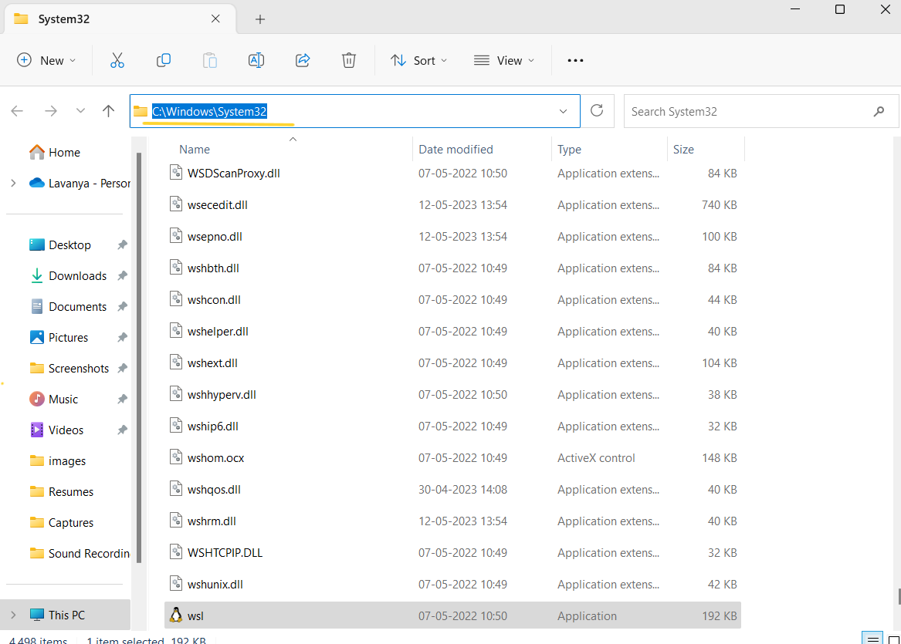 |
| **Step 2.C** | **Now, search for Edit the System Environment variables in search box and open that.**| |
| **Step 2.d** | **Click on Environment variables**|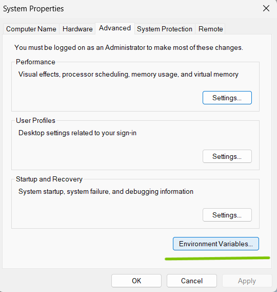 |
| **Step 2.e** | **Under System variables select Path and click on Edit.**|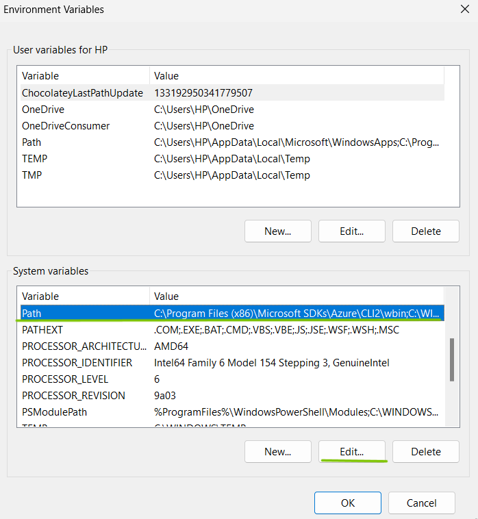 |
|     **Download Docker Desktop:**  | | | |
| **Step 3** | **Go to your favourite Browser, and type "Docker Desktop Download” select the first link.**|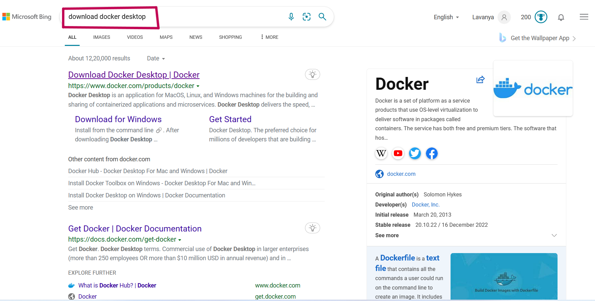 |
| **Step 3.a** | **Click on the Download Docker Desktop button, you will see Docker desktop downloading.**| |
| **Step 3.b** | **Once Docker desktop is downloaded, click on open file then you will see packages installing..**|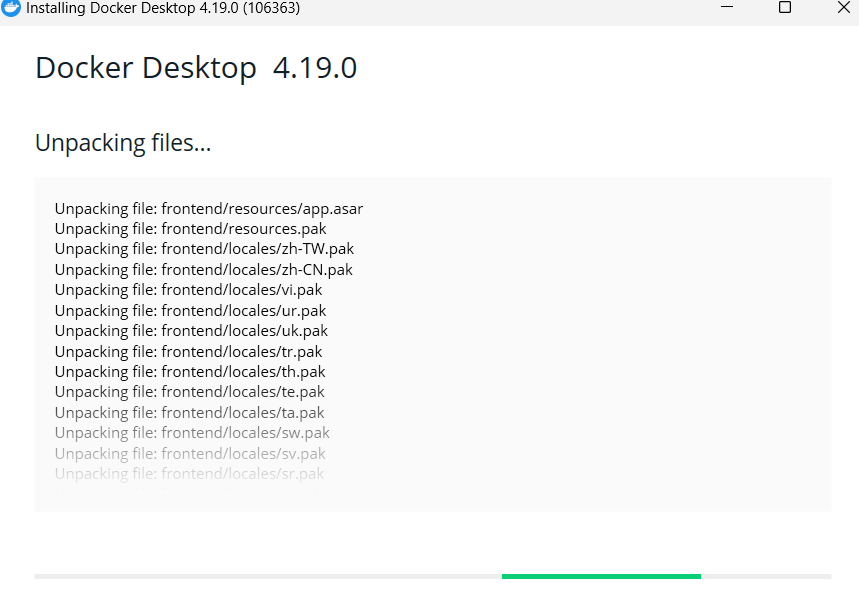 |
| **Step 3.c** | **Once the installation is done, come back to your main Desktop, you will see Docker desktop on the screen, open the Docker desktop.**|
| **Step 3.d** | **You will see Docker Desktop Running Successfully.**| |
|     **How to Verify**  | | | |
| **Step 4** | **Open PowerShell Terminal and run the following command**  ```docker run -d -p 80:80 docker/getting-started```|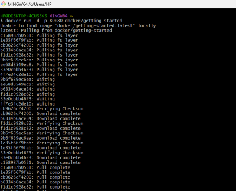 |
| **Step 4.a** | **Open browser and enter url "localhost:80".**|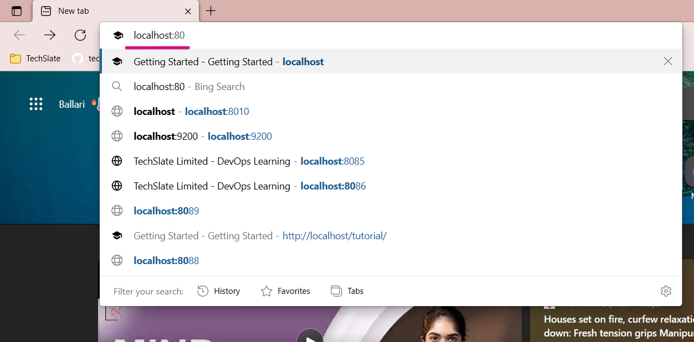 |
| **Step 4.a** | **You should see Getting Started Page Appearing.**| |


***
# Double Check (if errors) : 
- Verify whether Hypervisor is enabled or not.

``` 
Get-WmiObject -Class Win32_ComputerSystem | Select-Object -ExpandProperty HypervisorPresent
``` 